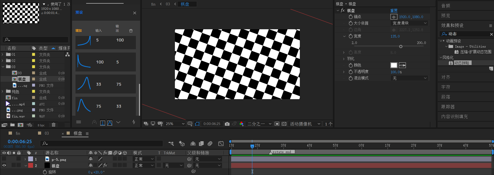
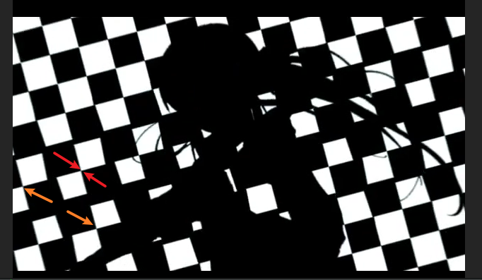
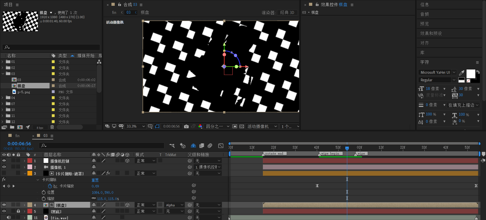

# 03 棋盘场景

## 背景

使用纯色层分别创建左侧白底和右侧黑底，作为背景。

复制02中的菱形形状层，去掉之前关键帧。稍加修改，调整为左侧【黑色块】，和右侧【白色块】。

新建空对象，命名【色块控制器】，将位置定于画布中心，创建旋转关键帧。0到115左右。先快后慢。

## 棋盘

下面新建棋盘。

创建一个新合成，命名【棋盘】。

新建黑色纯色层，注意，该纯色层大小为3840 x 2160。 目的是为了足够大，保证绕中心旋转时不会暴露边缘即可。并应用“棋盘”效果。

将带alpha通道的png素材导入，放于棋盘纯色层上面，对棋盘应用alpha反转遮罩。注意人物层也旋转一样的角度。

回到03合成。新建35mm摄像机，并创建空对象绑定。

摄像机位置动画：

- 从z=1800到z=0，x和y坐标可以有移动，也可以不用。

### 棋盘擦除转场

接下来做这个棋盘擦除转场。

原版的棋盘擦除分析：视觉上白色块逐渐缩小。一定要对准擦除方向。

这个棋盘擦除转场，使用卡片擦除效果来制作。

- 对卡片缩放值k帧，从1 到 0 就是擦除的效果。速度曲线从快到慢。
- 为了保证角度一致，将旋转改为+20。因为棋盘是+20度。

关键的地方现在开始说明。

调整这个遮罩层的位置和缩放属性，使得擦除单元格的大小包含这样一个正方形。这个正方形有两白两黑。

稍微拉动时间条查看，检查擦除效果，感受擦除方向。

## 入场淡入

回到fin合成（总合成）。在02-03合成之间，使用mask path做一个过渡揭示。

- mask path 从中间一条线，变成画布大小。速度为极致的先快后慢。

