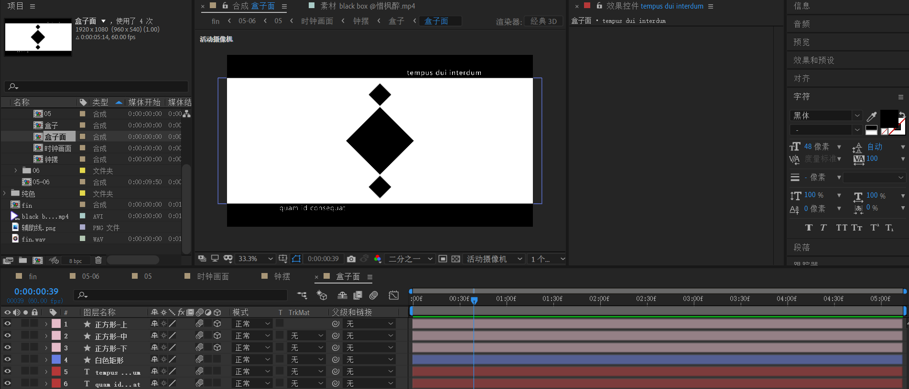
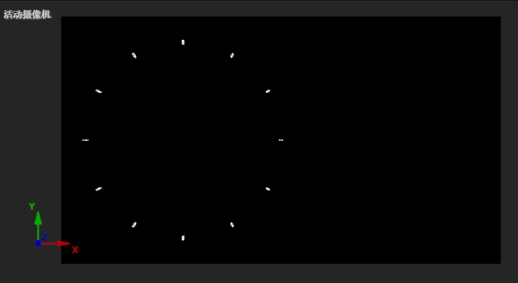
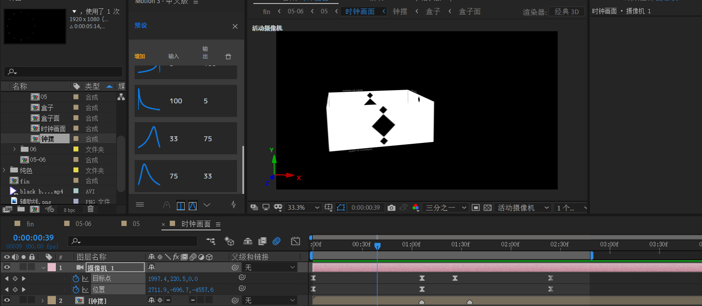
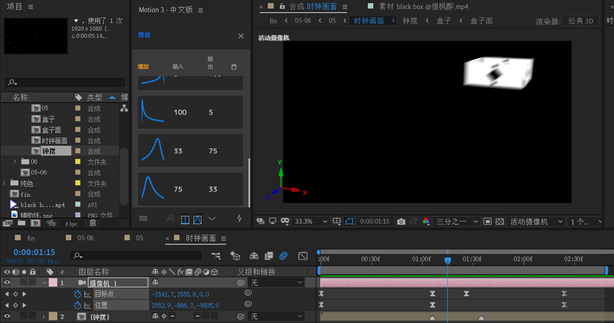
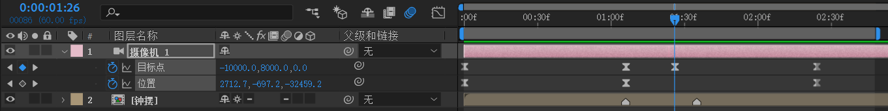
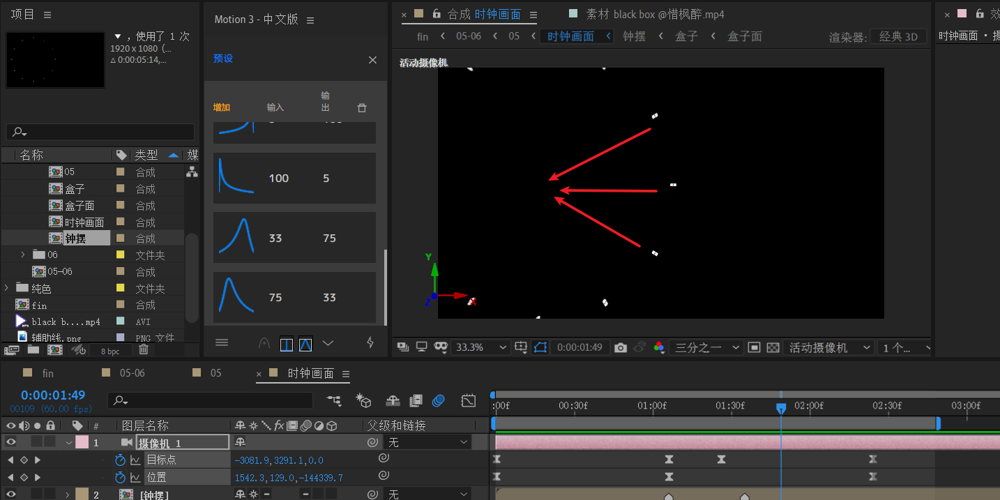
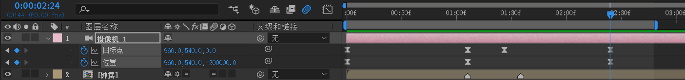
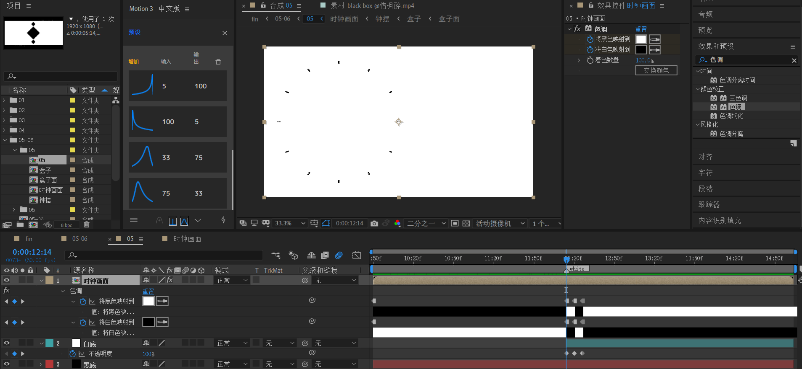
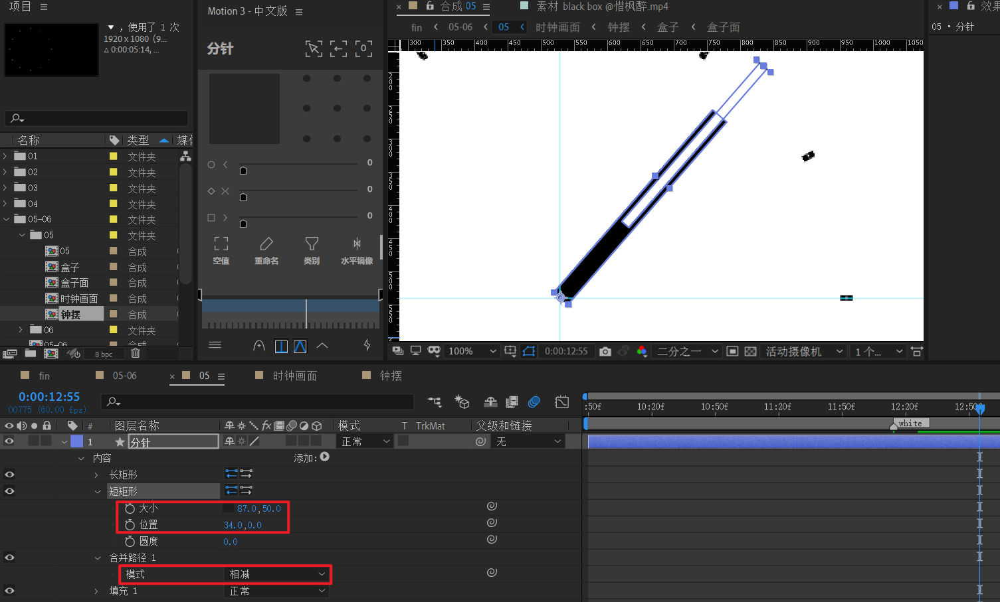
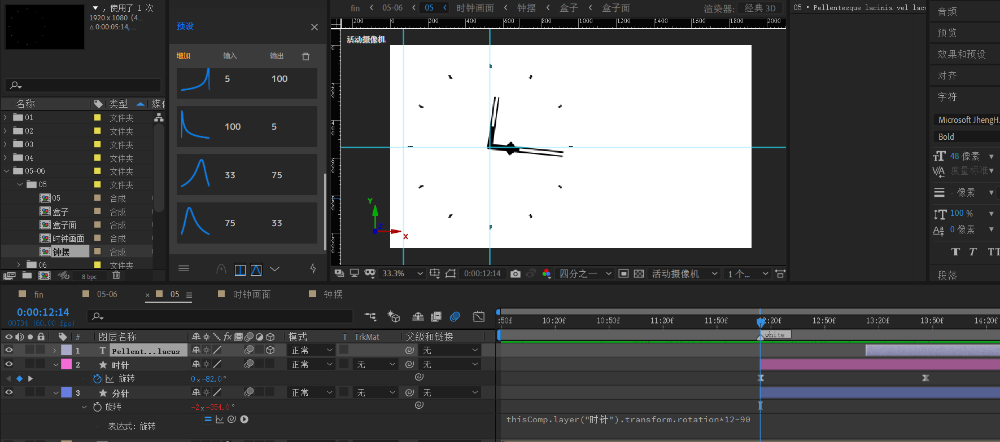

# 05

09:20-16:28左右为05-06合成。

首先向从盒子的一面入手，先制作这个合成。

创建合成【盒子面】，从之前合成04中复制所需的图层，并去掉它们的关键帧。



接下来制作四个面组成的盒子。

创建合成【盒子】，通过适当的数学运算和复制层，将四个面摆放好。

然后，新建空对象【盒子旋转-控制器】，将四个面绑定到该合成。

> 关键点：【盒子旋转-控制器】的锚点必须为盒子四个面围成的区域中心。


---

到这里，我们开始制作盒子缩小后组成的时钟。


新建【钟摆】合成，将上面的【盒子】合成复制成12份，并使用 - number 形式标记时钟刻度的数字。将所有盒子的合成：

- 锚点x 改为 -45000， y不变，z为0
- 位置x 改为 -45000，y不变，z为0

x的值不是固定的，但是值必须足够大。因为要保证刻度小到几乎变成一条线。

从【盒子-3】开始，z轴旋转0度，之后顺时针方向，【盒子-4】旋转30度，以此类推。

新建一个双节35m摄像机，将xy变成画布中心，z轴改为-200000。注意，该摄像机仅供观察，不作k帧。

如上图所示，时钟整体在画布左半部分。



---

新建一个合成，命名【时钟画面】，这个合成包含了盒子旋转和时钟进入的动画。将【钟摆】合成放入，然后新建一个35mm双节点摄像机。

开始：


---

接下来，盒子做一个往内部的旋转



此时，第二列关键帧：


- 目标点XY改变是为了稍微往左拍摄。也就是图中位置。
- 位置XY改变是为了稍微看见盒子四个面，有一定倾斜。z轴是为了拉远镜头。

---

接下来。盒子往右上角移动。



此时，只需要更改目标点位置。



- 也就是将目标点放于右上角。

---

接着，盒子回到时钟刻度3中，其他刻度也慢慢出现。目标点重新回到画布中心。摄像机继续拉远。





这个镜头其实有点复杂，请仔细考虑速度曲线的运动。参考曲线


- 盒子往右上角移动时，高速加速移动，时间很短。
- 之后，盒子返回刻度时可以稍慢。

---

回到05合成。创建黑底和白底。

- 先对白底opacity k帧：100 -> 0 -> 100 。也即是一个【白 -> 黑 -> 白】的过渡。
- 对时钟画面应用色调。对齐白底关键帧。作一个（黑) -> 【白 -> 黑 -> 白】的过渡。



---

制作时针和分针，以及文字进场。

> 分针。

新建形状层，打开标尺辅助，拉出两个十字辅助线来帮助时钟圆心定位。

> 注意：由于图形比较复杂。因此每个形状单元务必使用ctrl + G创建组。



- 在形状层添加矩形和填充（黑），利用移动工具将锚点定于圆心。
- 复制上面的矩形，命名为【短矩形】，利用大小和位置属性，将短矩形移动到合适位置。
- 添加合并路径，模式改为相减。这样两个矩形交集部分就被镂空。


补充小正方形和圆形。

---

将上面分针层复制一层，命名【时针】，将菱形组去掉，将x轴缩放变小一点。


---

分析时针和分针的角度关系。

一个小时60分钟，时针一个小时走30度，分钟走360度。也即是时针走1度的话，分钟走360/30=12度。

我们先对时针K帧，然后使用表达式将分针和时针绑定。



- 时针关键帧：旋转从-82 到-28。先快后慢

- 分针表达式

  ```js
  thisComp.layer("时针").transform.rotation*12-90
  ```

  *12 是角度关系，-90是为了让初始时分针和时针角度差为90度。

---

文字部分关键帧：

- 位置X
- y轴旋转


