# 11

time code 28:43-35:38

 初始化

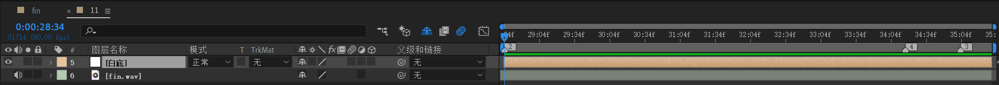

新建一个白色纯色层作为背景。

---

创建一个和合成11等长的合成作为【镜头11主体】


进入该合成。


## 制作【过渡背景】

前往之前镜头10合成。复制一下。从末尾处往前截取30 frames作为一个末尾片段。命名【镜头10末尾片段】。

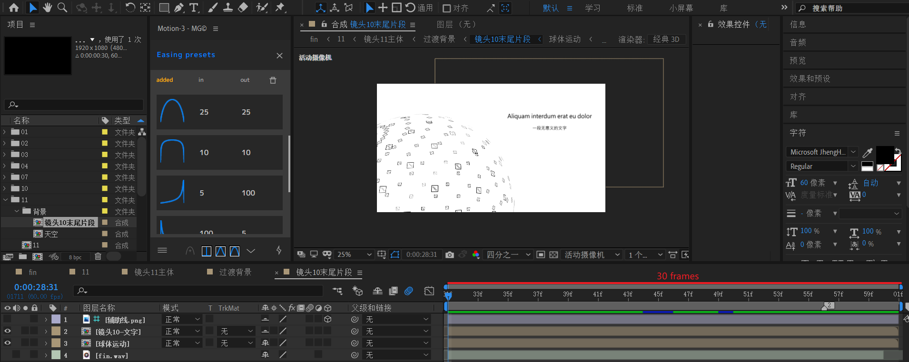

新建一个1s左右的合成，命名【过渡背景】。将上面【镜头10末尾片段】放入。

在【镜头10末尾片段】结束位置。也就是图中红点处添加【最后一帧冻结】效果。

> 最后一帧冻结：该时间点之后的帧全部静止为冻结点那一帧的画面。

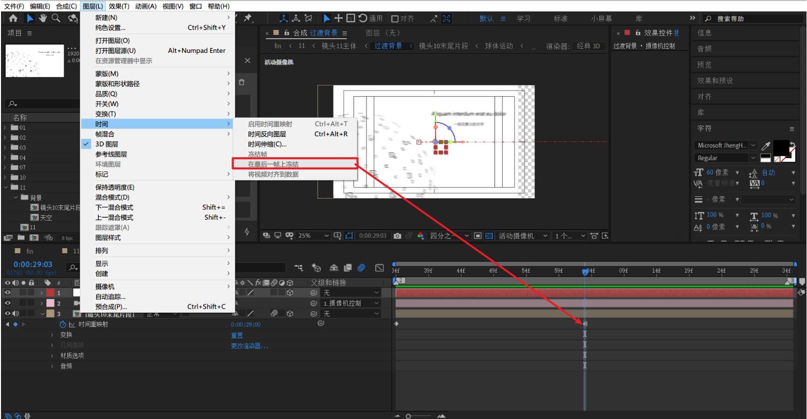

新建摄像机并使用空对象绑定，实现一个冻结帧画面向左平移的运动。

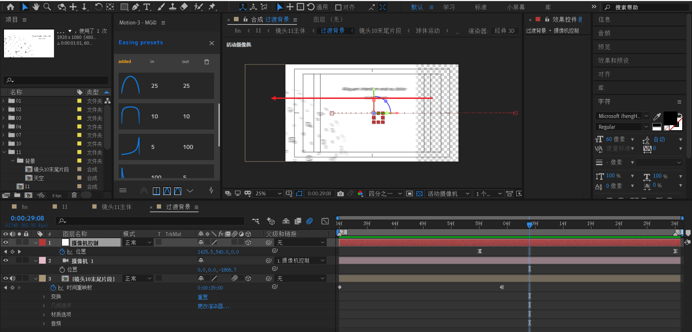

将该【过渡背景】合成放入【镜头11主体】合成。


## 制作【天空】


新建和11合成等长的合成【天空】，注意【天空】合成尺寸：3000 x 1080

首先制作一个渐变的蓝色背景 3000 x 1080。


新建黑色层 3000 x 3000作为粒子层。添加粒子效果后，关键参数是粒子类型改为云朵，空间区域拉大一点。

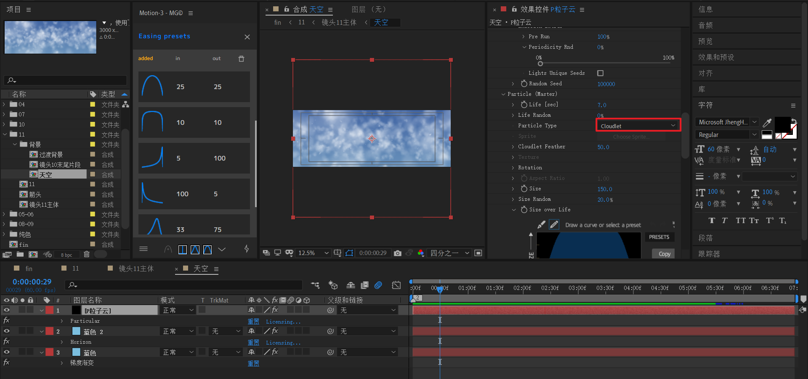

最后，复制之前的【蓝色】纯色层，去掉梯度渐变效果，添加RG horizon效果。将opacity降低到50左右，这样可以减弱蓝色。


> 实际上，即使不创建horizon效果这层，效果也不会相差太多。


## 制作【箭头】


箭身：两个矩形+合并路径【相减】

----

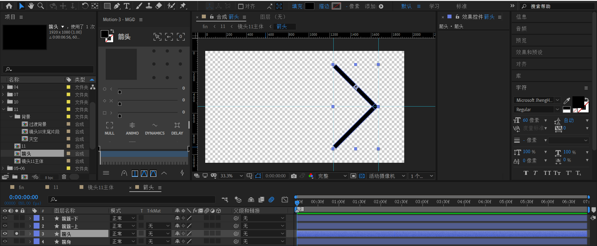

箭头：两个矩形，分别旋转45度和-45度。旋转角度和旋转锚点有关，这里锚点定于矩形中心。

---


箭簇-上：创建完整矩形，然后使用钢笔工具分别绘制两个三角形，然后稍微将三角形向外偏移（是为了去掉手动镂空不精确留下的描边）。最后，使用合并路径【相减】。

箭簇-下：复制箭簇-上，然后缩放的Y轴变为-100%。

---

整体效果

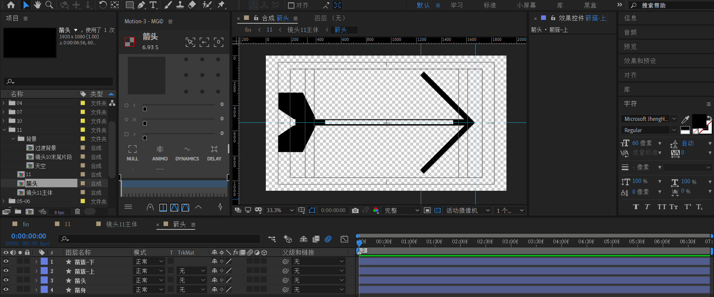

---


## 完善【镜头11主体】


1. 新建文本层
2. 将箭头合成放入
3. 新建白底
4. 新建摄像机和空对象绑定
5. 先忽略箭头要穿过的正方形通道的制作。

下面要重点制作 2和4的相对运动。


第一段：箭头从左往右快速进场。过渡背景保持不动。


----

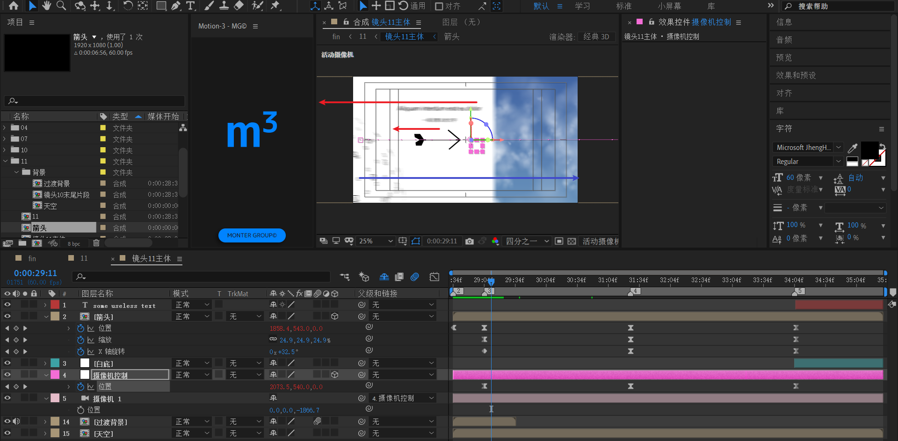

第二段：背景和箭头相对于摄像机往左运动，虽然箭头依旧朝着右边运动。根据物理学中相对运动理论，设摄像机往右运动速率为v1，箭头往右运动速率为v2，当v1> v2时，就会看见箭头相对于摄像机往左运动，因为箭头速率比不上摄像机。

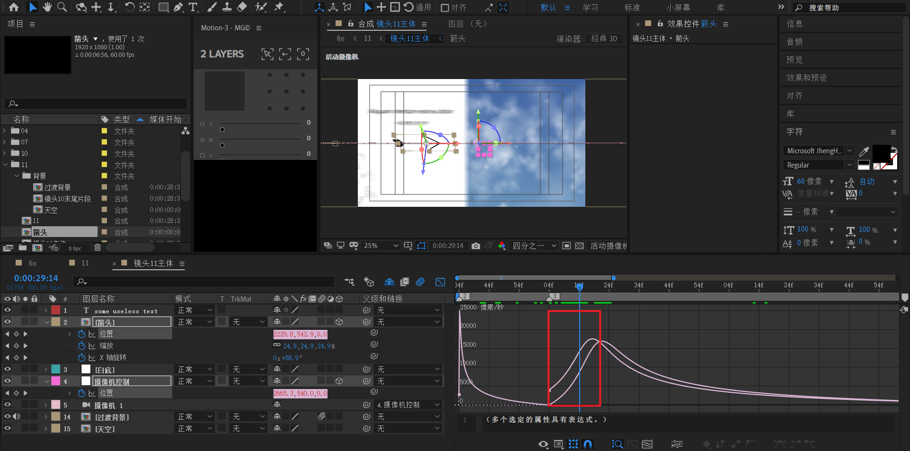

---


当v1=v2时，箭头和摄像机相对静止。此时箭头位于画面左侧。为后续发力提供足够的冲刺空间。

---

接着，箭头开始发力，速率快于摄像机。即当v1< v2时，箭头相对于摄像机往右运动。


---

最后，箭头速度< 摄像机速率，箭头逐渐回到画面中间位置。


---

整体曲线

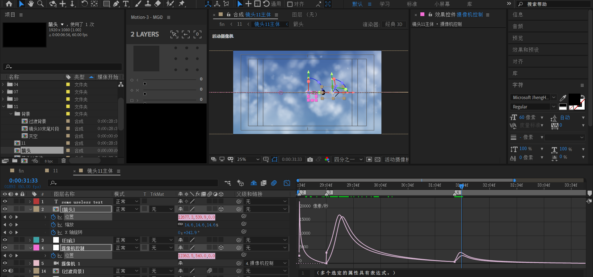

---

此外，箭头还有缩放动画：25% - 15% - 5%

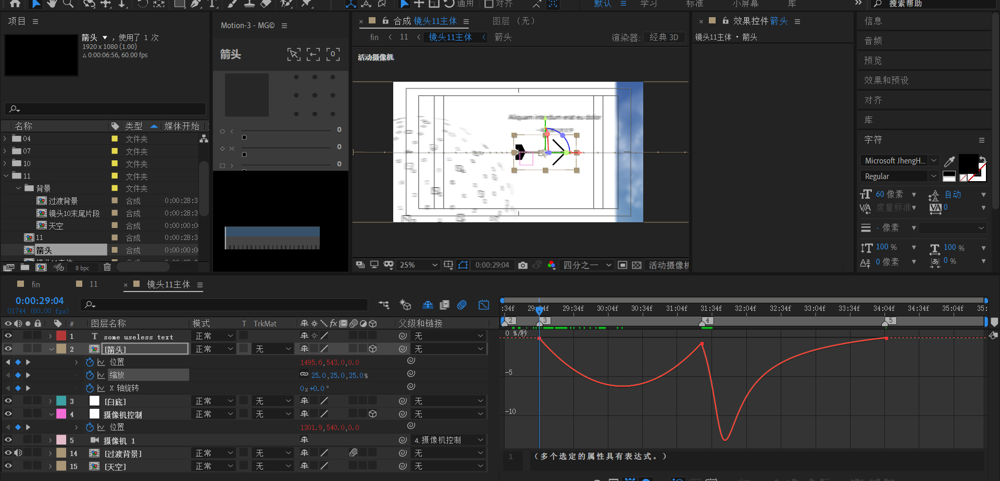

以及x轴旋转动画：0 -1-0


---

箭头运动效果预览

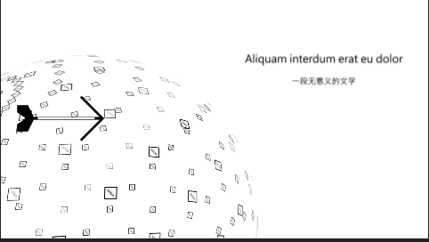

  下面，考虑箭头通道的制作。


## 制作箭头通道组

形状层，创建矩形，黑色描边，不要填充。打开3D，Y轴旋转90度。


对该层X位置应用AE表达式

```js
transform.xPosition+index*800
```

该层复制7次，形成一共8个通道。**注意将通道层运动模糊打开**。

下图为自定义视图观察。红色线框为摄像机位置。


---


## 最后

回到合成11


新建摄像机。

新建形状层【文字下划线】，绘制矩形，中间使用mask相减割除一部分矩形。

对【文字下划线】创建位置和Y轴旋转动画：

- 位置：从z=-2000到0
- y轴旋转：从1x到0x

---

最后是文字整体向下平移出画面。

新建空对象，将【镜头11主体】和【文字下划线】绑定到该空对象【整体向下控制】，k一个y轴加速平移即可。

 

合成11整体效果

