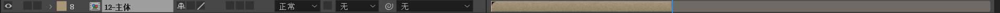
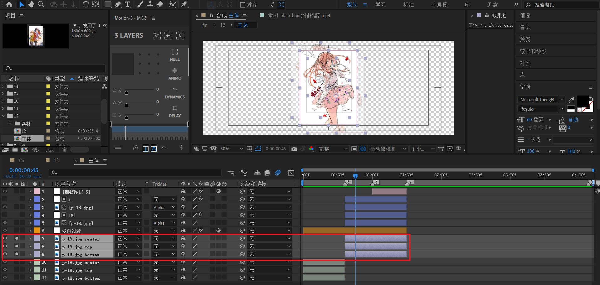
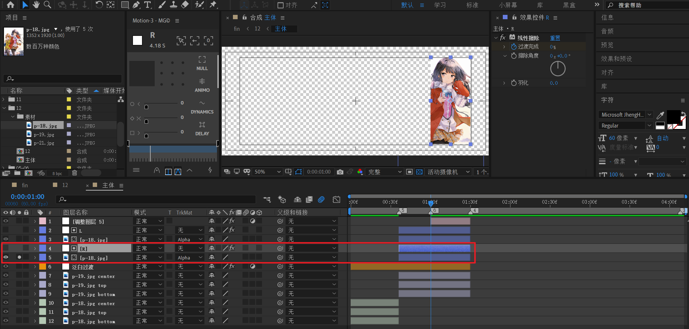
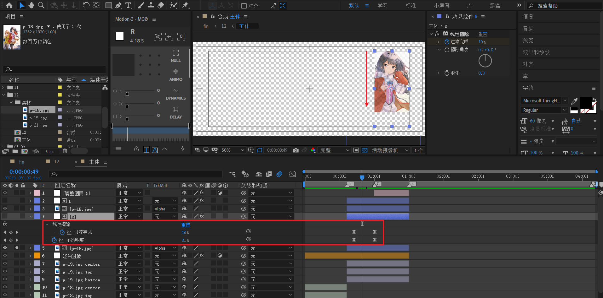
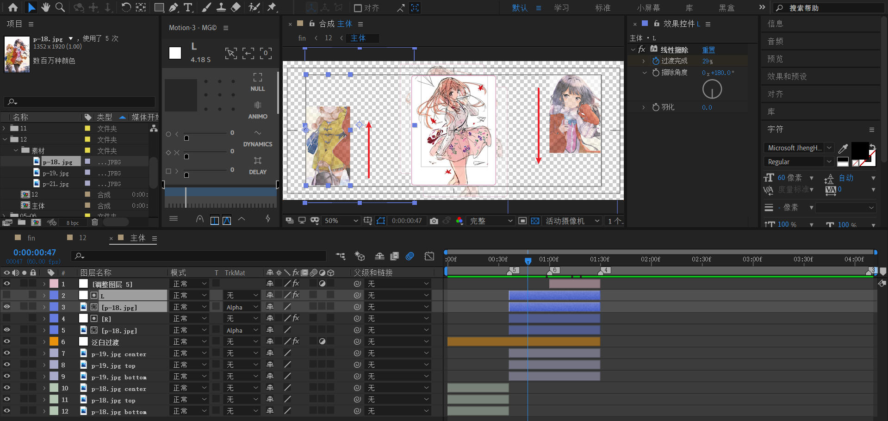
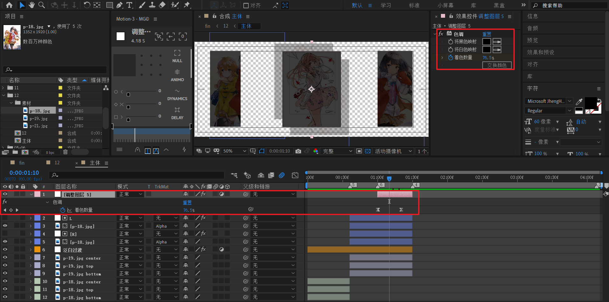
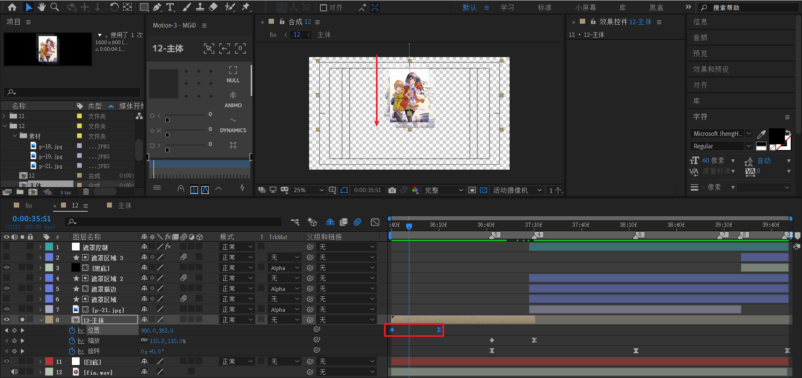
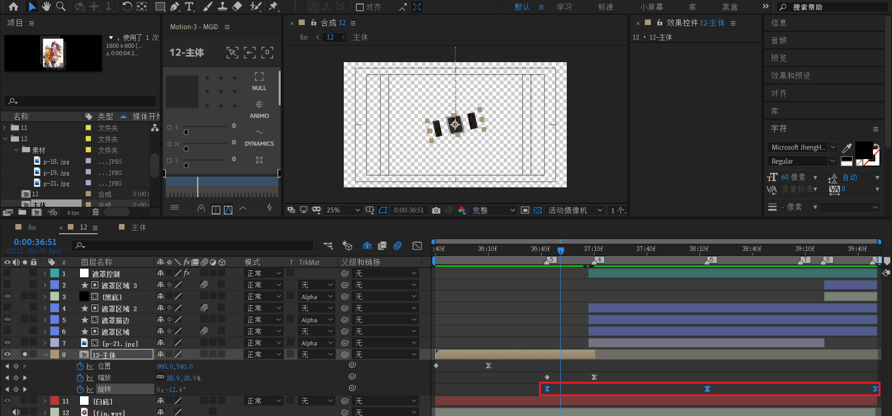
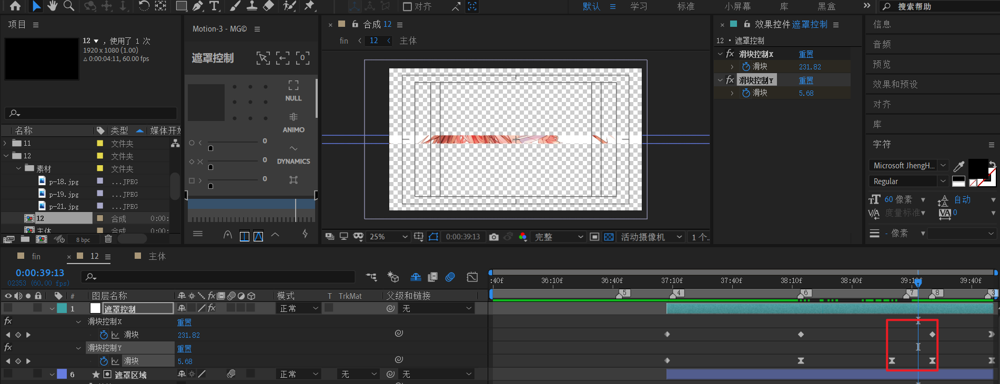

# 12

timecode range 35:38 - 39:48

截取为合成12，并新建一个白底


## 制作【12-主体】

在合成12中，新建一个空合成，尺寸 1600 x 600，命名【12-主体】，长度和合成12一致。



进入【12-主体】合成


1. 将第一张素材图片放入。

2. 对第一张素材图片复制2次，分别【左-上移动】和【右-下移动】，制造重叠效果，opacity改为15%左右。

---



1. 将第2张素材图片放入

2. 对第2张素材图片复制2次，分别【左-上移动】和【右-下移动】，制造重叠效果，opacity改为15%左右。

---


1. 新建调整图层【泛白过渡】，添加【色调】效果，将黑白全部改为映射到白色。
2. 在两张图片过渡时间点，对着色数量标记关键帧100%。然后往前/往后相隔6帧，对着色数量标记关键帧0%。
3. 将速度曲线改为极致的先快后慢。

---



1. 新建白色纯色层，缩放到图中右侧位置。
2. 将图片素材导入，放入白色纯色层下面。适当调整位置后，该层使用 alpha 遮罩。

下面对遮罩层制作动画



- 添加【线性擦除】效果，k帧，让过渡从上往下。通过【擦除角度】参数调整擦除方向。
- 对opacity k帧： 0 -> 100%。
- 以上动画时间间隔均为20帧左右。

对于左侧，原理类似，只是擦除方向为从下往上。这里不赘述。



---



最后，新建一个调整图层，使用色调制作一个黑场淡出。

先将黑白映射到黑，再将着色数量从0到100% k帧即可。

这个合成的有效时长其实是1:30。图中【4】标记处。


## 制作合成12

对于【12-主体】



第一个动画：位置，从上往下，直到画面中间。

---


第二个动画：缩放，从110%到0%

---



第三个动画：旋转，从0到-1x到-1x-135度。曲线先快后慢。

---


现在开始制作后续的遮罩动画。


1. 新建形状层【遮罩区域】，添加矩形，填充黑色；描边黑色，0像素。**这个矩形初始化为充满画布**。

2. 将背景图片【p-21.jpg】放入，改为alpha遮罩。

---

由于这个遮罩控制动画比较复杂，于是新建一个空对象【遮罩控制】进行独立管理。

该层添加两个滑块控制，分别是【滑块控制X】和【滑块控制Y】。

第一段动画。是背景从无到有地揭示。


|           | 开始帧 | 后续帧1 |
| --------- | ------ | ------- |
| 滑块控制X | 500    | 500     |
| 滑块控制Y | 0      | 80      |

对【遮罩区域】缩放使用表达式控制：

```js
x=thisComp.layer("遮罩控制").effect("滑块控制X")("滑块");
y=thisComp.layer("遮罩控制").effect("滑块控制Y")("滑块");
[x,y]
```

这样，【遮罩区域】的缩放就由表达式[x,y]控制了。图中时间点为[500%,42.3%]

> 上述的X初始为500不是固定的，300或者400都没问题，但是必须稍微大一点。因为考虑后续旋转，所以100是不行的。

---


这里，x依旧不变。y从80%到超出画布Y轴比例即可。列表如下

|           | 后续帧1 | 后续帧2 |
| --------- | ------- | ------- |
| 滑块控制X | 500     | N/A     |
| 滑块控制Y | 80      | 105     |

---



|           | 后续帧2 | 后续帧3 |
| --------- | ------- | ------- |
| 滑块控制X | N/A     | 200     |
| 滑块控制Y | 105     | 0       |

这里，x稍微缩放到200%，但是看不出明星效果，因为依然超过画布x=100%的比例。

y轴变为0，也就是完全消失。

---

**后续还有后续帧4，但是这里先忽略，后面会补充。**

----

接着，将【遮罩区域】的旋转打上表达式，绑定旋转角度。

```js
thisComp.layer("12-主体").transform.rotation
```


---

下面，制作遮罩区域描边


- 将之前的遮罩区域复制两次，分别为【遮罩区域2】和【遮罩描边】

- 将【遮罩描边】描边改为15像素，改为alpha遮罩。

---

制作收尾黑块。


- 复制【遮罩区域为【遮罩区域3】
- 新建黑底
- 遮罩控制最后补充关键帧，这也是上面提到的要收尾的地方。

|           | 后续帧3 | 后续帧4 |
| --------- | ------- | ------- |
| 滑块控制X | 200     | 25      |
| 滑块控制Y | 0       | 25      |

也就是最后，**黑底变为了一个缩放为25%，25%的黑块**。这段动画速度曲线为极致的先快后慢。

----

上面没有提到滑块控制Y的速度曲线，下面来分析一下


第一段：先快后慢

第二段：逐渐加速

第三段：极致的先快后慢，因为这段是背景收缩消失。

第四段：平滑型，因为这段是黑块出现。

注意第一段和第二段之间有个交点，可以考虑稍微提升，避免速度降为0产生明显停顿感。

---


最后，制作文字部分。


1. 新建两个文本层，分别K 位置动画和opacity动画。这里有个关键点，上面文字锚点在自身右侧。下面文字锚点在自身左侧。

2. 应用表达式：

   ```js
   thisComp.layer("12-主体").transform.rotation
   ```


效果预览


 