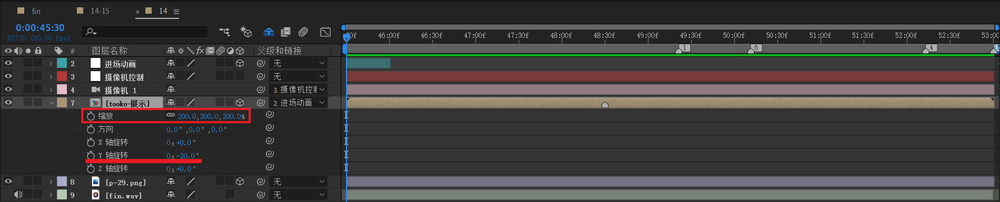
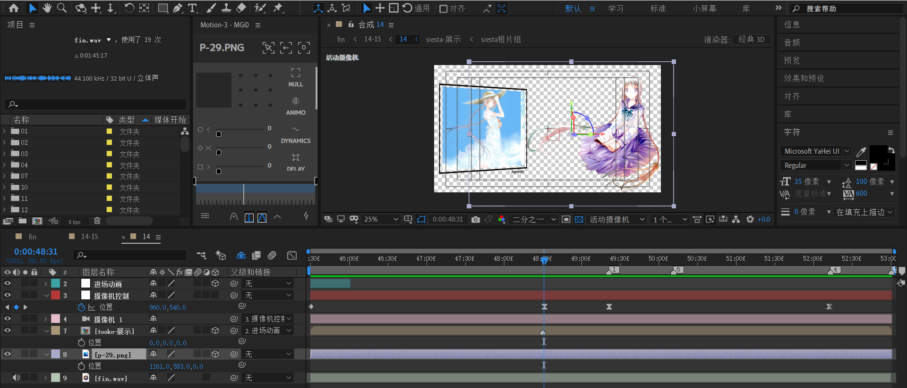
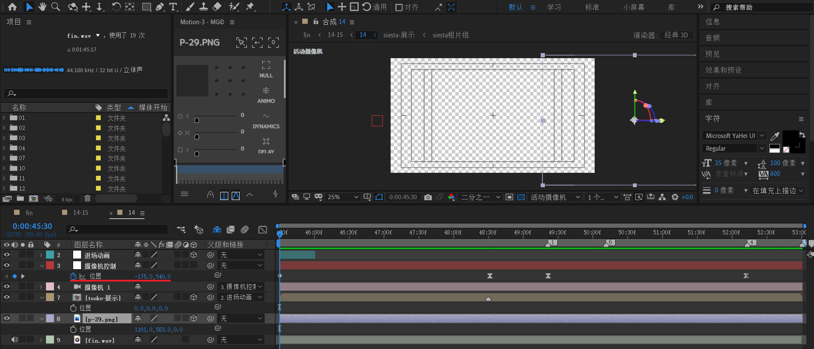
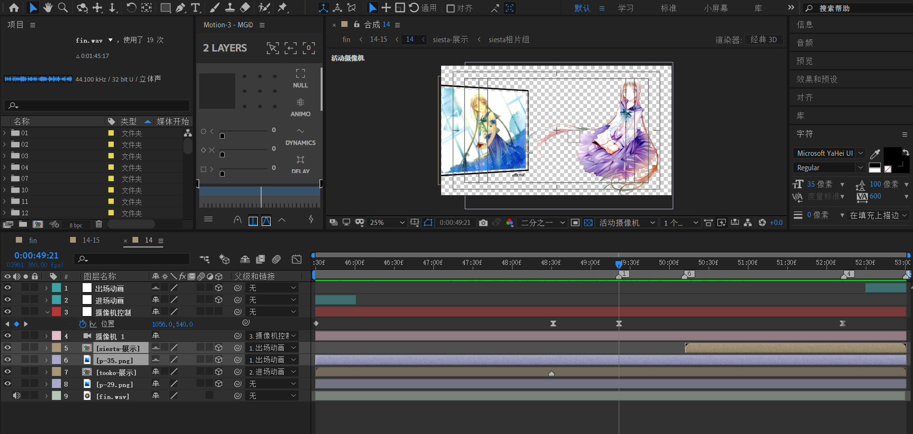
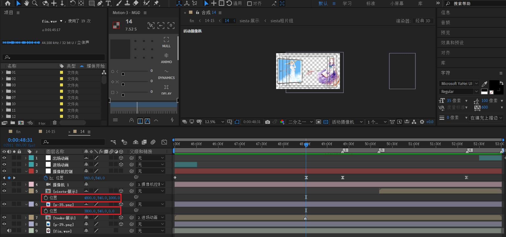
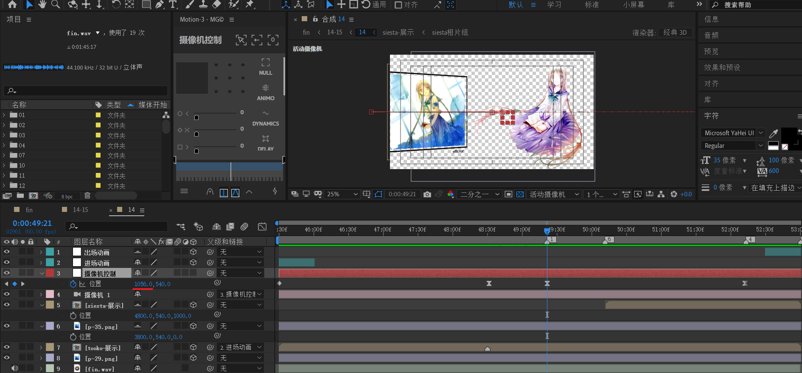
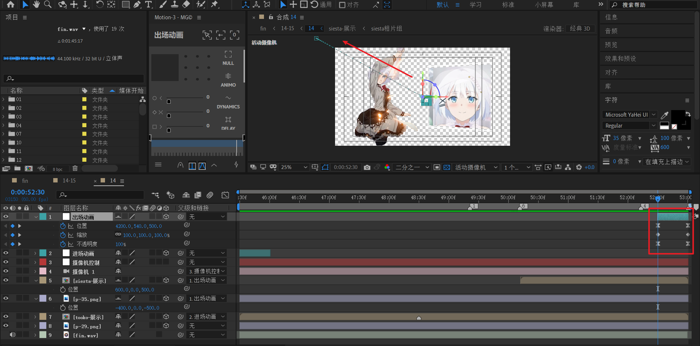

# 14

timecode 45:30-59:00

由于14和15镜头之间无明显淡入过渡，因此将14-15作为一个镜头组合成，里面再细分14和15合成。

其中：

- 14合成：45:30-53:00
- 15合成：52:28-58:59

## tooko相片组

- 新建一个等长于14合成时间的合成。合成尺寸为512 x 512。
- 将五张512 x 512 尺寸的图片导入，依次每张按30，50，50，50帧推迟排列。
- 对第2~5张图片，进行位置k帧，时间间隔为30帧，先快后慢。

这里，有个技巧。合成尺寸保证和图片尺寸一致。

## tooko展示

将【tooko相片组】打成预合成，命名为【tooko展示】，并将【tooko展示】尺寸改为550 x 650。

这里宽度和高度稍微比图片尺寸大一点，是为了预留后续描边和文字描述的空间。

- 新建五个对应文本，时间条裁剪：保持和相片组中的图片长度一致。文本为黑色。
- 然后按照每30帧进行opacity k帧。第1张淡出，第2~4张淡入淡出，第5张淡入。
- 相框：形状层，填充无，黑色描边10 pixels。

## siesta 相片组

新建一个合成【siesta 相片组】，尺寸512 x 512。时间长度2:50左右。

- 图片尺寸跟随之前的图片组尺寸。依旧是512 x 512。
- 每隔30帧推迟排列后续图片。
- 位置k 帧的时间间隔为30帧，曲线先快后慢。

## siesta 展示

将【siesta相片组】打成预合成，命名为【siesta 展示】，并将【siesta 展示】尺寸改为550 x 650。

- 新建五个对应文本，时间条裁剪：保持和相片组中的图片长度一致。**文本为白色**。
- 然后按照每30帧进行opacity k帧。第1张淡出，第2~4张淡入淡出，第5张淡入。
- 相框：形状层，填充无，**白色描边**10 pixels。

## 14

- 将【tooko-展示】放入，同时导入p-29，这个图片是扣图后的tooko，PNG格式。
- 对【tooko-展示】放大一倍，y轴旋转-20度。
- 新建35mm摄像机，并绑定空对象【摄像机控制】。
- 新建空对象【进场动画】,时间长度为30s。将tooko展示绑定到它。**这里先不处理空对象的动画属性。**我们先往下走。

---

- 在合适的位置，图中48:31处，这里确定第一组相片展示的结束帧，也就是定版动画。

回到开始时间位置

调整摄像机控制的X属性，将tooko人物放于画布右侧（不可见区域）。

---

现在，就可以开始处理【进场动画】的制作了。

先确定结束帧:

- 位置：画布中间，XY具体参数可以自己调整。z参数的变化可以控制摄像机缩放大小。

然后调节开始帧：

- 位置：画布有上角不可见区域。
- Y轴：-1x
- Z轴：1x

这里，Y轴和Z轴都旋转了一圈。

> 关于旋转组合的个人实践：XYZ轴选取2个维度，分别朝相反方向旋转1圈。这样得出的效果一般是可行的。例如：x轴1x，z轴-1x。

下面按照类似方式处理第2组相片展示。

- 将【siesta-展示】和p-35导入。
- 新建空对象【出场动画】。**这里又是先不处理【出场动画】的制作。**

这里，先来处理【siesta-展示】和p-35的初始位置问题。

它们的X轴都是画面右侧远处的区域，为将来摄像机右移动做准备。

---

下面，先处理后续的摄像机动画。

第一组相片组轻微左移。

第二组相片组进入。

最后，实现【出场动画】

思路：从画面中间朝左上角不可见区域移动。同时，缩放从100%到35%。不透明度从1到0。

预览

