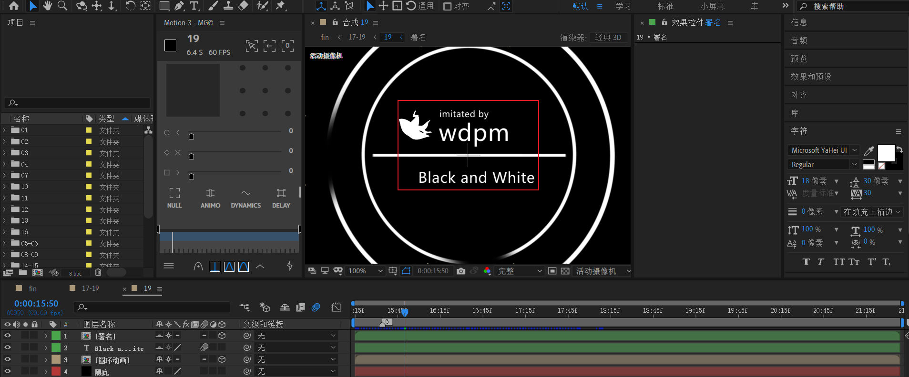
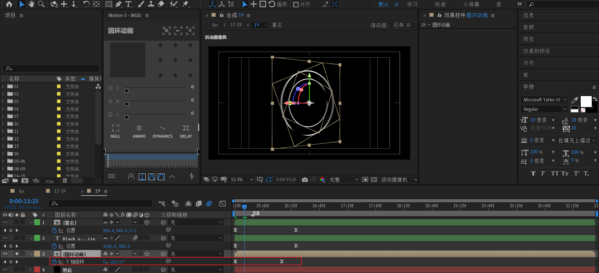

# 19 署名LOGO

> 时间码 0:01:31:30- end

进入合成19，新建一个黑底，以及新建一个等长的合成【圆环动画】。

## 圆环动画

- 新建形状层【外圆】，使用椭圆工具绘制标准圆（在画布中心处，按住ctrl+shift），填充无，描边10，白色。

- 使用工具栏中的“工具创建蒙版”来绘制一个矩形，并选择模式为相减，这样就去掉了圆环的一部分。

  

- 调整蒙版羽化，使用缺口处显得平滑过渡。

  

【外圆】做好之后，只需要复制【外圆】为【内圆】，并将缩放调小，改变蒙版位置到对角线。

中间的横线：形状层，创建矩形，保证矩形长度等于外圆直径。

---

内外圆动画：

- 外圆：Z轴从0到-2x。逆时针旋转2圈。
- 内圆：Z轴从0到+2x。顺时针旋转2圈。

中线动画：

将缩放锁定取消，X轴从0到100%缩放。

以上动画速度曲线一致，都是极致的先快后慢。

## 文本

回到19合成中，创建一个等长的合成【署名】，进入【署名】合成

- 副标题 imitated by
- 作者（仿）名称
- 图标：添加填充效果，白色。

回到合成19，新建一个文本。以中横线为分割，与【署名】上下居中摆放。

## 19动画

回到19合成。

将圆环塌陷打开，对圆环做一个Y轴逆时针旋转一圈的动画。

---

上文本从左侧X平移到中间，下文本从右侧X平移到中间。

---

最后，回到17-19合成。给19合成添加一个入场淡入。

主体工作已经完成，接下来做一下后期完善就可以了。

