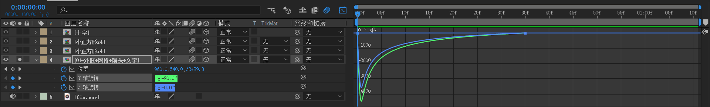
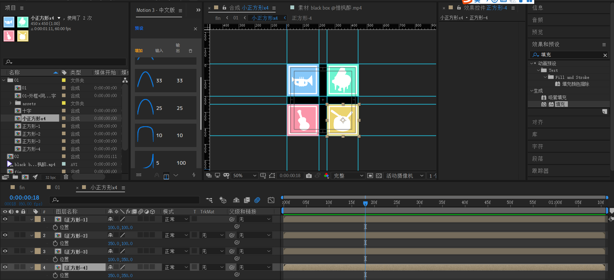

# 网格开场

> 时间码 00:00 - 01:11

## 外框+网格+箭头+文字

先制作底层背景合成。

- 【网格】使用plexus插件绘制，point render & line render。
- 【外框】正方形使用形状层实现，添加描边。
- 四个内部箭头：先绘制正方形，旋转45°，作为【内部箭头】。 然后再新建一个正方形形状层【内部箭头-遮罩】（略小），添加填充。最后给【内部箭头】应用alpha反转遮罩。
- 四个文字层【上】【下】【左】【右】，直接使用文本层实现。

该合成的关键帧。

有三个动画：

- 位置：从z=70000 到 z=0，这是一个拉远的镜头，视野变宽。
- Y轴：1x+90 到 0x+0，Y轴旋转1圈90度。
- Z轴：1x+0 到 0x+0，Z轴旋转一圈。

这三个动画关键帧都是先快后慢。可以利用motion 3插件提高编辑效率或手动调整速度曲线。参考曲线如下：

## 四个小正方形

- 小正方形x4合成为450x450大小。使用视野标尺和参考线划分区域（图中蓝色线）。
- 正方形-1，-2，-3，-4合成都是200x200大小。也即是中间缝隙宽度为50。

### 小正方形的实现

对于每个正方形，实现原理相同，下面选取正方形-1说明：

1. 新建浅蓝色纯色层，大小充满画布。
2. 将抠图处理后的png素材导入，填充白色。
3. 绘制一个略小的正方形描边。

### 小正方形的关键帧

两个关键帧：

- Z位置：从70000到-500，注意这里是-500，因为四个小正方形应该位于背景合成(Z=0)的上面。
- Z轴旋转：从320°到0°。

注意：这里最好使得背景和小正形的旋转角度错位，也就是旋转角度不一致。这样才不会过于死板。

> 通过设置上面的Z轴初始角度为320°，和调整Z轴旋转的速度曲线来保证和背景旋转角度错位。

### 小正方形x4的关键帧

将小正方形x4合成在01合成中间打断（ctrl shift D）

两个关键帧：

- 位置：从z=-500到z=-2600左右。
- z轴旋转：从0到90°左右。

## 缝隙的十字

下面制作小正方形x4缝隙的十字。

拉出参考线和标尺，划分大致位置。

新建两个纯色层，适当调整大小，并绘制mask，使用mask羽化来平滑过渡边缘。

### 十字的关键帧

- 使用表达式将十字合成的position和z轴旋转绑定到小正方形x4合成。

> 请留意你使用的AE语言，截图使用的是AE中文语言版本。windows 10系统下配置路径一般位于：
>
> C:\Program Files\Adobe\Adobe After Effects 2020\Support Files\AMT\application.xml
>
> 该部分`<Data key="installedLanguages">zh_CN</Data>`表示语言配置。

- 缩放从0到100。速度曲线缓入缓出，不需要剧烈加速。

## 预览

> pdf 版本中，该动态GIF图片不能正常显示。

## 小结

- plexus快速制作带点的网格线。
- AE表达式绑定某一个图层属性到其他图层的属性。