# 10 天台球

## 方法论

在进行合成10的实现之前，我们先谈一下实现策略。下面我将借鉴软件工程的实践理论来进行迁移实现。

> 在软件工程中，有两个专业术语。自上而下(Top-Down)和自底向上(Bottom- Up)。
>
> - 自上而下的分析，代表着，从粗略大概的模块设计开始，逐步细化实现，直到最细节的部分实现完成。
> - 自底向上的实现，代表着，从底层的可运行模块开始，逐步拼接组合模块，直到最上层的目标模块（整体）实现。
>
> 这两种方式都是可行的方法论。具体使用哪一种，取决于具体情况和个人喜好。
>
> 不管你有无意识到这些理论，他们都客观存在着。不管采取哪种方法理论，最终殊途都是同归的。

类比到AE工程中：

- 如果你经常新建空的预合成，然后再往里面实现，那么就是自上而下。
- 如果你经常在一个合成中新建很多图层，先把效果做出来，然后再将逻辑相关的层打成预合成，然后整理项目，那么就是自底向上。

简洁一点：

- 如果你喜欢先实现，然后再抽取预合成，那么就是自底向上。
- 如果喜欢先概要设计，先明确目标(使用占位合成)，然后再考虑效果的实现，那么就是自上而下。

---

在合成10中，我们将结合这两种方式：

**自上而下的分析**

合成10主体是一个球，这个球由很多圆环组成，而圆环由很多面组成。

**自底向上的实现**

先实现面，然后实现圆环，复制多层圆环来实现球。

## 实现

### 合成10初始化

合成10的时间码为24:00-29:00


新建空合成【球体运动】，时间长度也是24:00-29:00


### 【球面基础】

时长1s左右

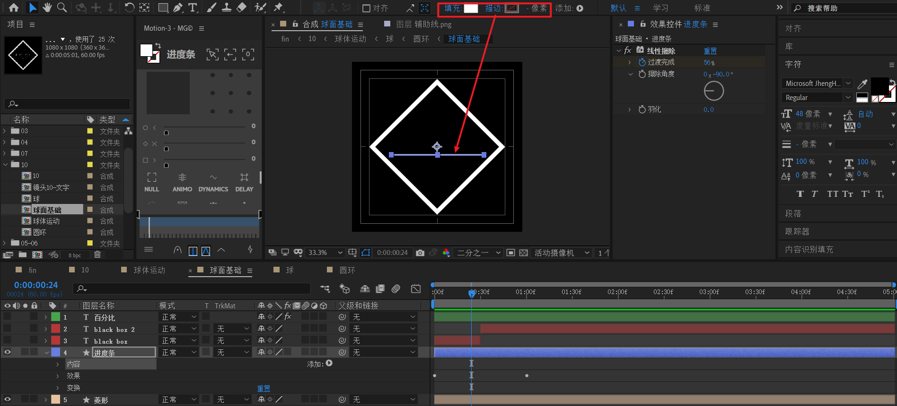

- 外层白色菱形：使用形状层绘制正方形，旋转45度。白色描边，填充无。
- 内部进度条：使用形状层绘制小矩形条，白色填充，描边无。

---

接下来，制作进度条动画：

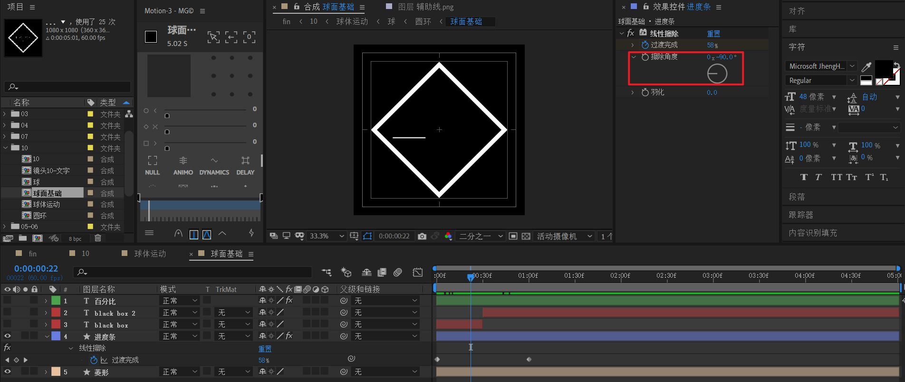

- 给【进度条】层添加【线性擦除】效果，将擦除角度改为-90度。开始帧过渡完成为80%，结束帧过渡完成为20%。这个80%和20%取决于【进度条】的初始宽度，具体情况请适当调节。

---

下面制作文字闪烁动画：

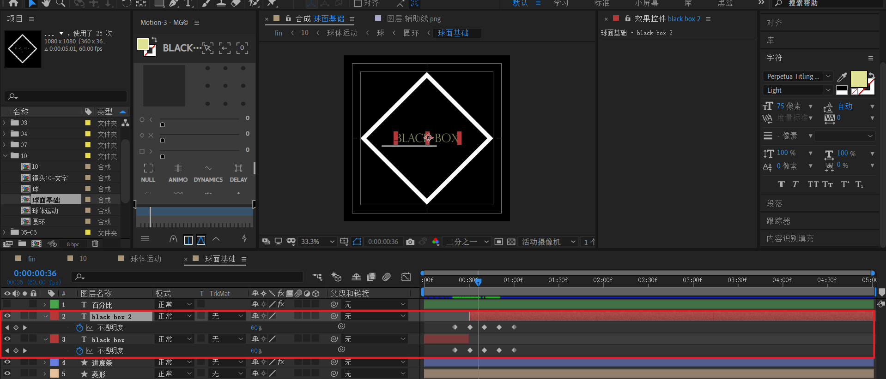

新建一个文本层，在合适位置对opacity k帧：

- 100% -> 0% -> 100% -> 0% -> 100%

使用ctrl shift D将这个文本层打断，修改新的文本层颜色。这样就能制造文本闪烁变色效果。

---

最后，制作进度条百分比显示：

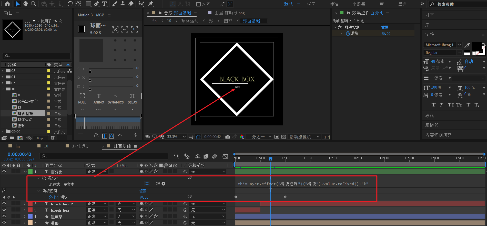

新建文本层，添加【滑块控制】效果，k帧从值0到100.

对源文本进行表达式：

```js
thisLayer.effect("滑块控制")("滑块").value.toFixed() + "%"
```

式中，.toFixed() 表示取整，也就是不要显示小数点。

### 【球体运动】初始化

当【球面基础】完成后，可以先处理开头这个简单的进场动画。

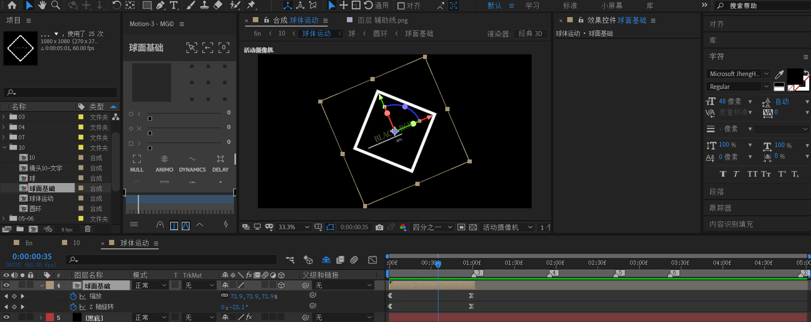

将【球面基础】合成放入【球体运动】，左对齐时间轴。动画为一个缩放+ z轴旋转的进场。

- 缩放：从0到100
- Z轴旋转：从-90到0

速度曲线。也就是给一定的初始速度，然后缓动即可。


### 【圆环】

现在，将开始从面到环的实现。

这里，将采取24个面组成一个间隔相等的圆环。间隔角度为360/24=15度。

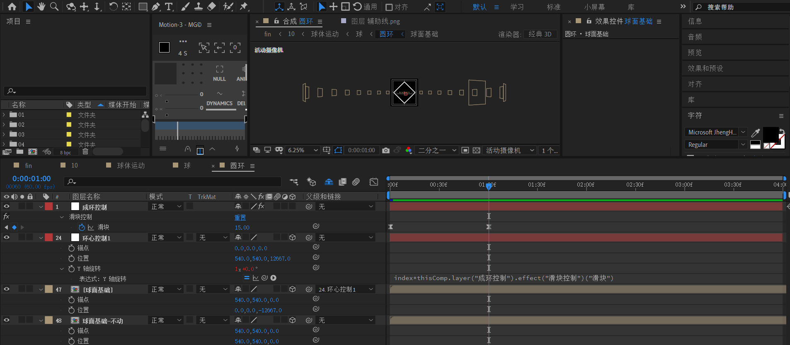

下面将一步一步讲述如何实现：

1. 将【球面基础】放入【圆环】合成，命名为【球面基础-不动】，将锚点和位置改为(540,540)

2. 复制【球面基础-不动】为【球面基础】，后面备用。

3. 创建空对象【成环控制】，添加滑块控制，从0到15。速度曲线为急剧的先快后慢。

   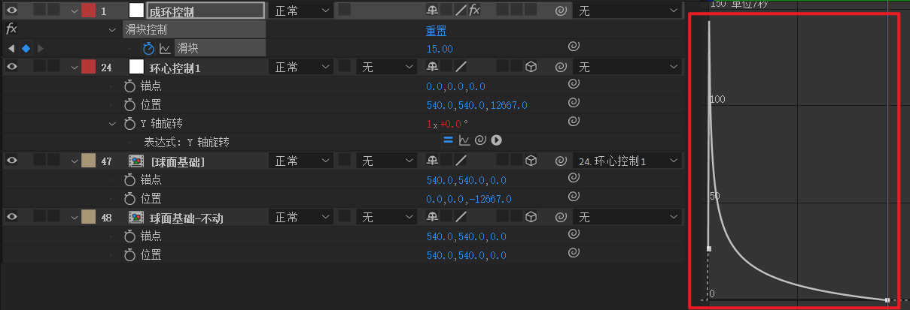

4. 新建空对象【环心控制1】，将锚点和位置改为

   

   注意位置z=12667，这个12667是圆环的半径，也是后来的球的半径。
   > 这个值的具体计算原理可以参考bilibili up@ 月谷诗林的仿black box 专栏笔记。这个值不是绝对的，只是一个合理值。

   此外，注意这层index为24，表达式

   ```js
   index*thisComp.layer("成环控制").effect("滑块控制")("滑块")
   ```

   就为24*区间[0，15]。也就是在[0,360]度之间。

5. 最后，将【球面基础】父连接到【环心控制1】。

   > 如果仔细观察，就会发现上面其实隐藏了图层2-23，一共22层以及图层25-46，一共22层。这是刻意为之。
   > 这些图层其实就是副本图层，下面会进行讲解。

将【环心控制1】复制为【环心控制2～23】，也就是环心控制为1-23层。


将【球面基础】复制22次，一共形成23层，【球面基础】为25-47层。注意修改对应的父连接。

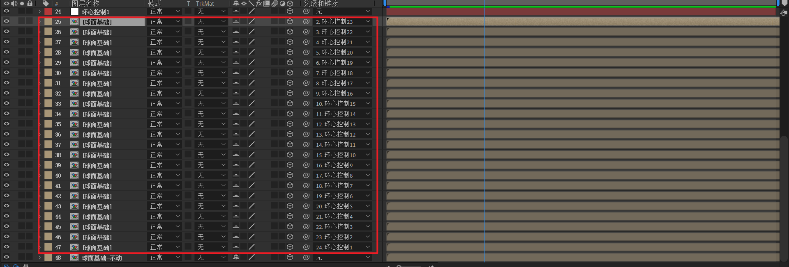

圆环大致效果如下


### 【球】

【圆环】完成后，就可以考虑如何制作球了。这里，采取球心固定，复制圆环副本，并对圆环副本在X轴逐渐旋转15度的方式来实现。

请结合下图进行进行想象，一开始中间截面只有一个圆环，逐步旋转15度，一共有24层 x 15度，保证覆盖一个球。

> 读者可能的疑惑：这种旋转方式，会有大约一半的圆环重合。这是事实。

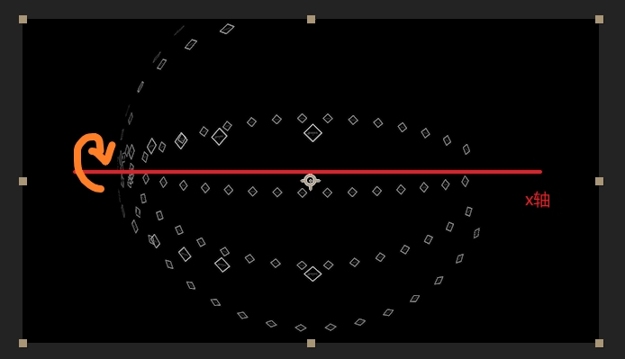

下面开始实现

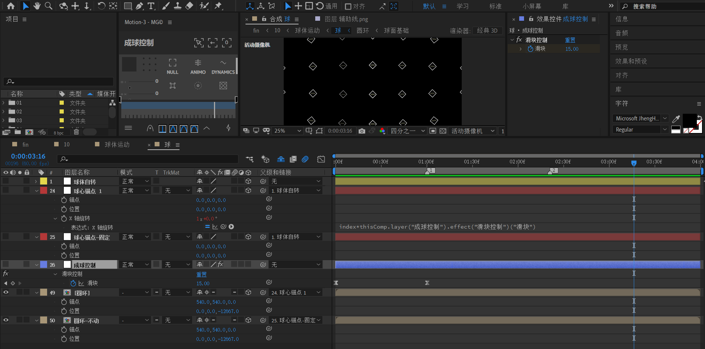

1. 将【圆环】合成放入【球】合成，重命名为【圆环-不动】。先将锚点改为（540，540）。然后将位置改为（0，0，-12667）。这里，12667这个值就是球半径。
2. 新建空对象【球心锚点-固定】，锚点和位置全部置0。然后将【圆环-不动】链接到【球心锚点-固定】。

3. 对于【圆环】和【球心锚点1】，分别是复制【圆环-不动】和【球心锚点-固定】形成。

4. 新建空对象【成球控制】，添加滑块效果，k帧从0到15。速度曲线如下

   

5. 注意到上面【球心锚点1】index为24。是为了24 * 15= 360度形成封闭。

   

6. 下面开始处理球体自转动画。新建空对象【球体自转】

   

   X轴 k 帧：从0 到2x 到 1x +270度。也就是先旋转2圈，然后朝之前旋转的反方向旋转90度。

7. 对于上图的隐藏层 2-23 和 27-48，分别是复制【球心锚点1】和【圆环】。

效果预览

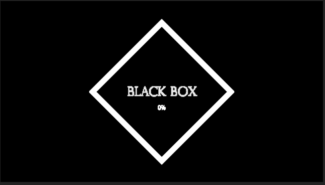

### 【球体运动】黑白对调

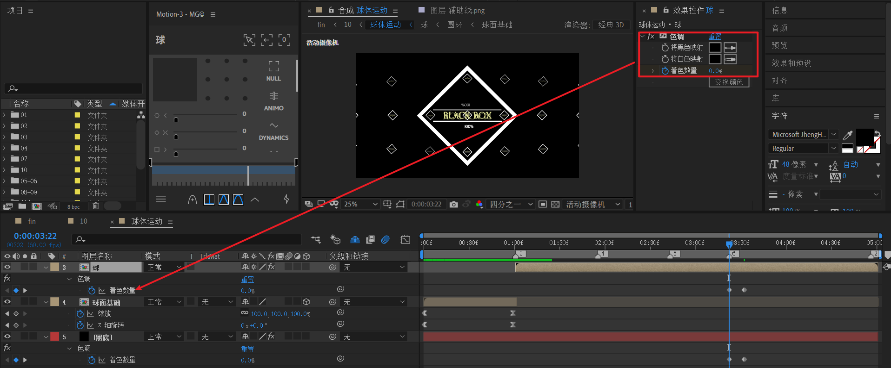

将【球】放入【球体运动】。在需要进行黑白对调的时间点，进行标记，图中为标记6。

- 对【球】：添加色调，黑白都map到黑，从0到100%
- 对【黑底】：添加色调，黑白都map到白，从0到100%

### 摄像机动画

下面处理摄像机动画。


新建35mm摄像机，并新建空对象绑定。先做一个Z轴从0到-45的旋转线性动画。

然后考虑摄像机位置动画。

第一段关键帧动画：从左上角逐步缩小到中间。

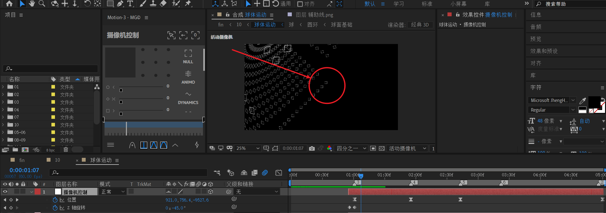


k 帧，从（960，540，0）到（960，540，-40000)。明显，这是一个拉远的镜头。

---

第二段关键帧动画：从中间放大回左下角。


k 帧，从（960，540，-40000）到（2500，-8000，-5000)。这个值不唯一，只要保证是左下角即可。这是一个推近的镜头。

---

第三段关键帧动画：从左下角稍微缩小。

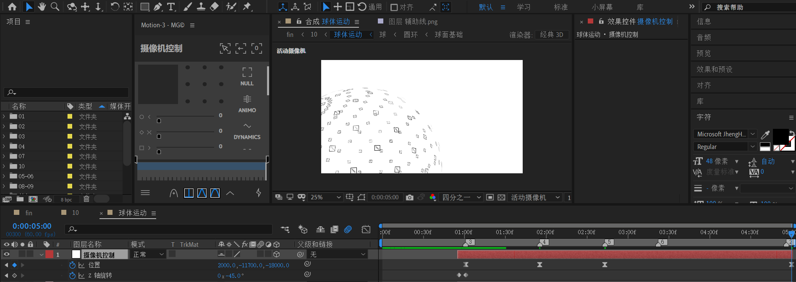

k 帧，从（2500，-8000，-5000) 到（2000，-11700，-18000）。这个值不唯一，只要保证是稍微缩小即可。这是一个拉远的镜头。

---

速度曲线调整，图中两个点注意提升，不要为0。


效果预览


### 镜头文字

回到10合成，在画面变白结束后，选一个时间点。新建一个合成【镜头10-文字】

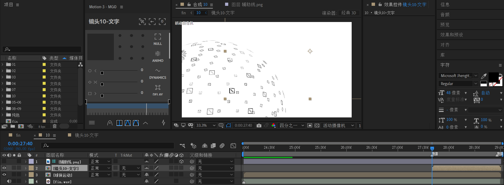

进入该合成。

新建两个文本。先确定结束帧

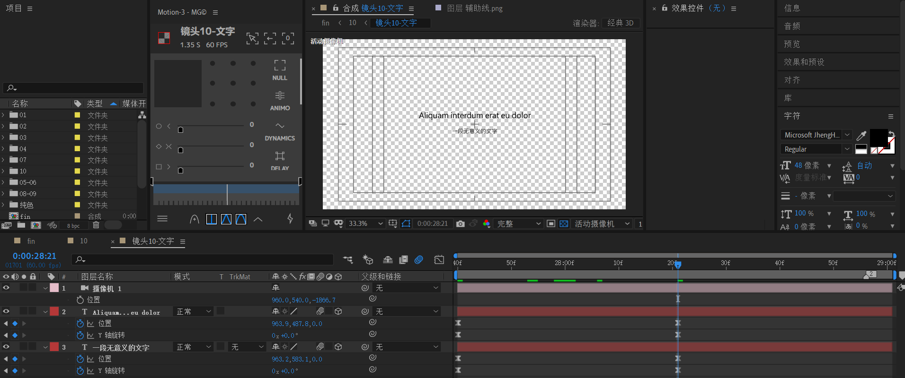

然后回到初始帧位置，将位置改为z=-2000。 y轴旋转改为1x。

也就是，这里是一个y轴旋转一圈，不断缩小的文字进场动画。

新建摄像机。保证z=-1800左右。这样初始帧就不会看见文字。


回到合成10，将辅助线放入，确定文本位置，拖动【镜头10-文字】到红圈位置。最后隐藏辅助线。

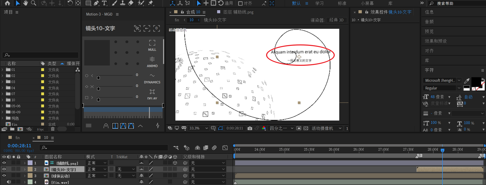

### 合成10预览


## 小结
- 一个球体的实现，可以分解为环，然后将环分解为面。