# 15 代码空间

新建一个白底。

## 中间文字

### 整体右侧进入

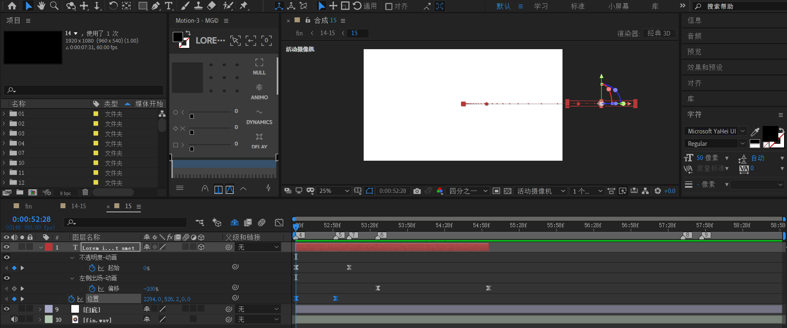

新建文本层，文本锚点定于自身中间。然后对位置k帧，从右侧进入画布中间。

### 文字逐个出现

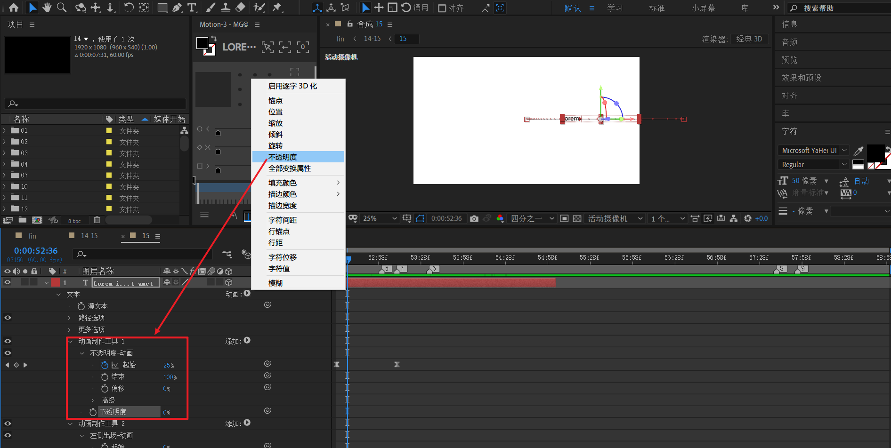

展开文本，动画添加【不透明度】，生成红框区域。

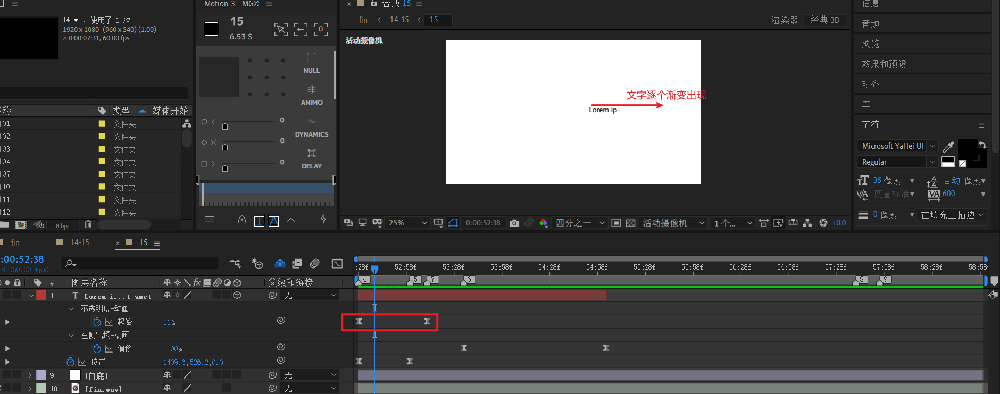

对起始k帧，从0到100%。曲线先快后慢。这样就能产生文字逐个平滑出现的效果。

### 文字逐个消失

下面制作文字的消失动画。文字是逐个从左侧平行飞出。

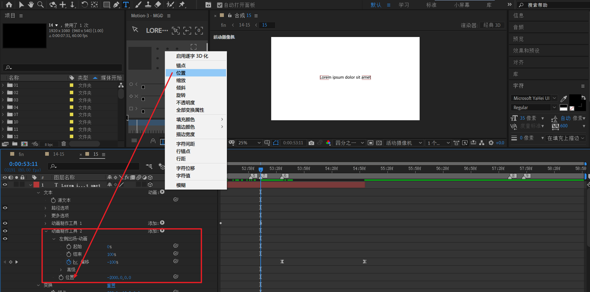

展开文本，添加第二个动画【位置】，生成红框区域。

- 位置设置为-2000。符号为负表示向左运动，指代的是运动方向；2000这个绝对值表示运动幅度，也就是平移的距离。

  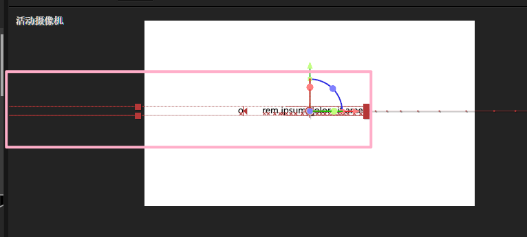

- 对偏移量k帧。偏移量从-100%到0。-100%表示从左侧第一个文字L开始向左飞出。

  > 而100%表示从右侧第一个文字t开始向左飞出。这里不需要。

  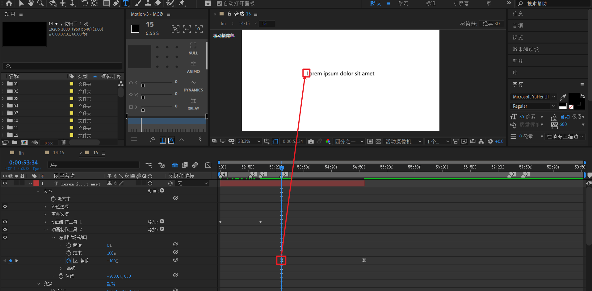

## 文字雨

### 文本层特殊处理

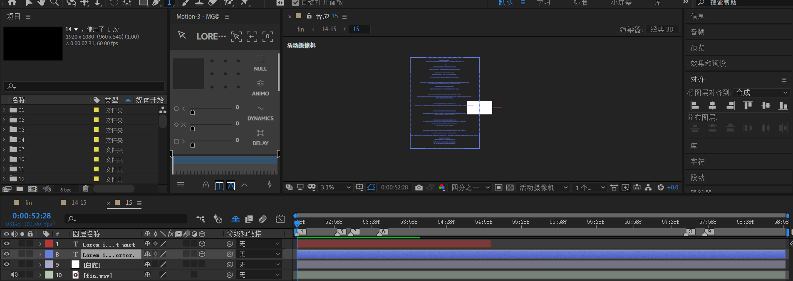

新建一个文本层。这个文本层需要特殊处理，有以下关键点：

- 文字大小为35像素。

- 文本分为十个段落左右，**文字总量非常大。**
- 文本排版为垂直居中。VA字符间距很大，参考值600。字符行距也稍微变大一点。**这些都是为了撑大文本区域空间。**

### 文本区域整体的动画

下面开始处理**文本区域整体的动画**。

初始位置设置在画布左侧，稍微暴露一些文字。

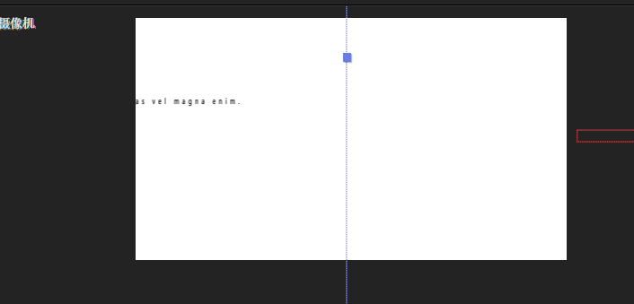

初始位置缩放版，方便理解全局位置。图中蓝色框。

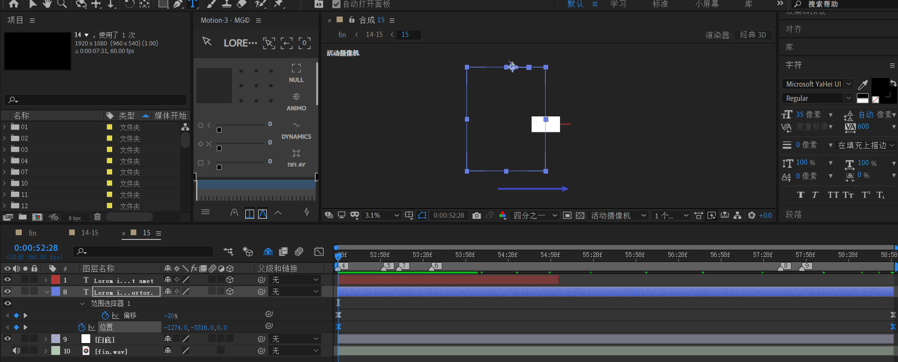

结束帧位置。注意：**位置移动幅度不能过大。否则下面要制作的文字飞舞拼贴效果会过快**。

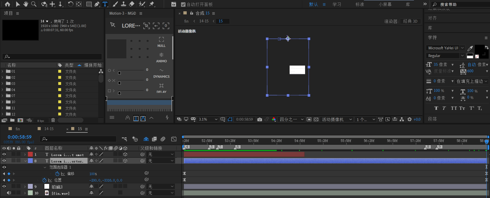

### 文本区域内部字符的动画

下面开始处理**文本区域内部字符的动画**。

展开文本，动画添加【位置】，生成红框区域。

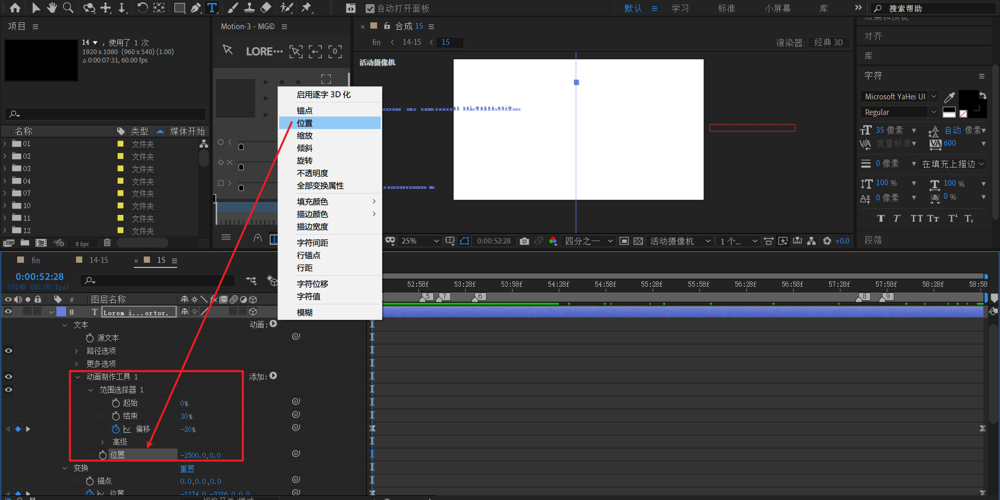

- 位置设置为-2500。
- 结束属性设置为30%。

- 偏移量，从-20%到100%。

- **高级设置中，将随机排序打开，形状改为上斜坡，数量削减为30%**。

  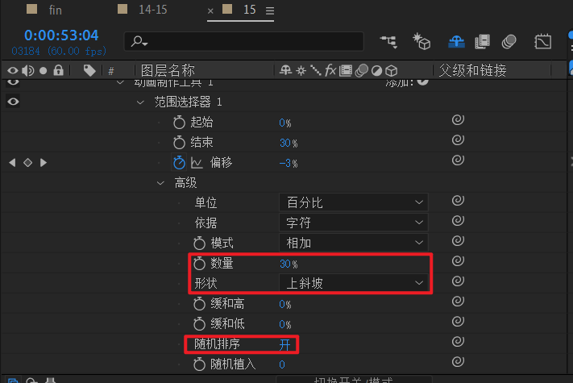

效果预览

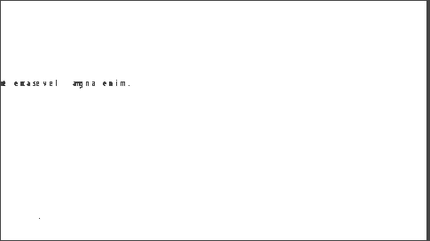

这样，第一个文字雨模板就制作完成了。接下来，可以利用复制-调整的方式快速制作其他文字雨。

### 2个竖着的文字雨

将之前的文字雨复制一份，将初始位置z变为-1800，形成黄色图层控件显示的文字雨。

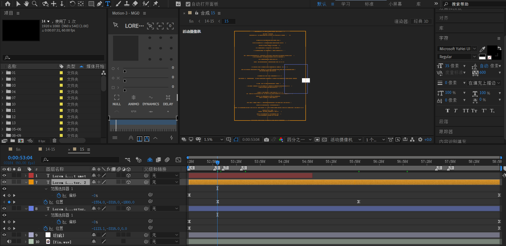

接着，稍微对位置属性做一个图示的朝右下角平移。

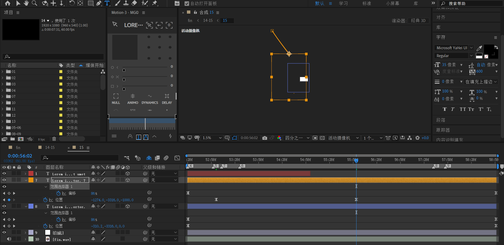

这步目的是为了使用相似的稍微大尺寸的文字雨，填充画布。

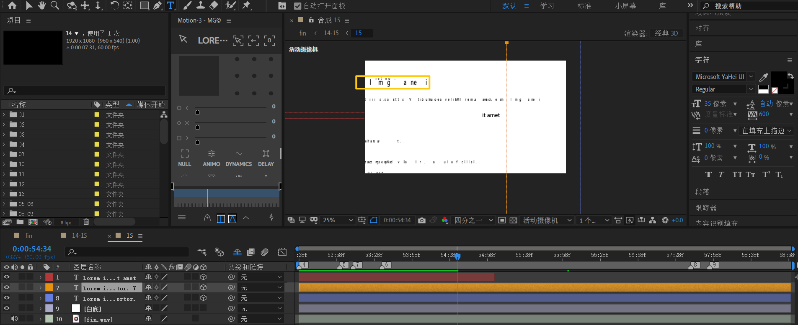

### 3个横着的文字雨

上面两个都是一开始竖着的文字雨。下面要制作3个横着的文字雨。

将之前的文字雨复制3份。z轴分别改为2000,3000,3500。XY位置拖放如下图所示。稍微错开，重叠部分大体是画布区域。

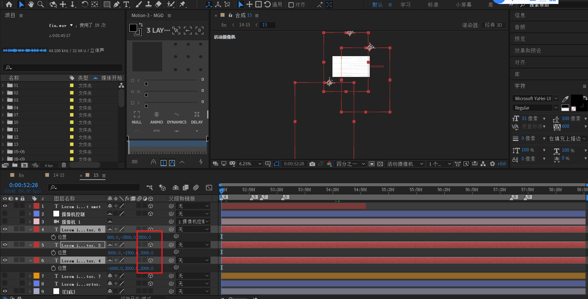

然后将这3个文字雨都改为X轴旋转-90度。

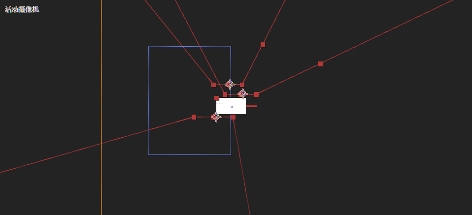

将之前的位置动画都删掉。仅保留字符动画。

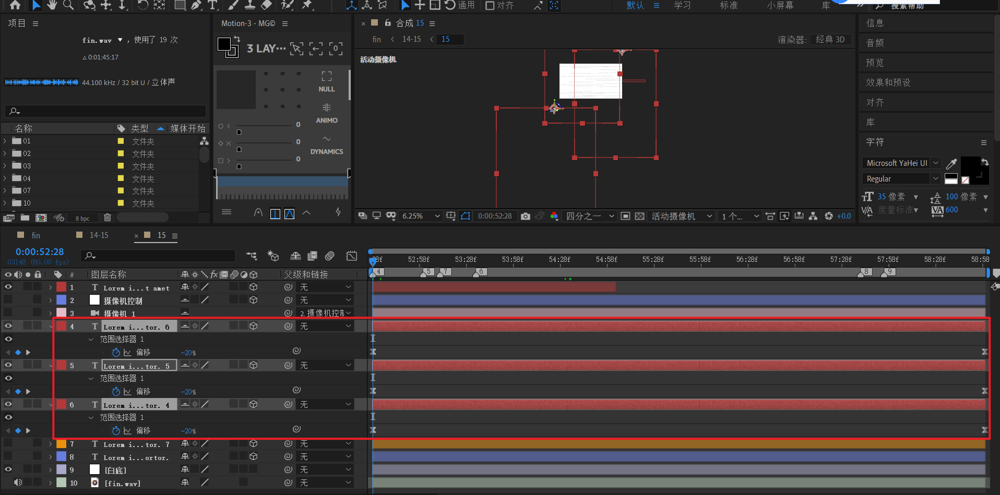

### 摄像机动画

下面考虑摄像机动画。

对于位置属性：

- 下移。这段代表文字雨【蓝】【黄】下移。

  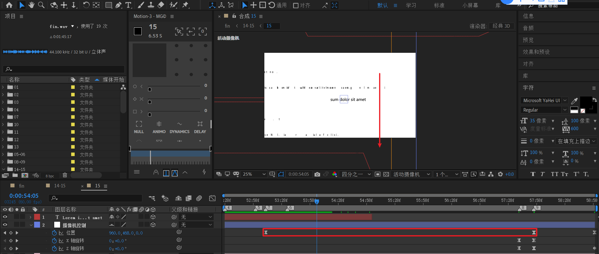

- 上移。这段代表文字雨【红】上移。

  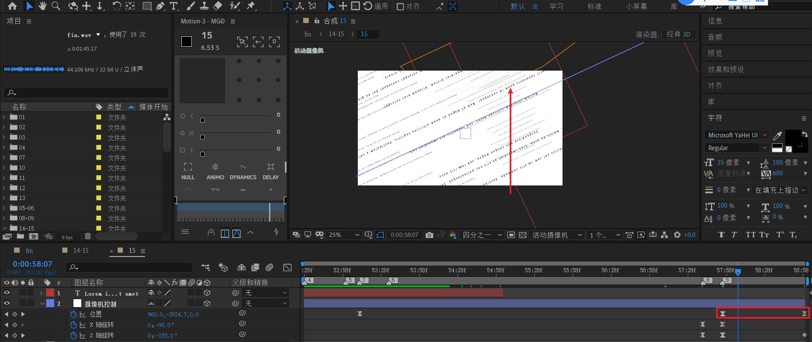

对于旋转属性：

- x轴旋从0到-90度。由于此时摄像机和文字雨【红】X旋转都是-90度。此时，文字雨【红】回到视觉上的正面。

- z旋转从0到-150度。

  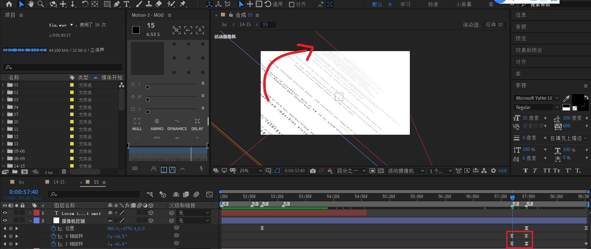

- 最后z从-150到-180。

  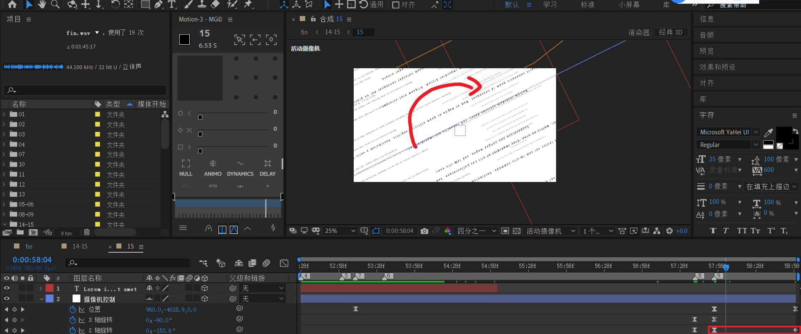

速度曲线

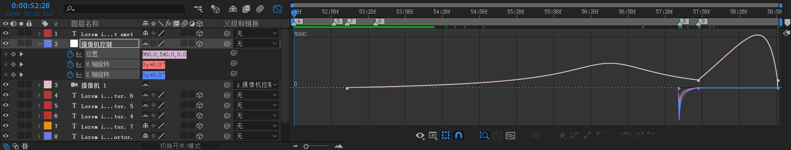

### 15 预览

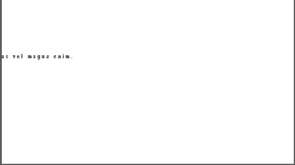

## 14-15

### 黑白对调

回到14-15合成。

新建白色纯色层【黑白变换背景】。添加色调。将黑白map到黑。

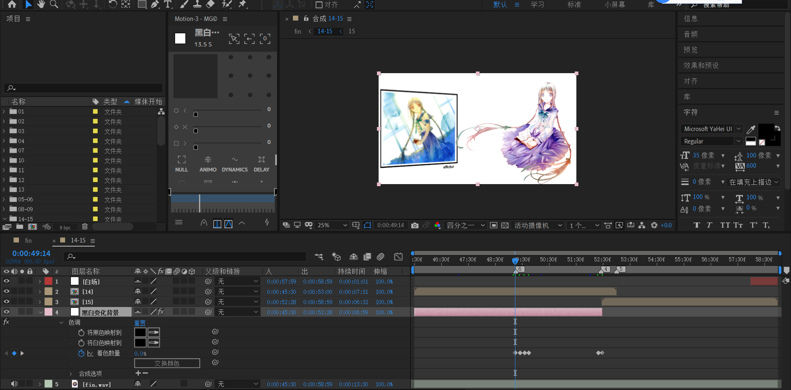

在第一组相片展示结束后，每10帧间隔k帧：0 -> 100 -> 0 -> 100。形成白- 黑-白-黑的变化。

在第二组相片展示开始前，每10帧间隔k帧：100 -> 0 。形成黑-白的变化。

---

最后，结束位置做一个白场淡出。

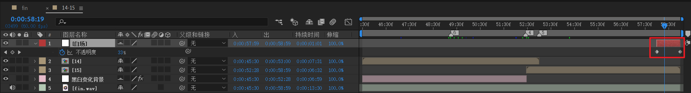

### 14-15 预览

## 小结

- 文字层：添加不透明度动画，对起始k帧，可以创建文字逐个出现的效果。
- 文字层：添加位置动画，对偏移k帧，可以创建文字逐个消失的效果。
- 文字层：添加位置动画，对偏移k帧，设置"随机排序"，可以创建文字随机出现的效果。
- 将文本层字符间隔和行距拉大，可以增大文本层空间。
- 当摄像机和文字雨旋转角度一致时，此时文字雨对于摄像机来说，就是常规的正面角度。