# 17 螺旋花

> 时间码 1:16:15-末尾 为【17-19】合成。

## 合成切分

在【17-19】合成中创建【17】合成，时间范围：1:16:15-1:23:22

在【17】合成中新建【17-主体】合成，主要用于制作形状层动画。文字层先忽略不管。

在【17-主体】合成中新建合成时间长度为2:09左右的合成【箭头】，补一个黑底。

## 箭头

### 方块

1. 打开安全框辅助参考。
2. 新建一个形状层【方块】，绘制正方形，旋转45度。填充白，描边无。
3. 将素材LOGO放入方块居中位置。并绑定到方块。

### 箭头"<"

然后开始制作箭头"<"

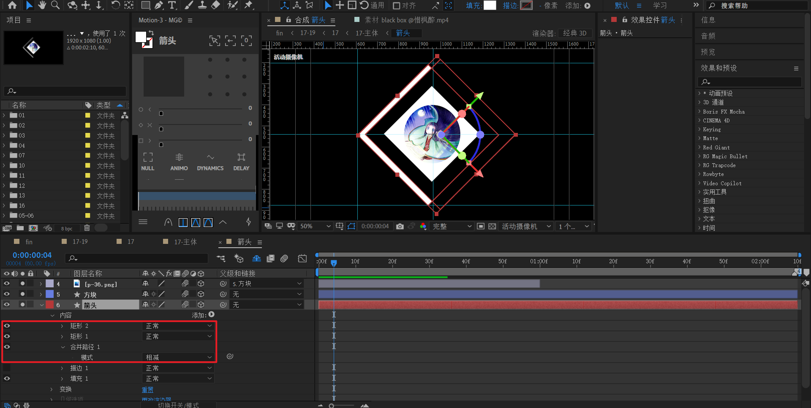

1. 将上面的【方块】复制为【箭头】，适当放大。
2. 展开内容，将矩形1复制为矩形2，然后将某个矩形稍微往右偏移一定距离。
3. 添加合并路径，模式改为相减。这样，就等于左侧矩形减去了两个矩形的交集部分。从而得到一个箭头。

### 方块文本和内边框

下面制作方块文本和内边框。

1. 将之前的【方块】复制为【线框】。适当缩小。填充无，描边5像素。
2. 新建两个文本，字体一大一小。
3. 三个图层全部绑定到【方块】。

### 动画

最后，制作动画。

选中【方块】合成，在合适位置打上Y轴从0到1x的旋转帧。速度曲线先快后慢。

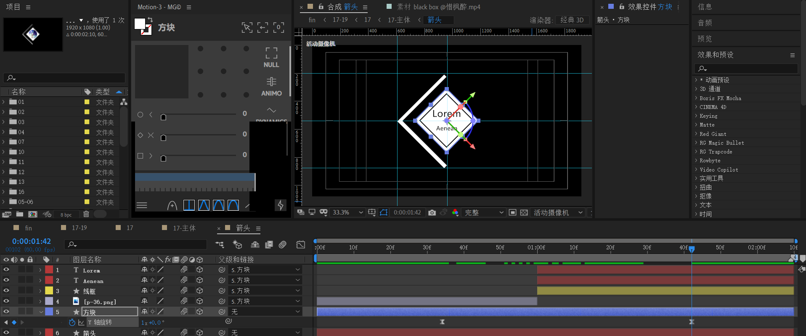

## 螺旋花

### 圆心

在【17-主体】中创建等长的合成【螺旋花】，尺寸为3000x3000。

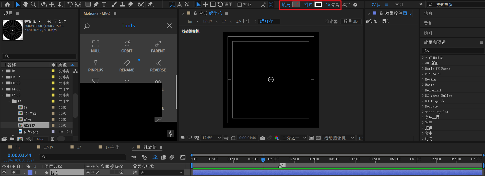

1. 使用形状层的椭圆工具，在中心处按住ctrl + shift 键新建一个标准圆。
2. 填充无；描边16像素，描边为白色。调整缩放，尽量小一点。

### 弧线

下面制作弧线。

1. 创建白色纯色层，充满画布，也就是3000x3000。不透明度改为40%左右，于是变为灰色。
2. 绘制第1个mask：使用椭圆工具画一个标准圆，直径为3000。模式改为相减。图中红色图层控件。
3. 绘制第2个mask：使用钢笔工具绘制一个类似扇形的叶子。图中黄色图层控件。
4. 给Z轴应用表达式：`(index-1)*15`。也就是计划使用360/15=24层来形成一个圆。

最后，将【白色-3000】复制为一共24层。可以使用重命名插件辅助快速重命名（示例中使用motion 3）。

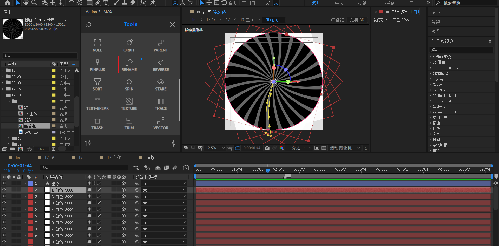

## 17-主体

### 【箭头】合成的动画

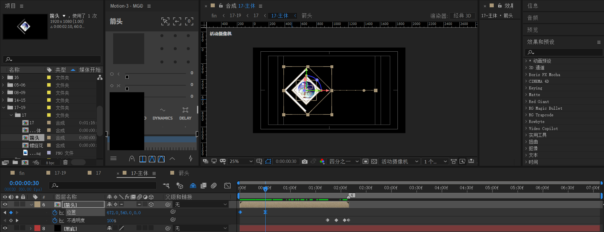

- 位置动画：从右侧进入到左侧，整个过程都在安全框区域内。速度先快后慢。
- 不透明度动画：100 -> 0 -> 100 -> 0。这里最后的100->0这个组时间跨度稍微短一点，也就是第二次消失时感觉消失得更快了。

### 文本层

新建一个文本层。并将结束帧位置放于右侧，与【箭头】的y轴平衡。将文本绑定到【箭头】，从而跟随【箭头】运动。

### 【螺旋花】的动画

将【螺旋花】合成导入，并在大约1:15处使用alt + [ 修剪掉左侧部分。

它的入场动画是：缩放进入，z轴旋转一周，方式为淡入。

于是，创建关键帧：

- 缩放：从0到100%
- z轴旋转：从-1x到0。由于是数值增加，所以这里为顺时针旋转。
- 不透明度：从0到70%。这里不是到100%，因为后续还存在关键帧。
- 以上速度曲线都是先快后慢，保持一致的变化速率。

预览一下，目前制作进度到这里了。

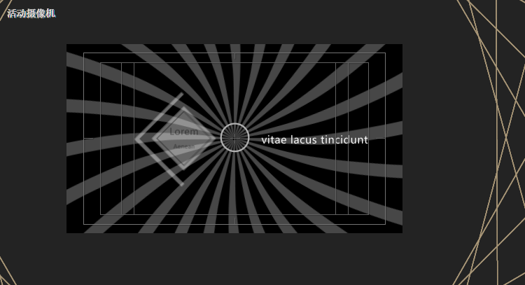

### 摄像机动画

接下来，需要考虑摄像机的加入了。

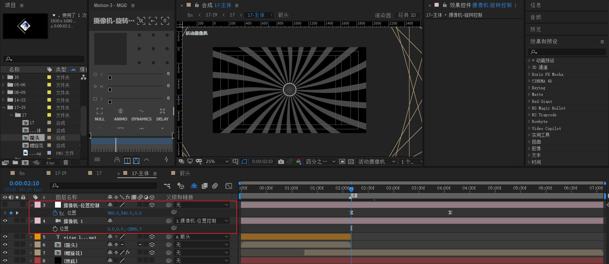

新建35mm摄像机，并绑定到空对象【摄像机-位置控制】。

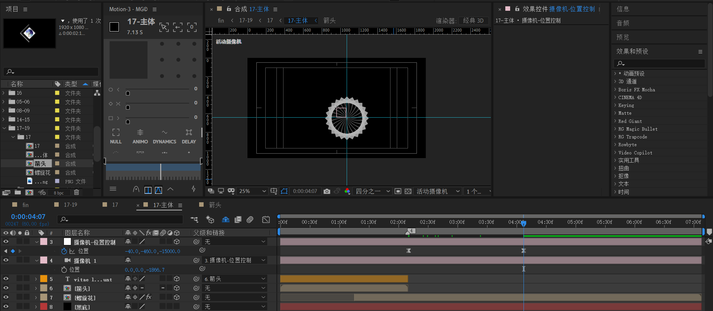

接着，对位置k帧：我们的目标是让镜头拉远，同时螺旋花移动到中心点稍微偏向右下角的位置。

这里，给出参考值：从（960,540,0）到 （-40，-460，-15000）。

### 白色射线

下面开始制作白色射线。

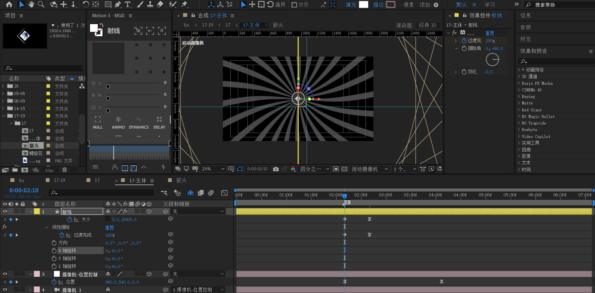

1. 新建形状层，添加矩形。将矩形初始大小改为 5 x 20000。
2. 添加线性擦除效果，擦除角度为90度，初始擦除为100%。

制作关键帧

在大约30帧之后，打下结束帧：

- 大小：100 x 20000。也就是长从5变为100。
- 过渡完成：值为0%。对齐上面的关键帧。

此时，注意到这个射线的方向不正确。它应该垂直于螺旋花。

于是，将预览视图改为左侧，这样方便观察。将x轴旋转改为+90度。此时它就垂直于螺旋花了。

回到活动摄像机视图。**发现这个射线向右下角生长了。而我们的目标是向左上角生长。**

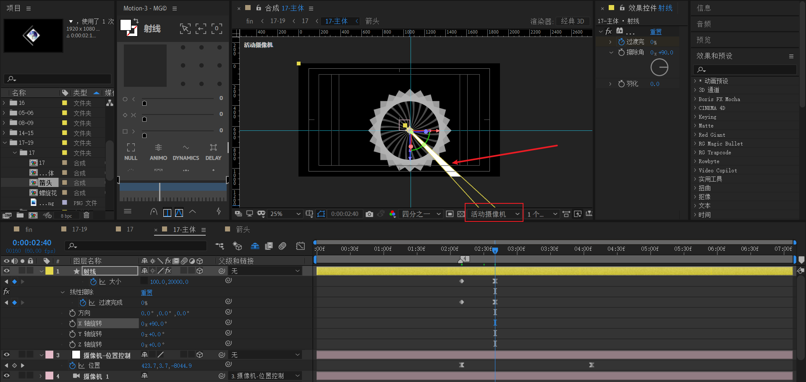

此时，**我们需要调整摄像机的角度来使得射线向左上角生长。**

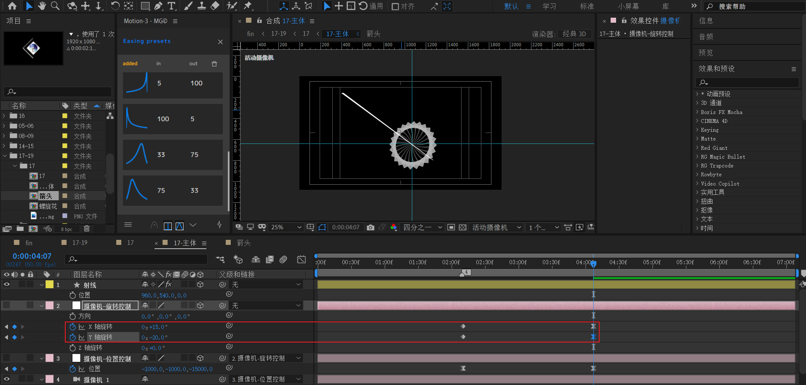

新建空对象【摄像机-旋转控制】，将【摄像机-位置控制】绑定到它。一番调试过后，发现当（X，Y）旋转角度为（+15，-20）时，达到目标。

此时只要补上初始关键帧即可。初始关键帧（X，Y）旋转角度都是（0,0）。

此时，虽然射线方向对了。**但是又有2个问题：**

- **射线长度不够长。**
- **由于调整了摄像机XY角度，螺旋花看起来有一点旋转，不再是完美平行屏幕了。**

我们逐个来修复问题。先处理第一个射线长度问题。

解决方法：将射线z改为-10000。

**分析：这是因为摄像机的Z在结束帧是-15000。如果依旧射线z为0，那么相对于摄像机而言，距离太远了。所以看起来射线很短。**

**将射线z的值减小，变为负值，相当于在向摄像机靠拢，此时摄像机观察到的就是比较长的射线了**。

---

接下来，要解决第二个问题：螺旋花的旋转角度校正。

解决方法：将摄像机角度XY旋转角度属性复制到螺旋花。

> 注意：复制关键帧时，保证从【螺旋花】的04:07处（图中红色垂线处）开始复制。保证对齐。

**分析：将摄像机角度XY旋转角度属性复制到螺旋花，它们之间便不存在任何XY旋转角度差值。对于摄像机来说，螺旋花的XY旋转角度就会重置回之前的状态。**

### 生长的曲线

好了。下面可以开始制作生长的曲线了。

先理清制作思路：

1. 创建四个点光源，位置摆放为上下左右。
2. 将四个点光源绑定到空对象。
3. 创建纯色层，添加particular粒子效果，调整粒子参数使得粒子变成点，并且跟随点光源。
    - 对particular粒子size进行k帧，实现size的增大效果。

4. 对第2步的空对象进行k帧，实现路径生长的效果，伴随放大和旋转效果。

---

下面开始实现。

1. 新建四个点光源，白光，强度设置60%，这是为了契合整体灰色的色调。统一命名为”灯光A [数字]“的格式，例如灯光A 1。
2. 调整位置摆放如图所示，具体操作：以中心点为参考，分别向上，向下，向左，向右移动相同距离。这里距离是250。
3. 保持所有灯光z轴都是0。
4. 新建空对象【灯光路径控制器】，将上面四个灯光绑定到它。先忽略图中的位置k帧。

新建纯色层，添加p粒子效果。这里给出粒子关键的参数。

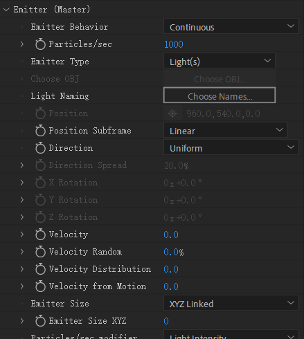

Emitter:

- 发射行为为持续。

- 发射速度为1000。

- 发射类型为Light(s)。

- Light naming为：灯光A。

  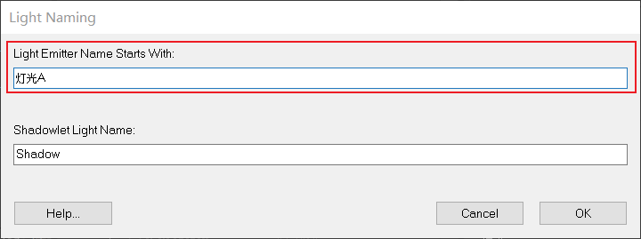

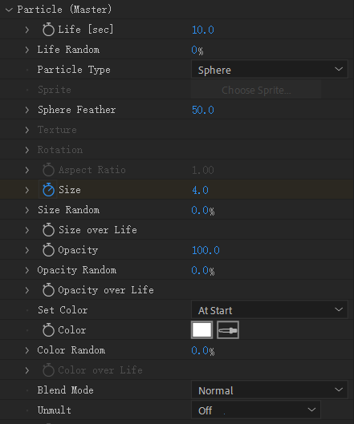

Particle：

- 生命设置为10
- 粒子类型设置为Sphere。
- Size初始帧为4.0。

---

对粒子层k帧。

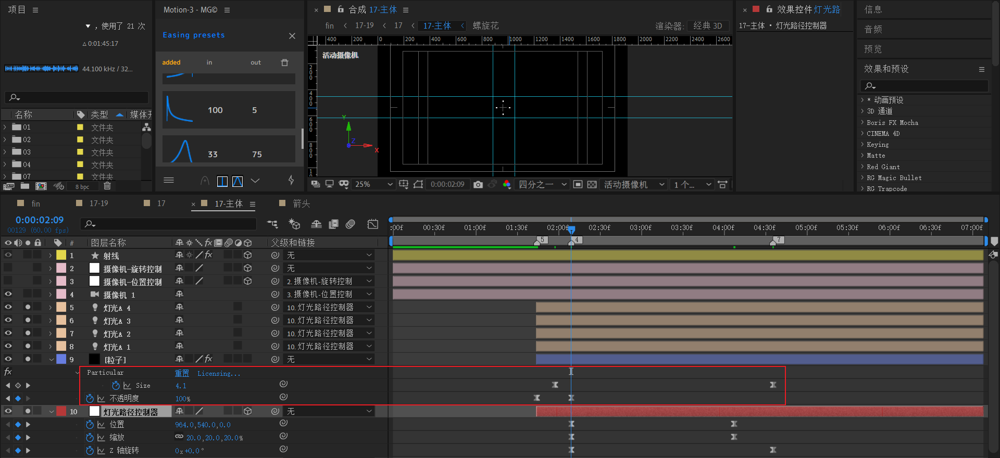

- 不透明度：0 到100%，实现淡入效果。
- size：从4 到 30。速度曲线为逐渐加速，最后才突然减速。

然后对【灯光路径控制器】k帧

初始帧：

- 位置(960,540,0)
- 缩放20%
- Z轴旋转0

---
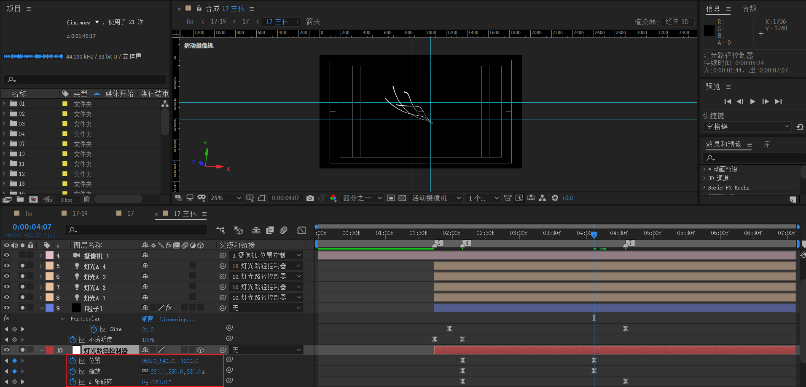

结束帧：

- 位置z变为-7200。也就是向着摄像机（摄像机结束帧是z=-15000）的方向生长。速度曲线为加速。
- 缩放为220%。逐步加速，然后减速。
- z轴旋转：360度。将这个关键帧稍微后移，对齐粒子的size结束帧。所以图中显示的不是360度。逐步加速，然后减速。

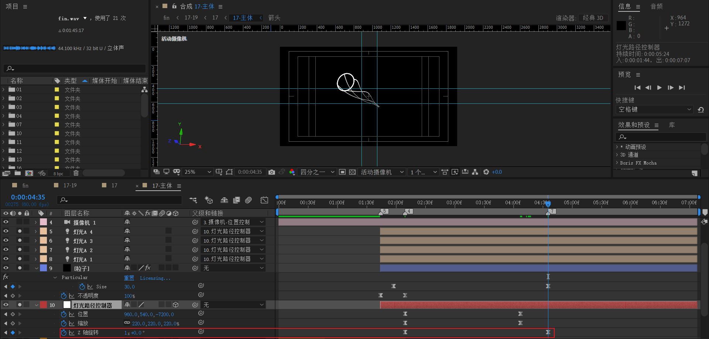

z轴结束帧为360度。 从预览上看，已经形成圆圈了。

我们从【背面】视图来观察一下。它是逆时针旋转生长。所以可以推测，对于摄像机来说，它是顺时针旋转生长。与之前的考虑一致。

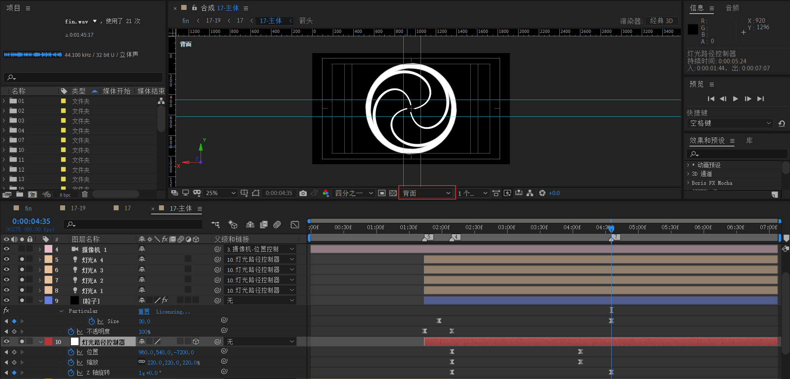

最后，将灯光隐藏。

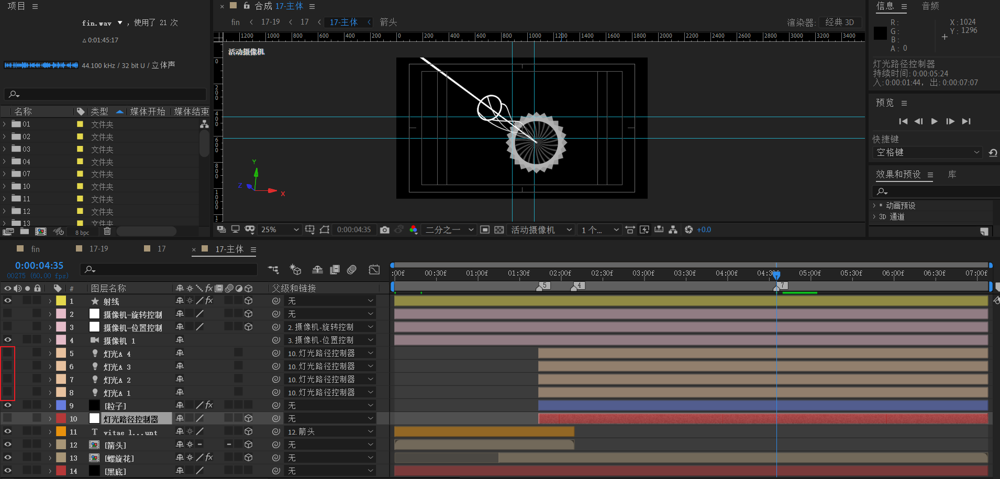

这个螺旋花就完成了。

我们需要标记一下这个螺旋花生长结束的时间点。

## 17

回到17合成，给17-主体添加色调效果。我们需要制作一个黑白对调的颜色变化。具体着色为：0 - 100 - 0 -100

将上面标记的螺旋花结束的时间点作为最后一帧的时间。每一个帧间隔为10帧。

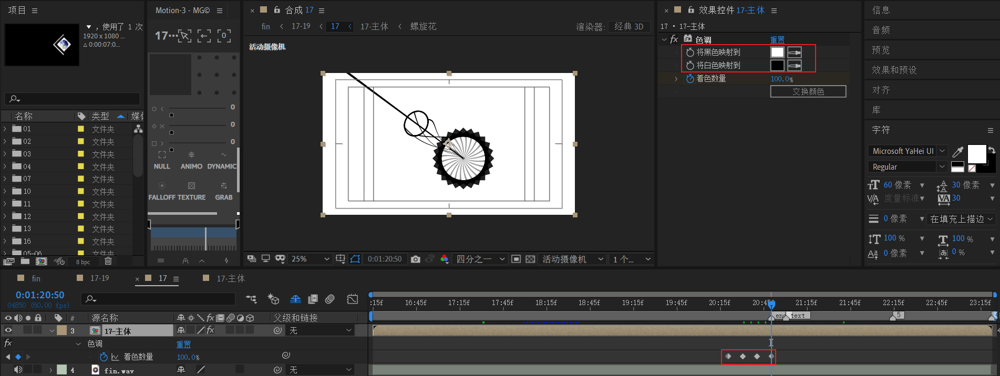

新建两个文本，确定好定版位置。标记下位置和Y轴旋转。

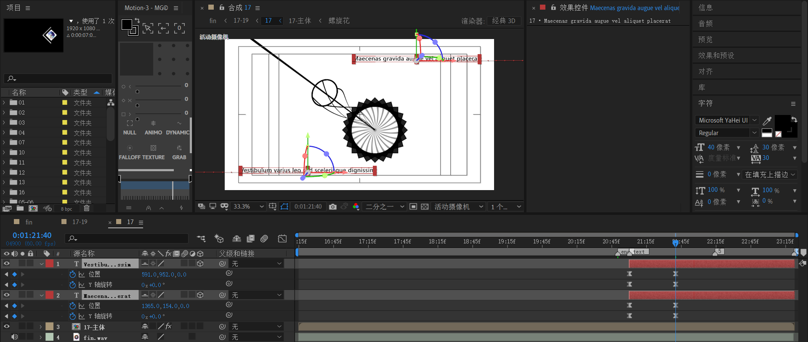

然后回到开始帧位置。

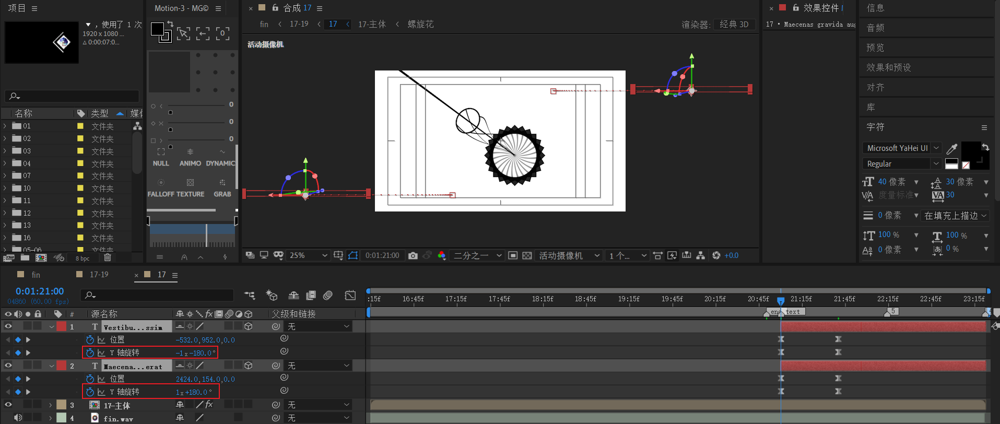

右上角文本为逆时针旋转，开始帧设置Y：1x+180。也就是递减到0。

左下角文本为顺时针旋转，开始帧设置Y：-1x-180。也就是递增到0。

## 17-19中的17合成

回到17-19合成。

入场做一个30帧持续时间的淡入，速度先快后慢。

离场做一个网格擦除，从0到100%，速度先快后慢。上图为中间过程22%的截图。

## 小结

- 螺旋花的弧线使用钢笔工具绘制路径，然后使用表达式将副本围成一个圆。
- 生长的曲线，关键在于使用particular粒子-> 跟随灯光 -> 4个灯源受空对象控制。
    - p粒子发射速率较大，将离散点变成连续曲线。
    - 伴随Z轴位置k帧，实现生长。