# 18 Thanks for watching

> 时间码 1:22:15 - 1:31:50

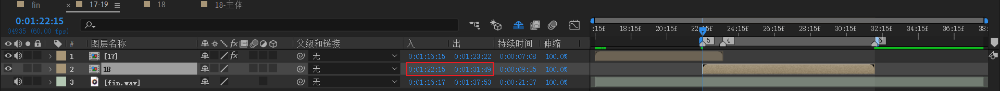

进入18合成，创建等长的预合成18-主体。这个【18-主体】制作主要动画。

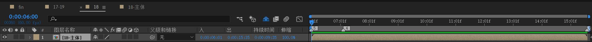

## 18-主体

### 【盒子-左】的初始坐标

将天梯中的【阶梯基础】合成导入，并命名为【盒子-左】。

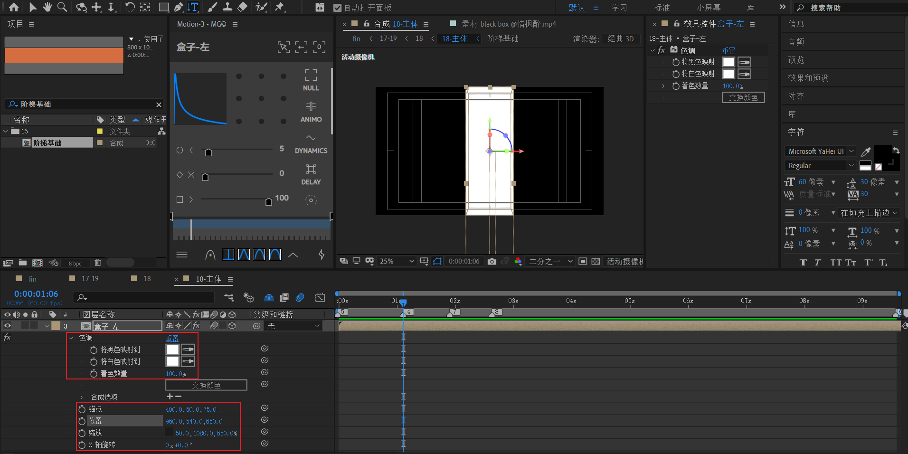

1. 添加色调，全部映射到白色。于是6个面都是白色。

2. 缩放从（100,100,100）%变为（50,1080,650）%。目的是拉伸长宽高。

3. 锚点从（400,50,0）变成（400,50,75）。相当于将锚点往里面一定距离。

   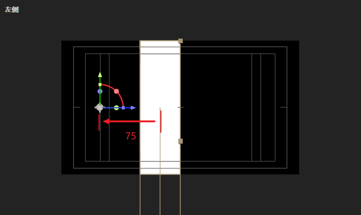

4. 位置从（960,540,0）变为（960,540,650）。提升了z轴，相当于缩小。使得刚好匹配画布高度。

### 【盒子-左】的动画

下面开始制作它的动画。

在01:06处打下X旋转-180，01:54处打下x旋转0。速度先快后慢。

我们从左视图进行观察。

| 开始帧                                                       | 中间过程                                                     | 结束帧                                                       |
| ------------------------------------------------------------ | ------------------------------------------------------------ | ------------------------------------------------------------ |
| 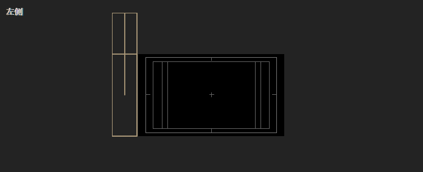 | 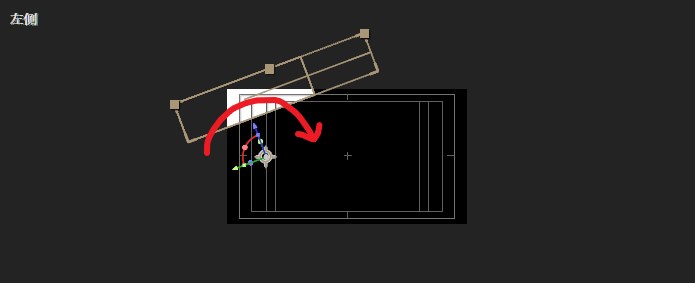 | 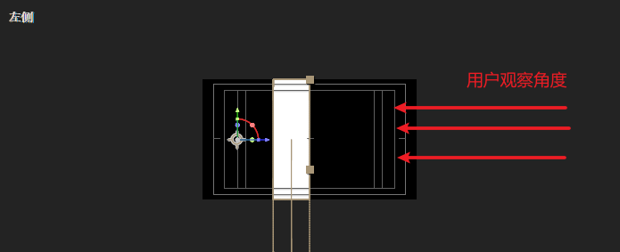 |

对位置k帧。做一个X轴平移到左侧的运动。

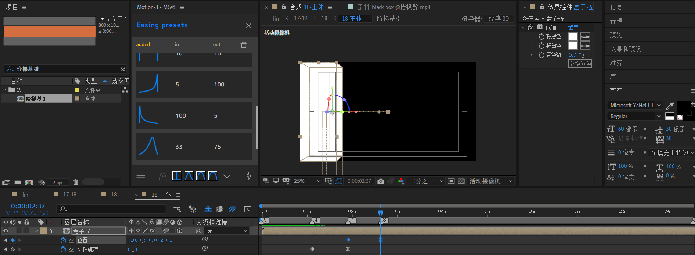

新建文本层。将文本在01:53处使得ctrl shift D打断。

将下层文本连接到【盒子-左】，并将位置z调整为-25。这个25=50/2。取决于之前创建的【阶梯基础】的尺寸。

判断标准：视觉上该文本必须在物体表面。图中是左视图。

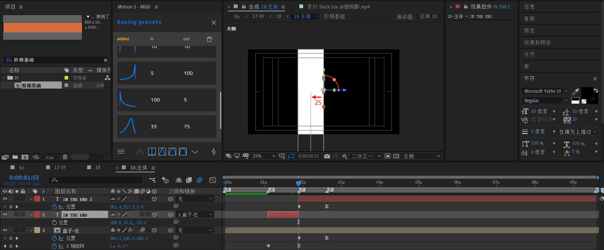

然后对上层文本做一个左移运动。

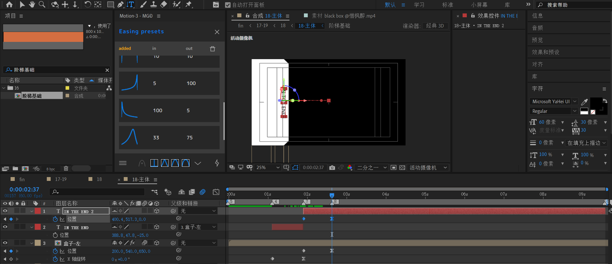

### 中间的文本以及横线

下面制作中间的文本以及横线。

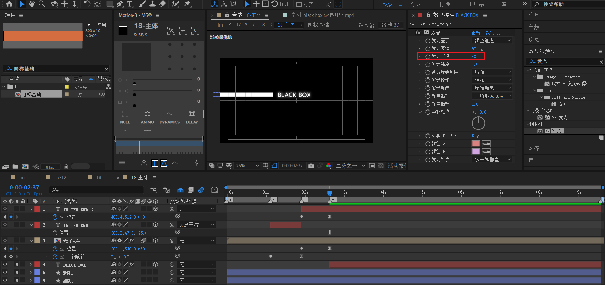

- 新建文本层，打上文字“BLACK BOX”。字体稍微大一点。添加发光效果，将发光半径调大。
- 粗线和细线都是使用矩形实现，填充白色，描边无。

裁剪长度后，将这三层打成预合成。

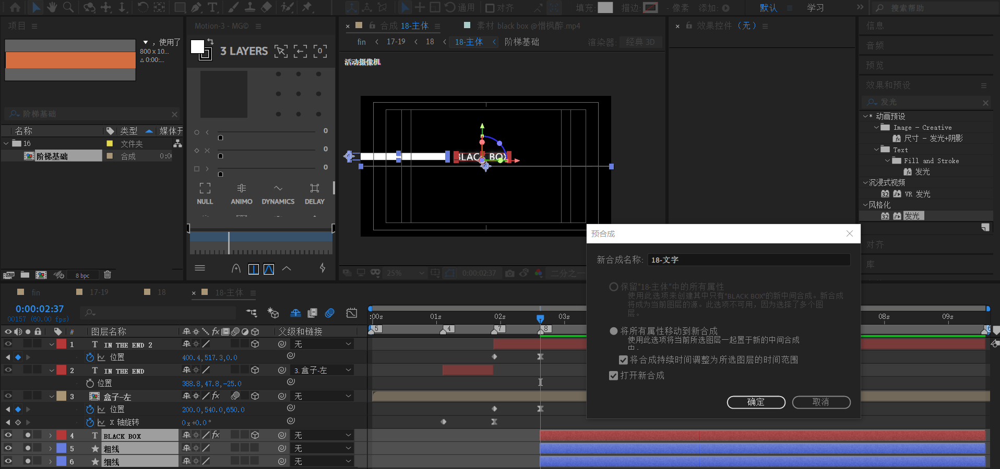

然后处理缩放以及旋转锚点的问题。

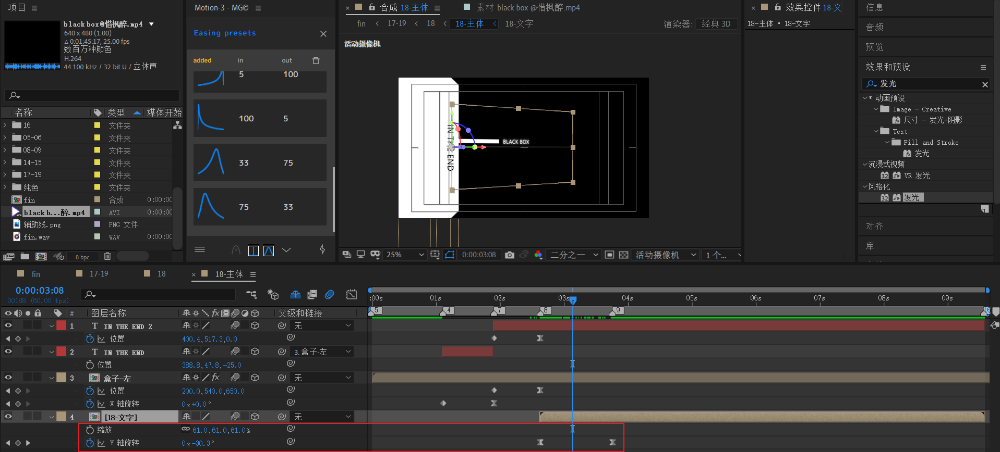

- 将旋转锚点定于左侧的IN THE END 文本中心处。
- 适当缩小合成。

### 另外3个盒子的拼合动画

最后，就是另外3个盒子的拼合动画了。

先处理【盒子-上】。

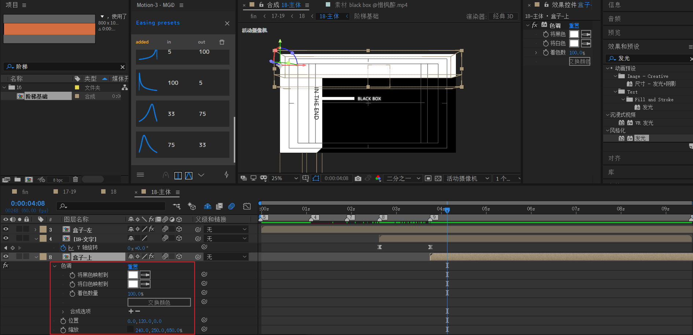

- 将【阶梯基础】导入，添加色调使得变白色。
- 将位置的y上移，使得刚好在画布上面位置。参考值120。
- 缩放X改为240%。因为1920/800=2.4。缩放Y参考值为250%。缩放Z参考值650%。
- 然后将锚点改为它本身的左侧中间位置。

然后对Y轴k帧，旋转半圈。从-180度到0度。

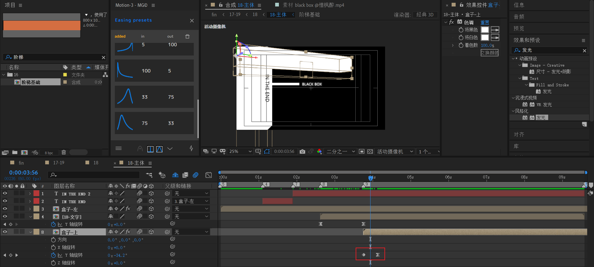

将【盒子-上】复制为【盒子-下】

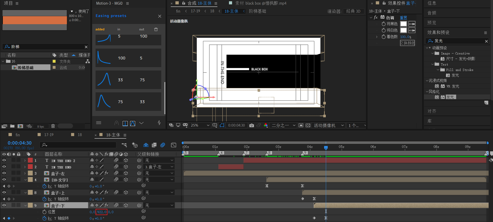

只需要修改Y轴位置就能实现。注意将时间排列稍微推后。

---

将【盒子-左】复制为【盒子-右】。去掉之前所有关键帧。

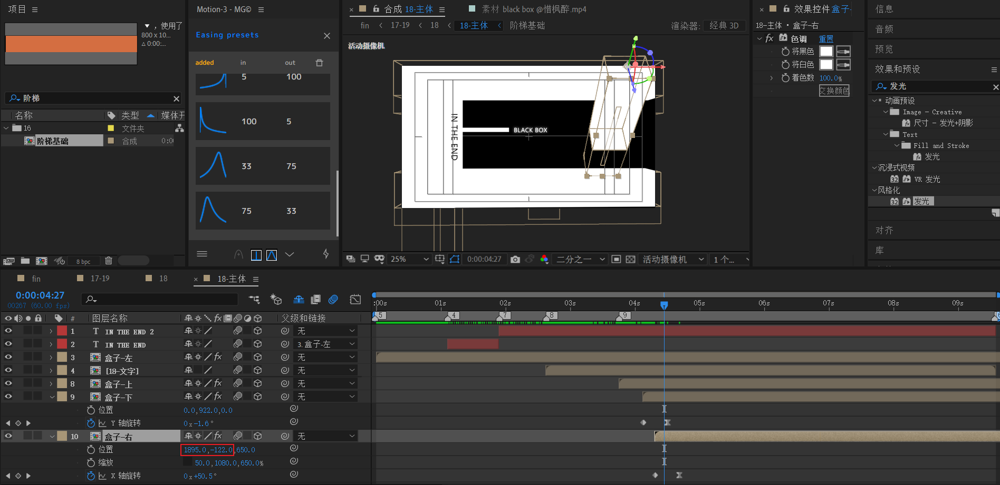

- 调整位置XY使得位于右侧。保持右边和画布右边重合。
- 将锚点定于自身上面中间位置。
- 对X轴k帧：180到0。速度先快后慢。
- 时间序列上，它的开始帧位于【盒子-下】的动画中间处。

于是，18-主体完成。

## 18

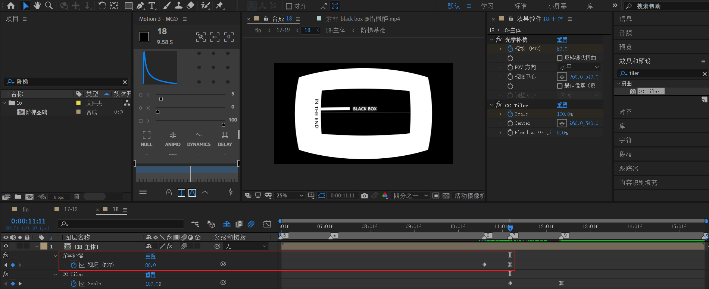

在四个盒子拼合之后，标记【7】为视场点，标记【9】为电视墙点。

添加视场效果：视场FOW从0到80。先快后慢。

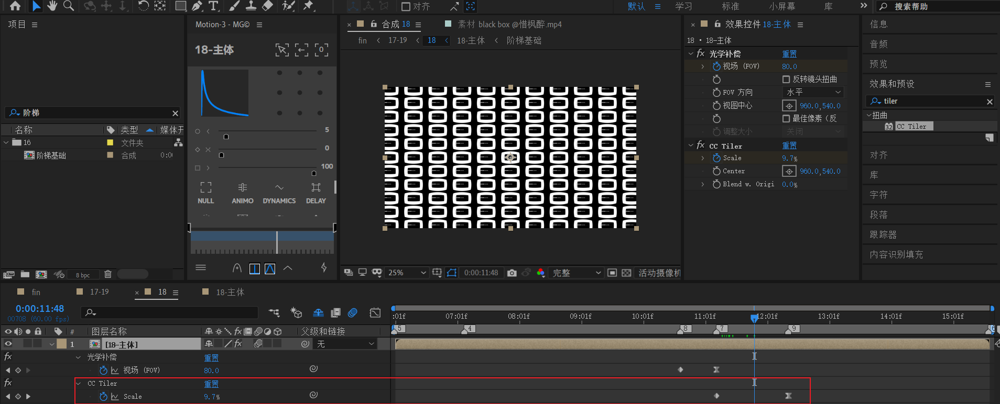

然后添加CC Tiler效果：Scale从100%到0%。先快后慢。

### 18 文字

中间线

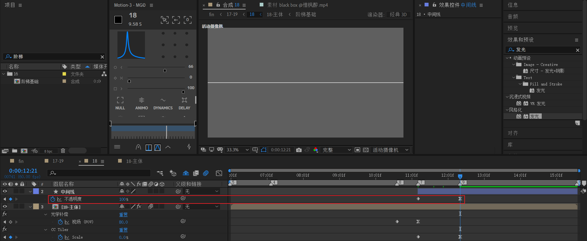

形状层添加矩形，尺寸1920x4，填充白色。做一个淡入进场动画。

---

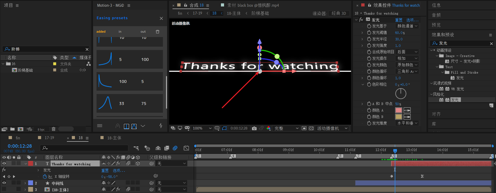

新建感谢标语。添加发光效果，发光半径调大。注意将锚点定于自身下面中间的位置。X轴旋转k帧：-90到0度。

另外两个文本补充。

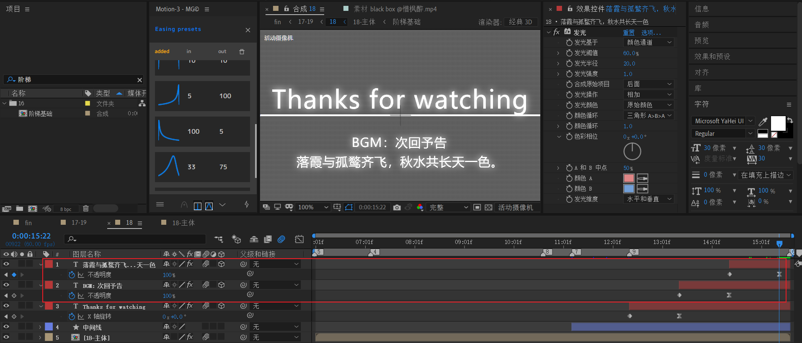

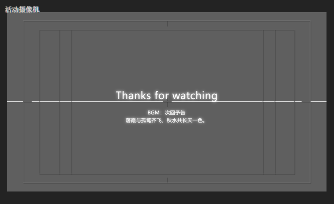

## 17-19

返回17-19中补充18的淡出效果。

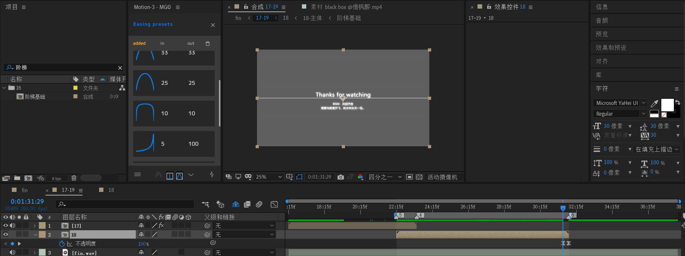

## 小结

- 视场可以制作小电视效果，CC Tiler可以制作瓦片铺砖效果。
