# 02 大风车
<!-- READING-TIME:START -->
>  🕛 reading time: 13 min read | 🔖 words: 2462
<!-- READING-TIME:END -->

> 时间码 在02:14低谷处标记。

前面即为【02-prev】，后面为【02-next】。


## 十字扇叶

将图片导入后适配画布大小，绘制横向和纵向mask矩形如下

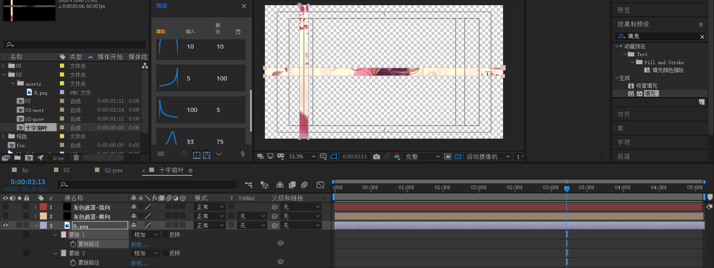

### 横向伸长的mask动画

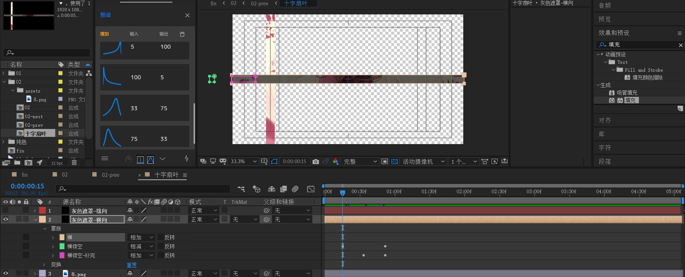

- 新建一个黑色纯色层，调整不透明度为65%。将之前图片的横向mask复制到该图层，或者重新绘制一致的也可以。对应黄色标记的【横】。

- 然后复制上面的【横】，重命名为【横镂空】，模式改为相减，稍微左移一定距离，同时将初始宽度改小，对应上面绿色标记的mask。注意将绿色mask的高度缩小一点，这样是为了形成边缘的不透明度差异。

- 在该图层，新建一个图中紫色的mask【横镂空-补充】，高度和绿色mask相同。这个位置是为了mask对称。下面会有说明。

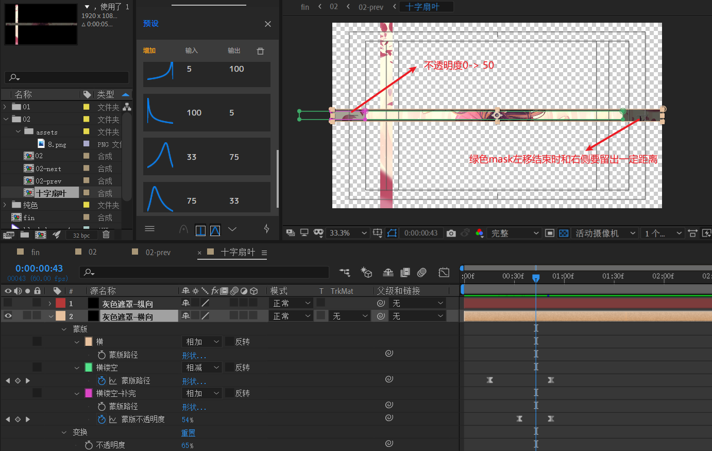

将绿色mask速度曲线改为先快后慢，紫色mask曲线改为初始ease。

> 效果检验

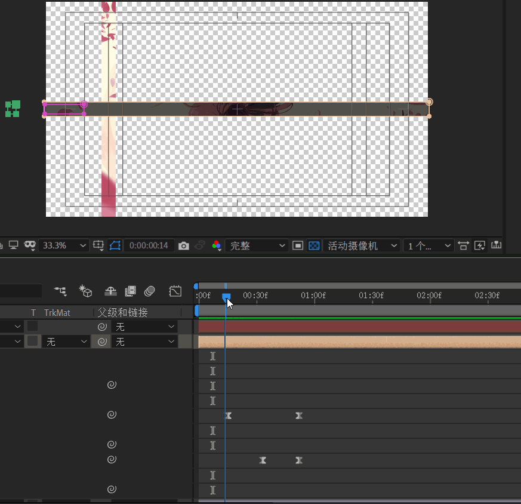

### 纵向的mask动画

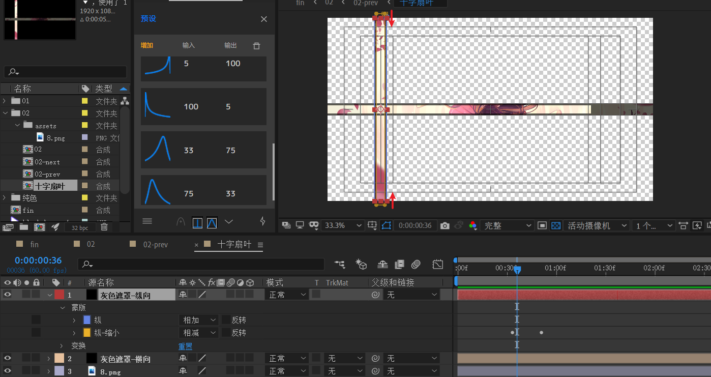

【纵-缩小】该层宽度需要稍微比【纵】mask要小一点，动画是mask向中心点稍微缩小一定距离。

### 文本部分


横条的文本没有任何动画。

右下角的文本字体稍大，对齐之前的关键帧，对position Y作位移动画，并且给予opacity缓入缓出。

## 02-prev

### 十字扇叶动画

回到合成【02-prev】。

新建一个空对象，将【十字扇叶】绑定到该空对象。我们将使用【十字扇叶-控制器】来控制十字扇叶的运动。

对比原作，做下标记。

- scale change 表示该时间点之前是放大，之后是缩小回正常比例。
- rotate out 表示后续就是扇叶开始消失（出场）。

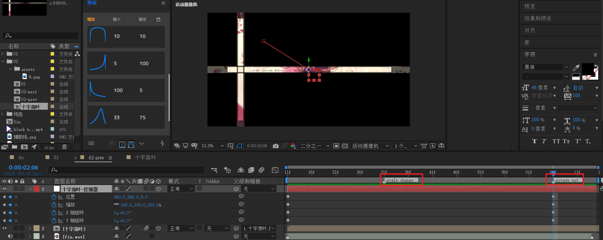

> 先来理清思路。

该动画存在四个关键帧列。

我们先从这两个属性：（缩放+旋转） 入手，一边实验，一边观察。

- 在rotate out处打下结束帧的关键帧。此时就是初始状态。

- 接下来，回到合成开头，将位置position移动到左下角处。将scale改为0。

观察此时的效果。


- 在scale change 标记处打下关键帧，值为200。也就是整体（%）0->200->100的scale效果。

  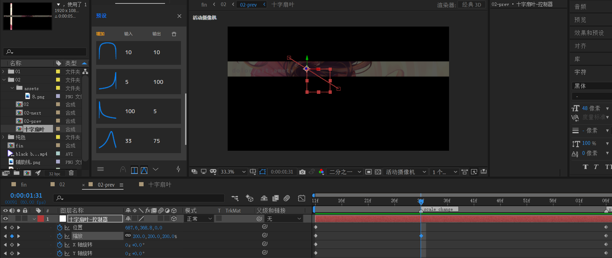

- 将x轴开始处关键帧改为180，此时观察效果。

  

- 下面只需要将y轴旋转补上就可以了。对y轴开始帧设置180。再次观察。

  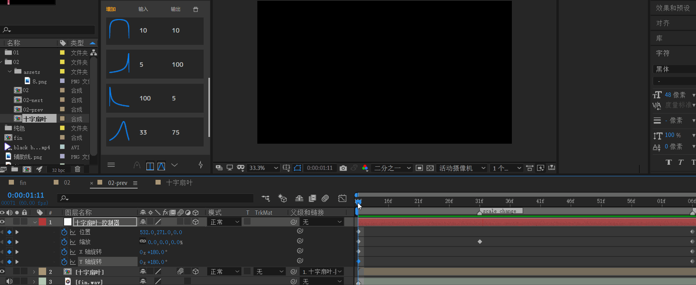

现在，效果已经正确。只需要稍微调整速度曲线。整体为先快后慢即可。

### 十字扇叶消失转场

下面开始制作十字扇叶消失转场。

首先将之前的十字扇叶合成复制一次，命名为【扇叶旋转-1】，注意重置transform属性。

然后新建一个空对象，命名【扇叶旋转-控制器】，用来管理扇叶群的旋转。


- 应用滑块控制k一个0到15的渐变。速度曲线先不调整。

- 对y轴旋转k一个0到120的渐变。末尾角度注意要> 90°，理由是大于90才能保证消失。

回到【扇叶旋转-1】合成。将锚点改到右中位置。


并对y旋转属性应用表达式：

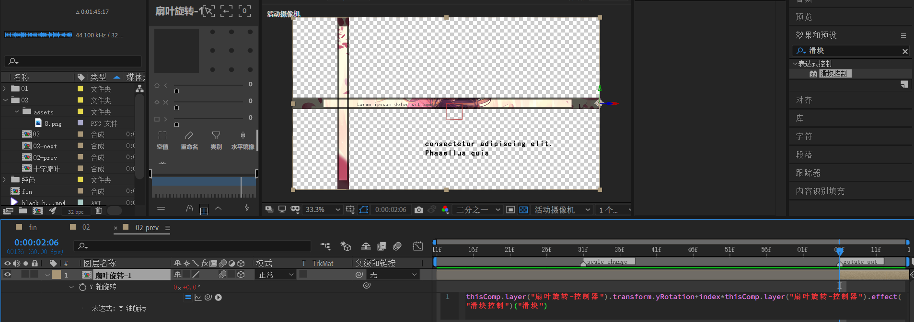

```js
thisComp.layer("扇叶旋转-控制器").transform.yRotation + index * thisComp.layer("扇叶旋转-控制器").effect("滑块控制")("滑块")
```

也就是说，【扇叶旋转-1】的y轴是受到【扇叶旋转-控制器】控制的。

将【扇叶旋转-1】复制9次，并重命名，形成【扇叶旋转-1】到【扇叶旋转-10】的群。列#1表示就是index=1的层。


index 范围 [1,10]，一共10个扇叶副本。对于上面的【扇叶旋转-控制器】，

- yRotation ∈ [0,120] 单调递增
- 滑块 value ∈ [0,15] 单调递增

index=1时，上面式子的值的范围是：[0,120+1*15] 为 [0,135]

index=10时，上面式子的值的范围是：[0,120+10*15] 为 [0,270]

观察效果。


下面调整【扇叶旋转-控制器】的速度曲线，先快后慢，两端不需要过于激烈。


将运动模糊打开后，就有了模糊的重叠效果。


下面回到活动摄像机视图，并将运动模糊按钮临时关闭。

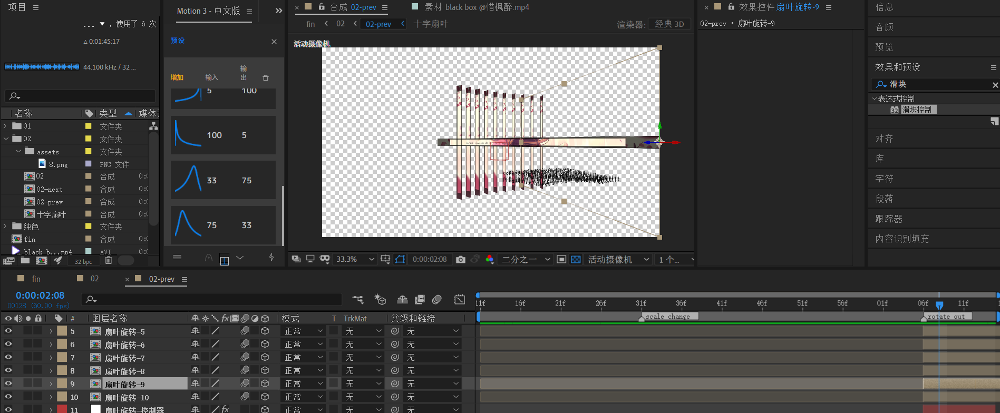

### 制作俯视效果

可以看到，视角是平行于扇叶的旋转面的，我们需要给一定的俯视或者仰视效果。

新建摄像机和空对象，将空对象绑定到摄像机。

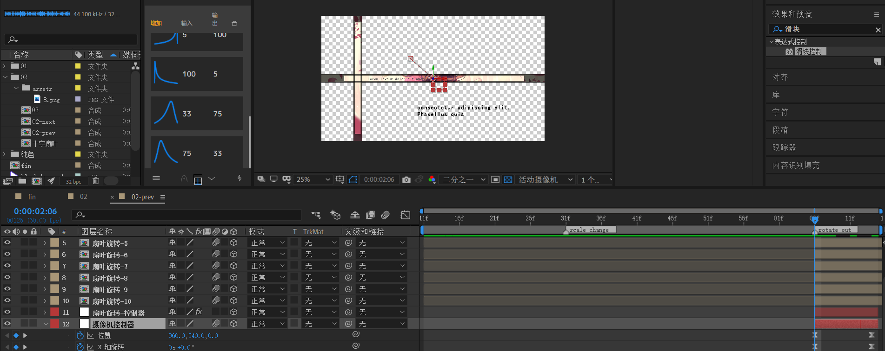

摄像机动画两个关键帧：

- 位置 z=0 到 z=400。这样会在旋转时产生扇叶变大的效果，避免扇叶旋转时直接变得很小，留白过大。
- x轴旋转，0到-15。这样就会形成稍微俯视的角度。

速度曲线先快后慢。

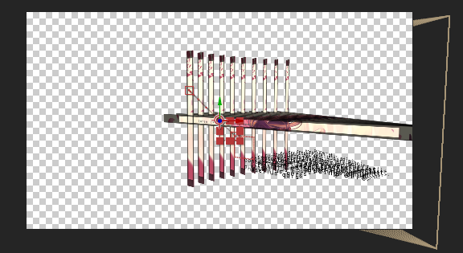

## 02-next

### 大风车的实现

【02-next】中使用了【02-prev】中的【十字扇叶】合成。

将十字扇叶合成复制过来，命名【十字扇叶-1】，重置一切属性，并将锚点定于右中位置。

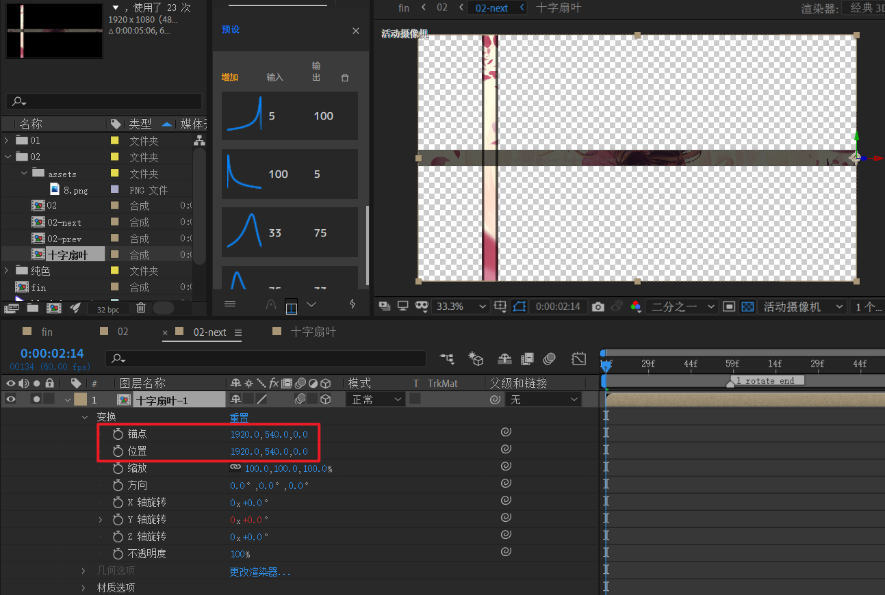

这样做的理由在于，右侧边就是选定的旋转轴心。

新建空对象，用于控制扇叶。


- 滑块0-30。因为计划使用12片扇叶，于是360/12=30。这个值不是随便取的。
- y轴从0-40。40这个值可以看做偏移量，是可以稍微随意取的。例如，取50或者60。

速度曲线都是先快后慢。

然后回到【十字扇叶-1】合成，将y轴旋转应用表达式：

```js
thisComp.layer("扇叶旋转-控制器2").transform.yRotation + (index + 8) * thisComp.layer("扇叶旋转-控制器2").effect("滑块控制")("滑块")
```

> 注意，这里（index+8）的意义在于使得第一片扇叶为310度。以此类推，第2片为340度，第3片为1x+10度，...，第12片为280度。刚好以30度切分一个圆的角度。

然后将【十字扇叶-1】复制11次，形成12片扇叶。


### 同心圆点缀

下面制作三个同圆心的描边圆和一个文字圆。

以右侧边为旋转中心，新建如下：3个同心圆和一根旋转中心轴。都选择添加描边，不需要填充。

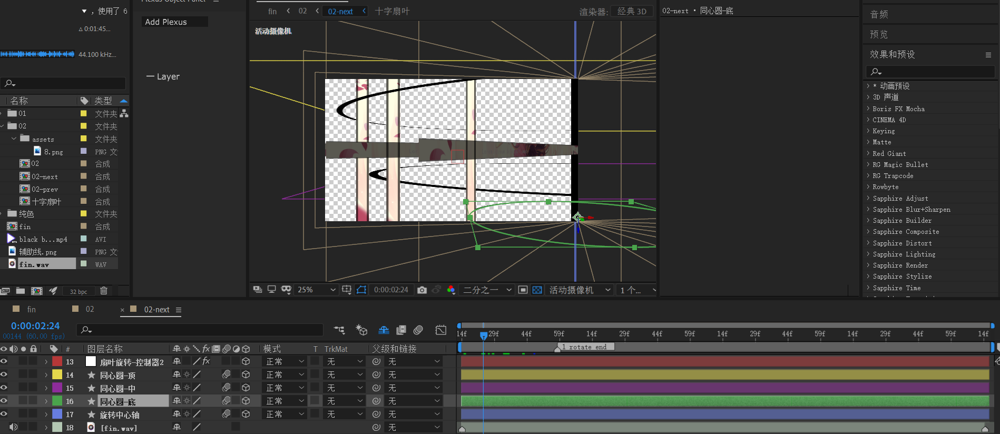

使用文本工具创建一个文本，在该图层绘制一个圆mask，将文本路径设置为这个圆mask。

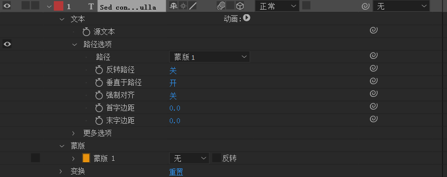

目前效果

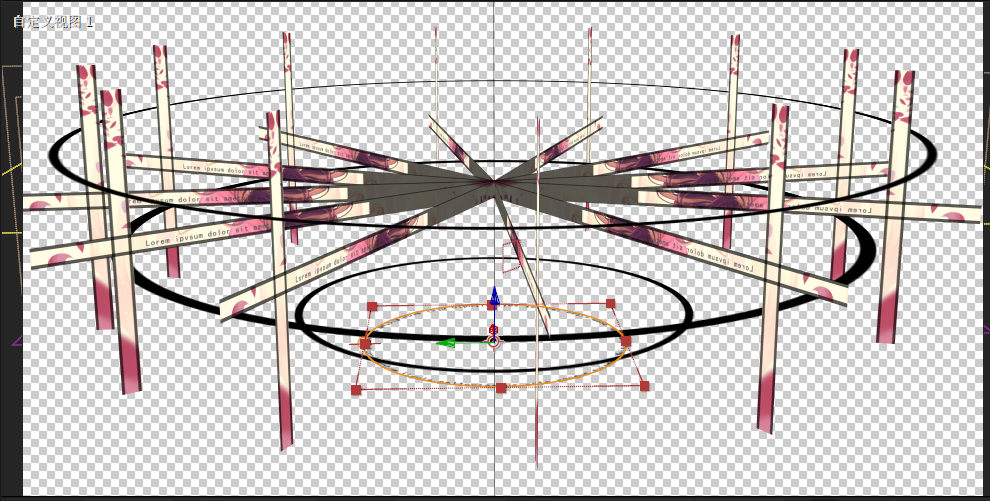

### 大风车动画

接下来，是非常关键的摄像机动画。

新建一个35mm的双节点摄像机。标记中间两个音乐结点。

第1个中间关键帧：

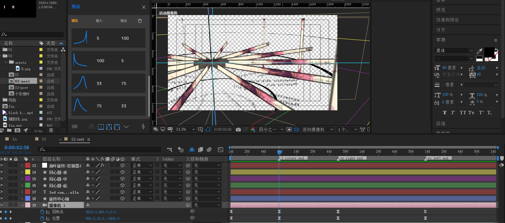

第2个中间关键帧：

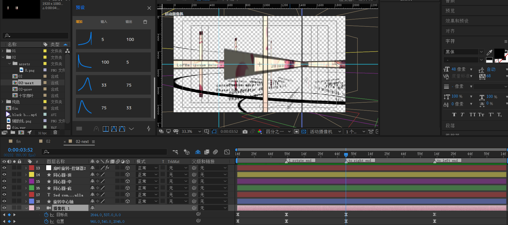

第3个中间关键帧：


注意：

- 先对位置k帧，分别是从左侧不可见地方进入，移动到右侧，然后回到左侧。
- 然后对目标点K帧。目标点的z轴不需要修改，只需要修改x和y，使得位置满足上图3个关键帧位置即可。

> 预览效果

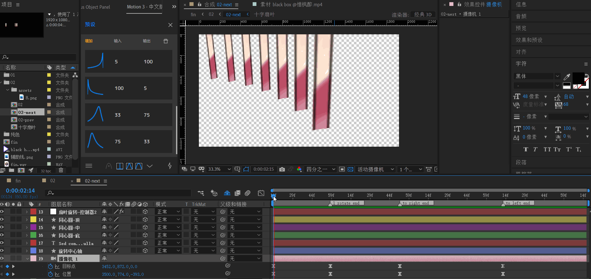

补充：在第2到第3个中间关键帧之间，回到【扇叶旋转-控制器2】补上旋转关键帧。

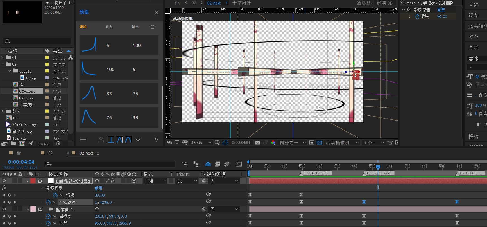

## 02

### 左侧黑色块

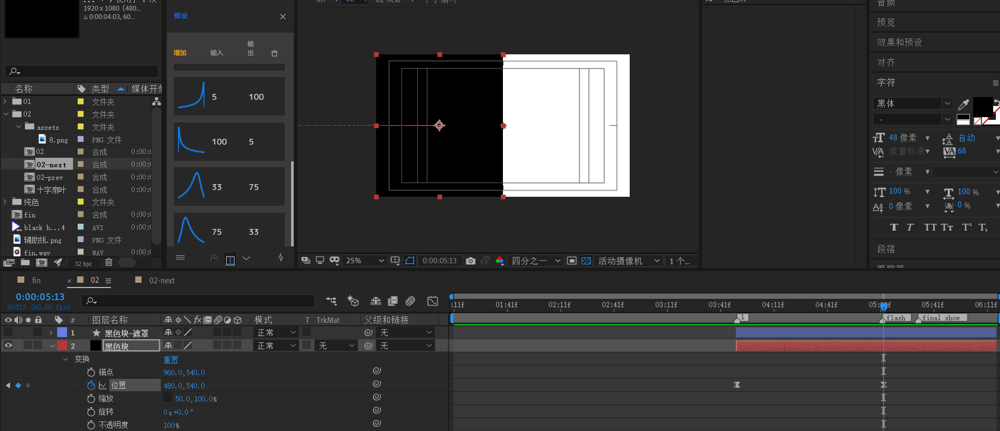

- 新建一个黑色纯色层【黑色块】，将锚点定于左半中间，x轴改为50%。
- 对X属性k帧，实现左侧进入的动画。速度曲线先快后慢。

新建形状层，添加矩形，旋转45°，然后填充为白色。描边为黑。将下面的【黑色块】层改为alpha反转遮罩。


对该【黑色块-遮罩】层进行k帧：

- 初始帧：缩放比例变大，覆盖左侧区域，旋转角度-45。
- 结束帧：缩放比例回归正常，旋转角度45。

### 右侧图片块

将左侧菱形形状层复制过来，命名【右侧-遮罩】。移动到图中位置。将图片素材拖入，放于下层。

将图片层模式改为alpha遮罩。并对opacity k帧：

- 0 50 100 50 0 50 100 每五帧一个关键帧。也就是淡入-淡出-淡入效果。

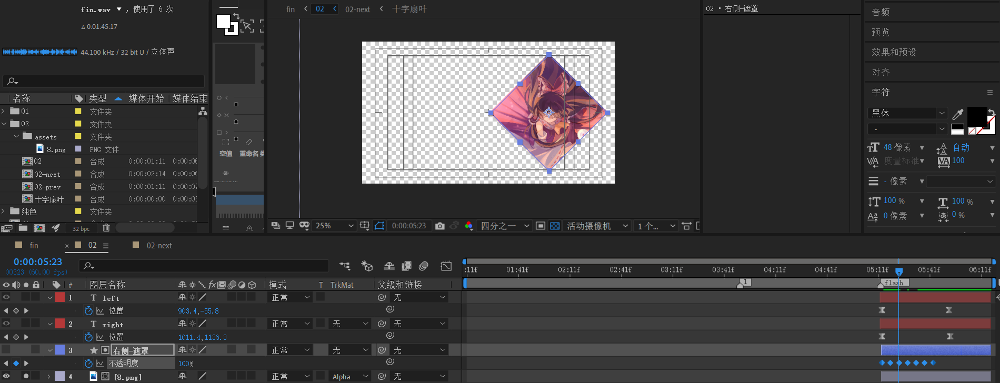

新建两个文本层。对位置k帧。由于比较简单，这里不赘述。

### 02 预览

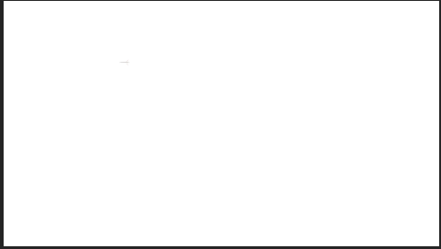

## 小结

- 同心圆点缀可以叠加设计空间感。
