# 04 黑盒的一个面
<!-- READING-TIME:START -->
>  🕛 reading time: 4 min read | 🔖 words: 727
<!-- READING-TIME:END -->

## 滑块

新建一个合成【滑块】，进入【滑块】合成。

新建形状层，命名【滑块】。使用内容Add添加如下四个菱形。

- 一个小菱形
- 一个大菱形
- 一个扁的小菱形，定版在左侧（从左侧进入）
- 一个扁的小菱形，定版在右侧（从右侧进入）

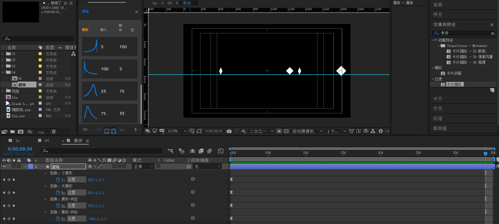

初始帧位置。

- 前三个在左侧
- 最后一个在右侧。

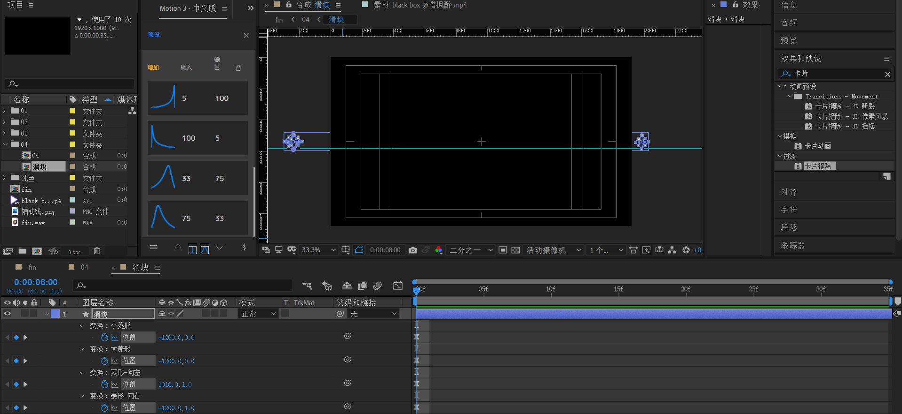

对这四个菱形position k帧。速度先快后慢。

## 滑块群

回到04合成。

将【滑块合成】复制9次，一共10份。分别延后1帧往后排列。

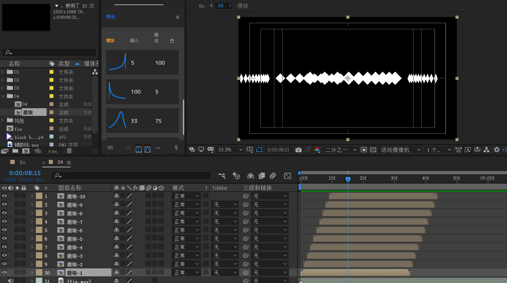

这样，这种进入的重叠效果就实现了。

> 知识延伸：关键帧辅助/序列图层...

## 拖尾直线

下面制作左侧拖尾直线和右侧拖尾直线。

回到【滑块】合成。分别选取这两个菱形作为参考点。

思路是，在这两个组之中，新建路径+描边形成拖尾直线。

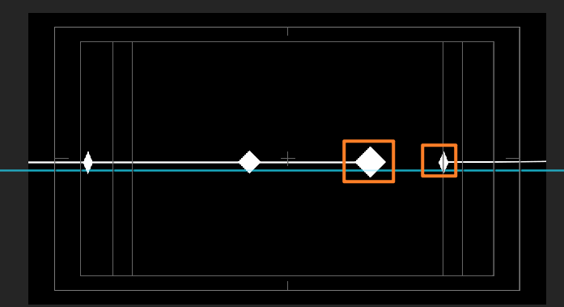

示例操作：

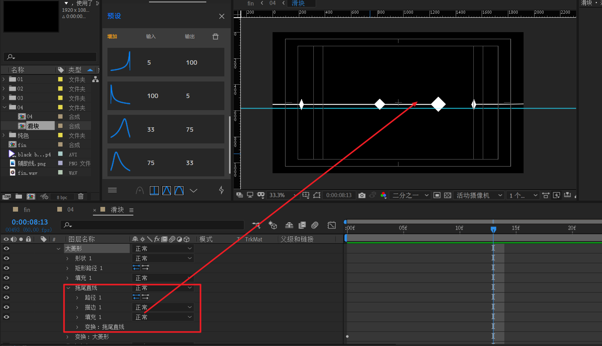

## 文本部分

新建两个文本层。在菱形滑块结束动画的那一帧打上标记。

然后对position k帧，记录一下结束位置。

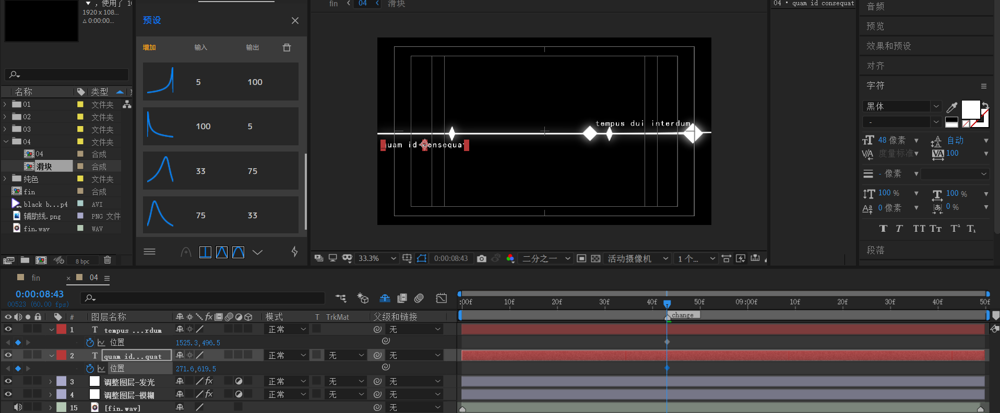

回到合成开头，打上开始帧，使得效果为文本从两侧分别进入。

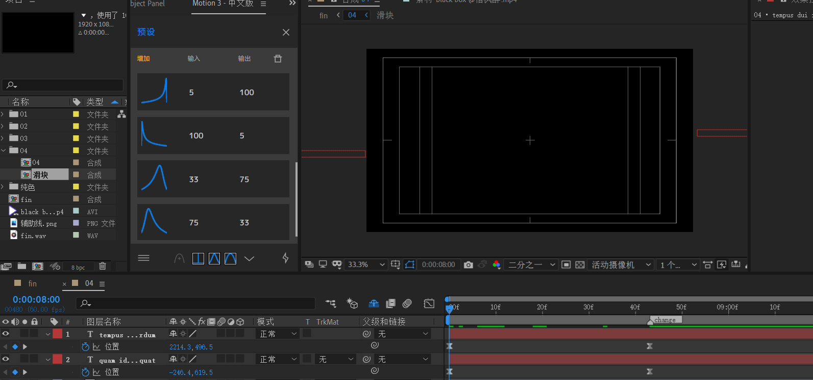

## 白色矩形入场动画

接下来，制作中间白色矩形展开和文本跟随动画。

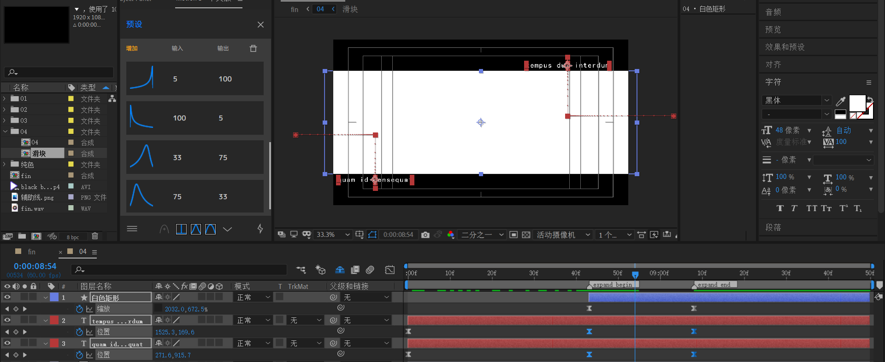

- 白色矩形使用形状层实现，开始时为垂直居中的一条横线，展开后结束帧如上图所示。速度先快后慢
- 文本关键帧对齐上面白色矩形关键帧，速度曲线必须和上面的一致。

## 白色矩形内部区域动画

制作白色矩形内部的动画。

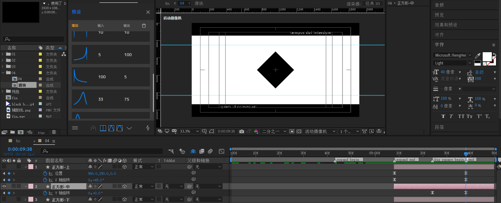

首先是中间黑色菱形的动画

- 结束帧，旋转角度是0度。
- 开始帧，垂直于用户视角，因此是90度，为了使得运动比较强烈，设置为1x+90度。

确定中间大黑色菱形的位置后，才考虑上下两个小菱形的动画。

考虑上菱形：

- 位置动画，这里不赘述。
- Z轴旋转，结束帧为45度，因此开始帧设置为-315度。从-315到45度，刚好一圈。

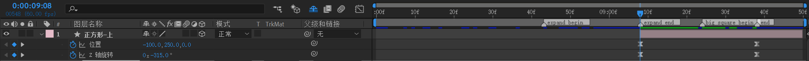

将【正方形-上】复制，命名【正方形-下】，只需要修改

- 旋转角度关键帧为：315到-45度。

- 位置从右侧进入左侧。

速度曲线参考

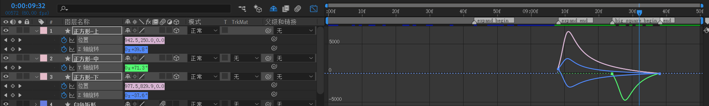
