# 06 摇晃的箭头
<!-- READING-TIME:START -->
>  🕛 reading time: 5 min read | 🔖 words: 935
<!-- READING-TIME:END -->

## 箭头的制作

新建【箭头】合成。

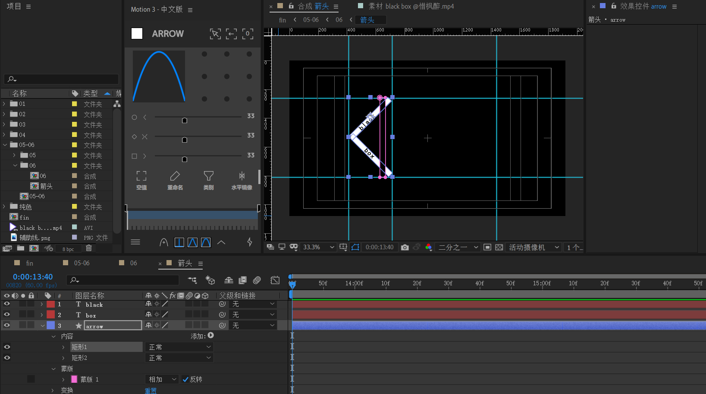

- 新建形状层【arrow】，将上下矩形打成组，分别旋转-45,45度。
- 新建两个文本【black】【box】。分别放于合适位置。
- 在形状层【arrow】创建蒙版。
    - 方式一：选择该图层 -> 右键 -> 蒙版 -> 创建蒙版。
    - 或者，使用工具栏的【工具创建蒙版】选项。注意反转mask，镂空图中紫色区域。

## 网格背景

将合成【箭头】放于06合成中。然后创建黑色纯色层【网格】，添加网格效果，适当调整网格参数。

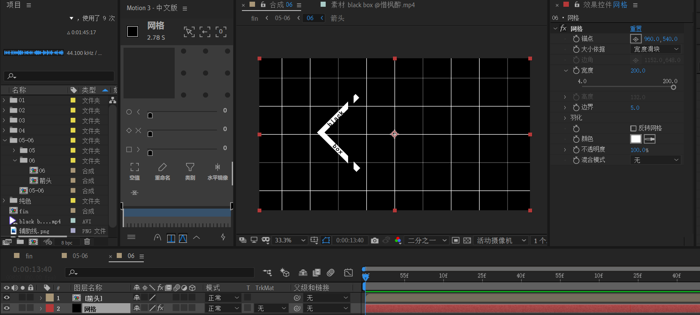

- 大小依据选择“宽度滑块”，设置200。

## 中间矩形条

制作中间矩形条。

矩形条=矩形块 +左右三角。左右三角其实是两个正方形(旋转45度)的各一半。

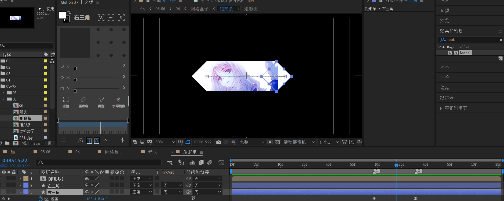

- 对右三角position k帧。速度先快后慢，给一定的初始速度。

  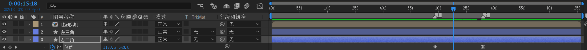

- 速度曲线参考

  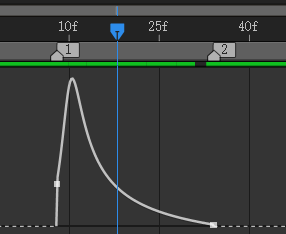

## 网格盒子

将之前制作的【箭头】，【矩形条】，【网格】预合成到一个命名为【网格盒子】合成。

### 【箭头】和【矩形条】的运动

下面考虑【箭头】合成和【矩形条】合成的运动。

由于箭头和矩形条在位置移动上是一致的。所以，考虑将它们看成一个整体，创建一个空对象【位移控制】来统一它们的运动。

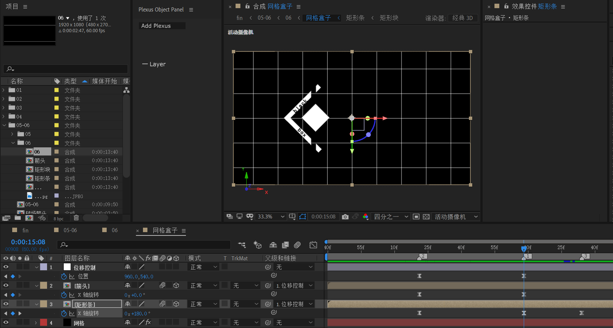

- 位移控制：作一个从右侧进入的x轴位移，速度先快后慢。

- 箭头：打上3d开关，对齐位移关键帧，x轴旋转从180到0
- 矩形条：打上3d开关，对齐位移关键帧，x轴旋转从360到180，然后再从180到0。

【网格盒子】合成预览

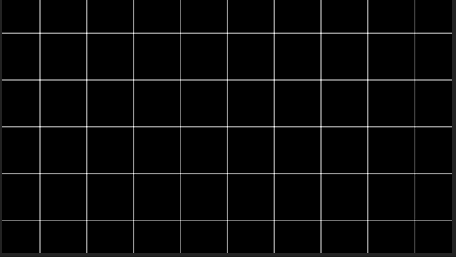

## 06

下面制作06合成。

### 4个【网格盒子】形成的空间

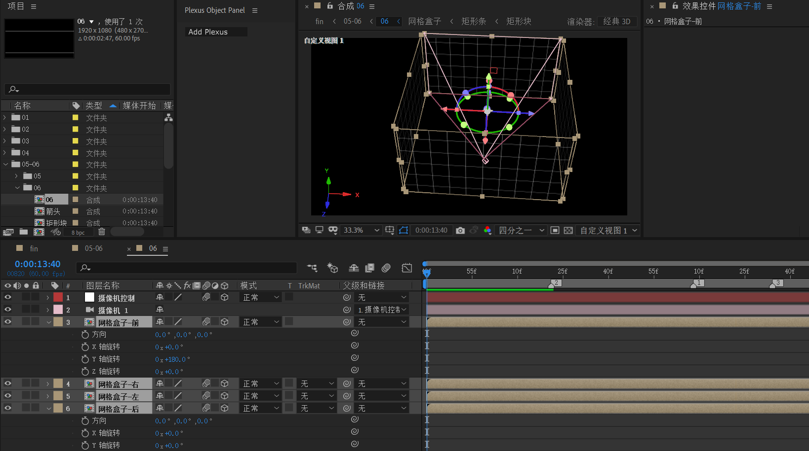

将【网格盒子】合成复制成4份，命名【前】【左】【右】【后】。打开3d开关后，使用y轴设置90整数倍的角度来构造盒子。

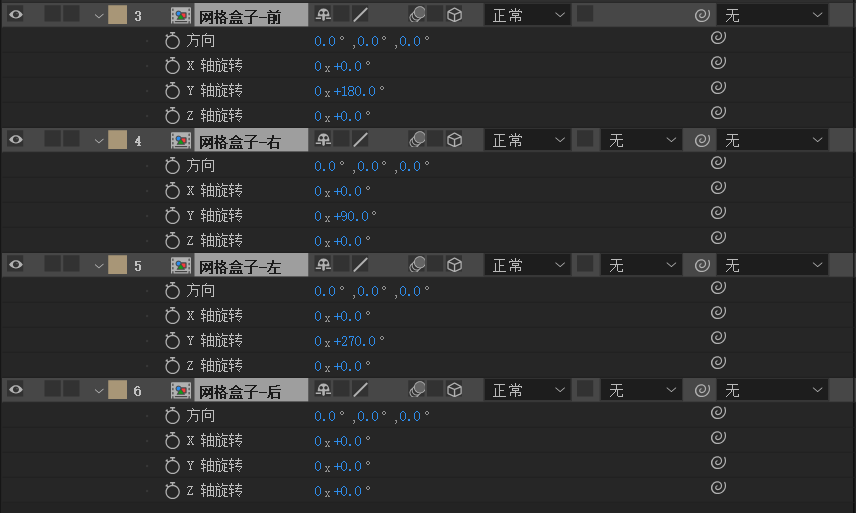

### 06合成的摄像机动画

新建摄像机和空对象绑定。

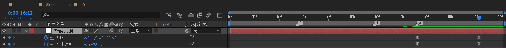

- 方向的z轴从0到60度

- y轴旋转从-3x-300左右到0
- 速度曲线为ease即可。

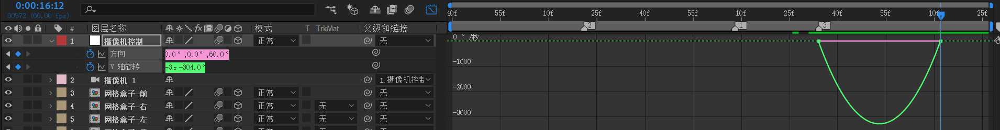

在自定义试图查看摄像机运动。

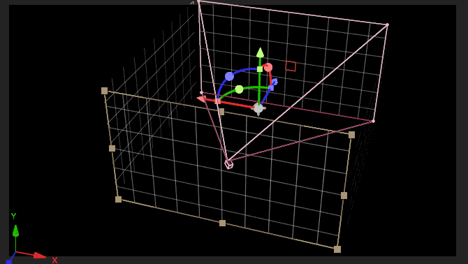

可以看到y轴旋转起到了摄像机绕圈拍摄的效果，而方向在Z轴的60度偏移则给了一定的空间错位角度。

回到活动摄像机视觉，再次观察。

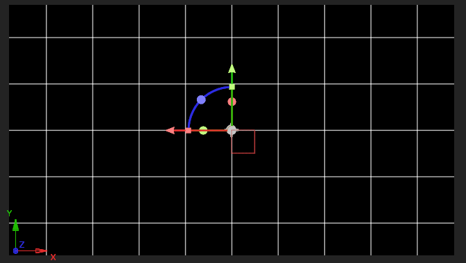

## 过渡的格子擦除

下面制作05到06之间过渡的格子擦除效果。

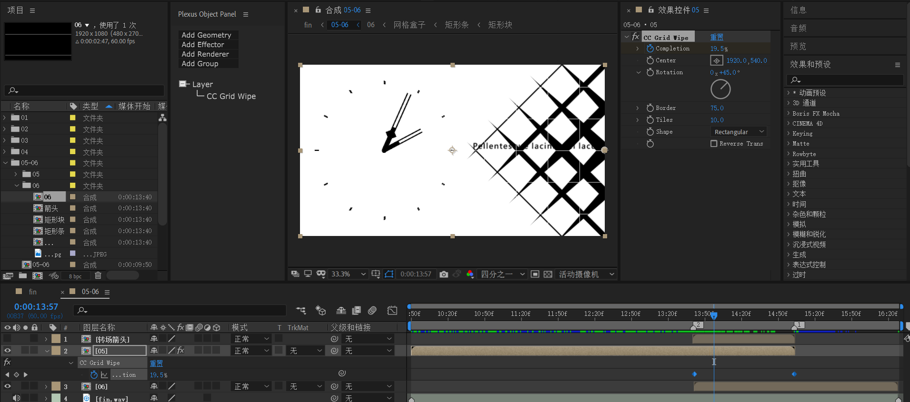

- 对05合成应用 CC grid wipe。
- 开始点设置为（1920，540），也就是右侧边缘的中间。shape选择rectangular（矩形）。rotation为45度。
- 完成度k帧从0到100%。

## 转场箭头

下面制作【转场箭头】。

该合成由三个箭头构成。分别为小，中，大。

我们先制作【箭头-小】，使用形状层绘制两个矩形块，互相反向旋转45度。其他两个箭头组也是类似道理制作。

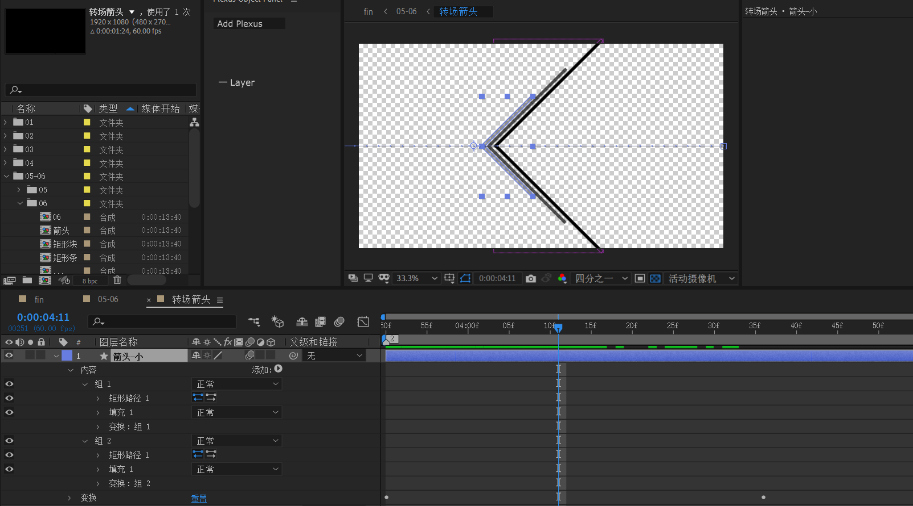

关键帧

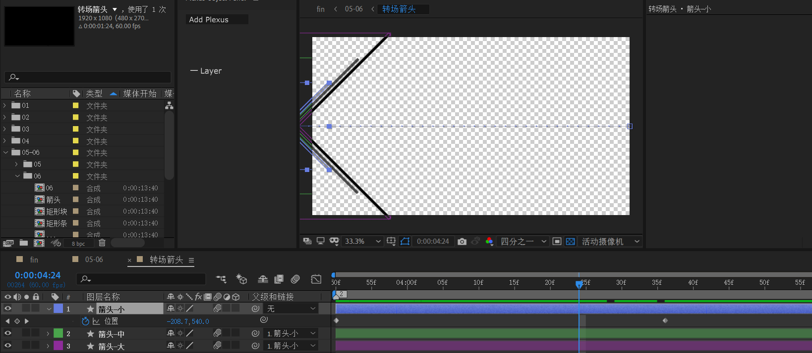

- 位置从右侧不可见到左侧不可见，线性关键帧。

回到05-06合成。

将【转场箭头】对齐过渡位置。注意箭头组应该位于格子擦除的左边。

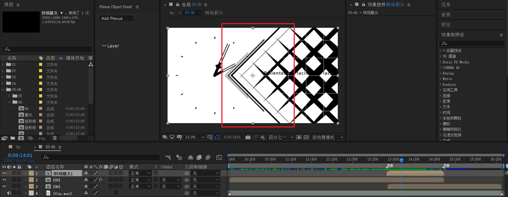

## 小结
- 使用空对象来统一控制【箭头】和【矩形条】的运动。
- y轴旋转起到了摄像机绕圈拍摄的效果，而方向在Z轴的60度偏移则给了一定的空间错位角度。
- CC grid wipe 可以制作丝滑的转场过渡。
