# 07 棋盘背景与遮罩旋转
<!-- READING-TIME:START -->
>  🕛 reading time: 7 min read | 🔖 words: 1218
<!-- READING-TIME:END -->

> 合成时间码 15:31-20:00

## 切分合成

首先创建白色纯色层作为整体背景。

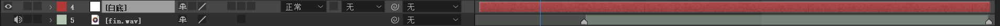

将07镜头分为两部分，7-1和7-2。

- 15:31-17:59 为7-1时间段。
- 18:00-20:00 为7-2时间段。
- 7-1的遮罩先忽略，后面会讲解。

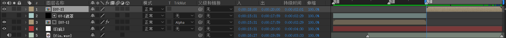

## 7-1

### 棋盘背景

先使用黑色纯色层创建背景。

然后再次创建一个黑色纯色层，应用棋盘效果。大小依据使用“宽度滑块”，稍微调整宽度值。

- 注意将棋盘层3d打开，x轴旋转-60度。

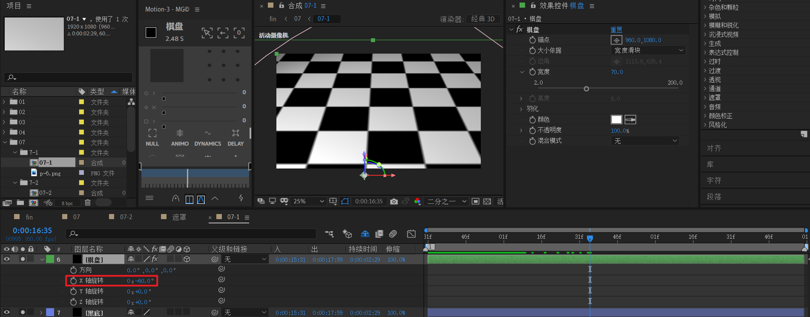

### 人物阴影

然后将人物素材导入，调整合适的缩放。位置和关键帧先不考虑。

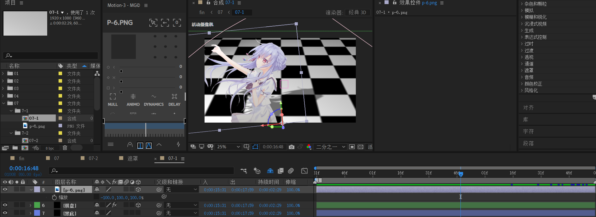

创建环境光层，强度值参考值50%左右，颜色白色。此时画面整体会稍微变暗一点。

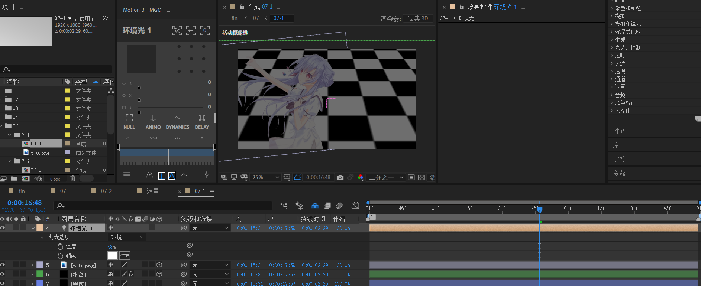

创建聚光层：这个聚光是生成人物影子的关键。

- 将光源位置放于远处左上角，目标点（红色小方框）放于人物投影面位置。

  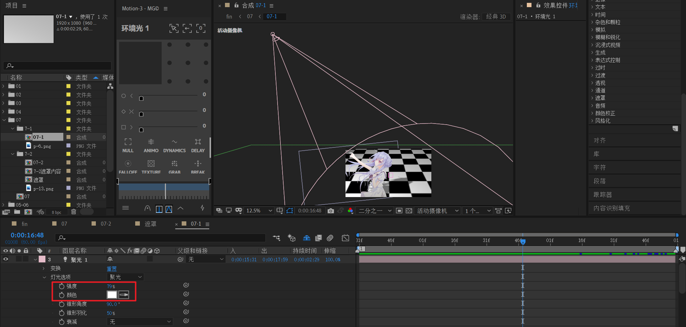

- 使用【自定义视角】观察，这个是微调的关键。建议在这个视图进行调整照射。

  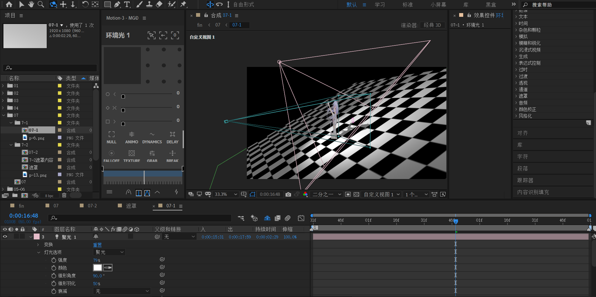

### 摄像机动画

新建一个摄像机，以及空对象绑定。

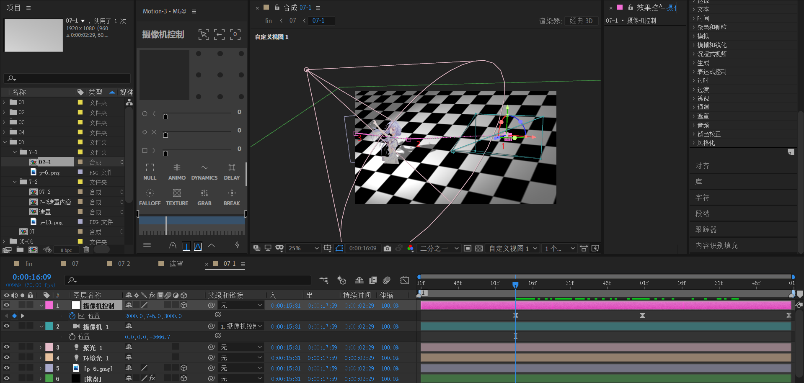

摄像机有三个关键帧

1. 右侧
2. 右侧朝自身稍微左上角移动。
3. 向左平移。

回到常规视图，请仔细体会这三个关键帧。

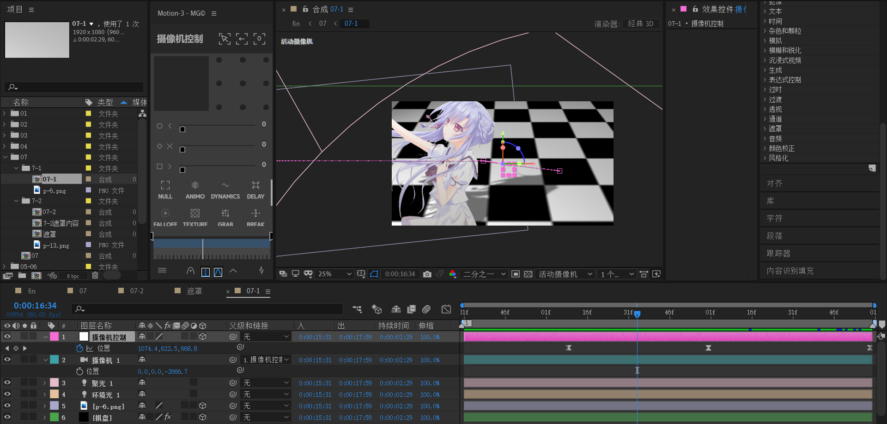

速度曲线整体是先快后慢。

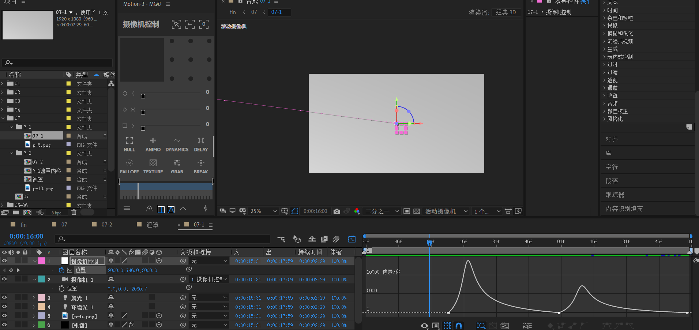

7-1预览

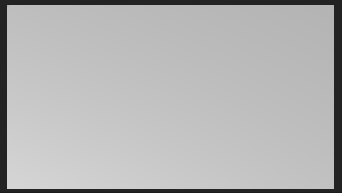

## 7-2 遮罩内容

### 人物的平移

【7-2 遮罩内容】合成大小为3000x3000。目的是为了让动画活动空间比画布大小大一点，这样才能产生从外面进入的效果。

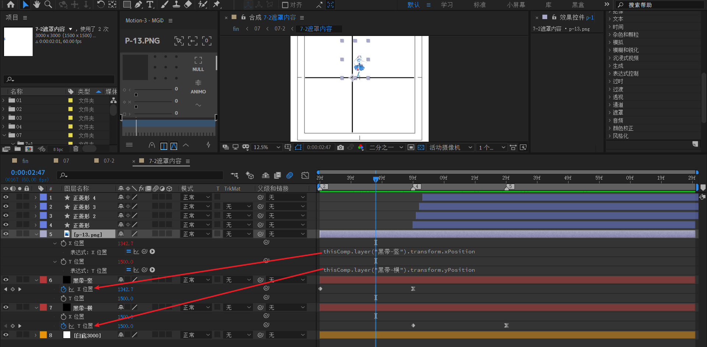

- 新建白色3000x3000纯色层作为背景
- 新建黑色纯色层【黑带-竖】作为黑色竖条，竖条关键帧为从x轴右移：→
- 新建黑色纯色层【黑带-横】作为黑色横条，横条关键帧为从Y轴下移：↓
- **将上面两个黑带层的位置 XYZ拆开，这个步骤非常关键。**
- 将人物素材导入，调整缩放。
    - 对人物x位置表达式绑定【黑带-竖】的x位置
    - 对人物Y位置表达式绑定【黑带-横】的y位置

也就是说，人物的运动：先→ ，然后 ↓。

### 四个正菱形

四个正菱形的制作。

- 创建形状层，添加矩形，调整为正方形，填充黑色。
- 关键帧为y轴上移，速度曲线先快后慢。

- 分别复制为4层。在时间轴上往后，分别右移1帧摆放，产生一种延迟滞后的视觉效果。

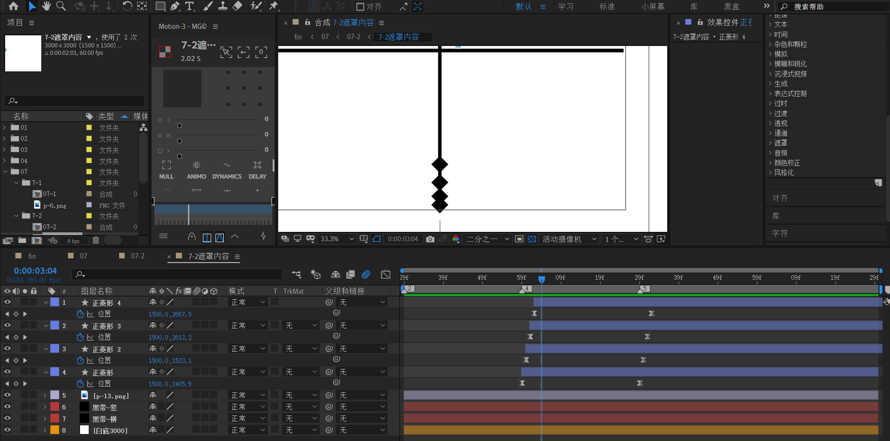

## 7-2

下面开始7-2制作。

- 创建黑底

- 将【7-2遮罩内容】使用ctrl shift D 从标记处打断。这个标记处大约是人物运动结束的时候。
- 图中橙色块的合成【遮罩】就是下面要完成的内容。

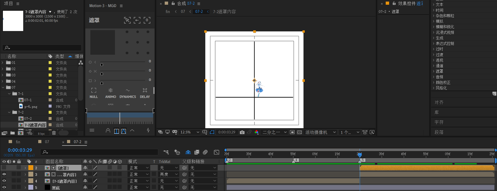

### 遮罩

7-2中【遮罩】合成的制作。

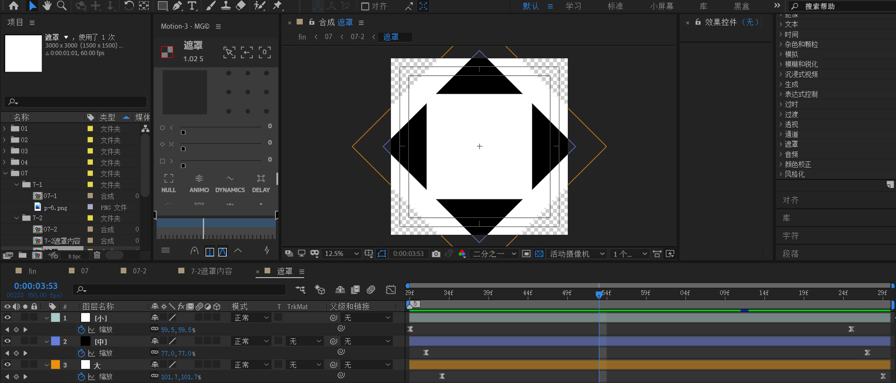

使用形状层分别创建三个正方形，分为小中大。

- 小：旋转角度0
- 中，复制小的，旋转45度，填充改为黑
- 大：复制中的，缩放变大一点。

这三个形状层整体都是作一个scale的k帧。从刚开始在画布外不可见缩放到一个很小的白色正方形。

开始帧

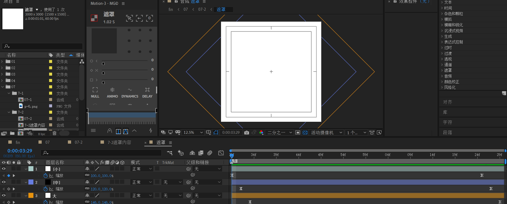

结束帧

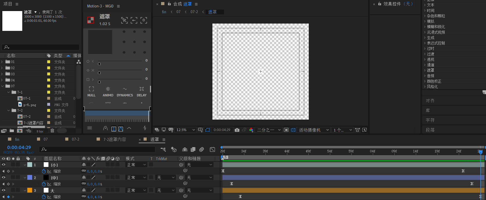

---

回到7-2合成

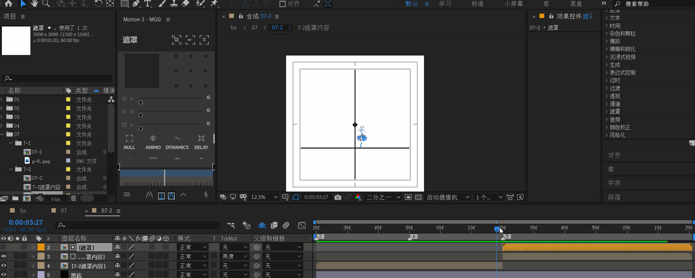

目前效果是没有旋转的。

由于【7-2遮罩内容】和【遮罩】层都需要一起旋转。那么应该考虑使用调整图层对它下面的一切图层进行调节。

创建调整图层，添加“变换”效果，k帧：从0到-135度。

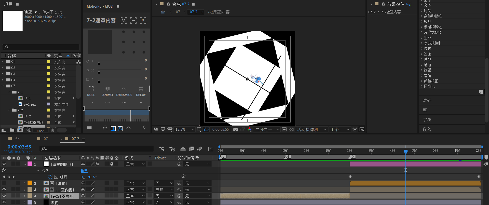

## 07

回到07合成。

下面开始制作7-1遮罩。它是简单mask动画，从画布大小到中间小矩形带。

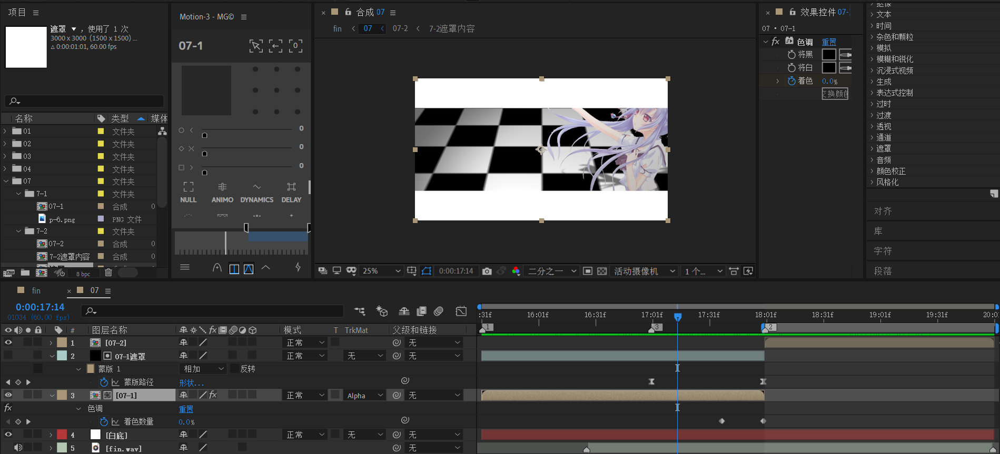

需要注意的是，7-1需要添加【色调】效果，在末尾处制造逐渐变成黑色的效果。对着色数量k帧。从0到100%。

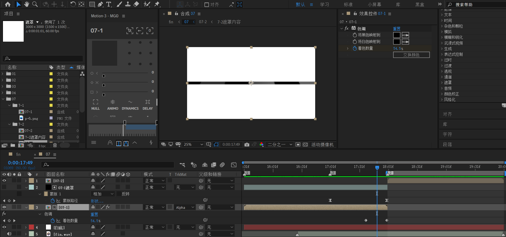

第二个注意点。7-1和7-2之间的衔接是大小相同的矩形带。尽量保证一致，否则会产生不和谐的感觉。

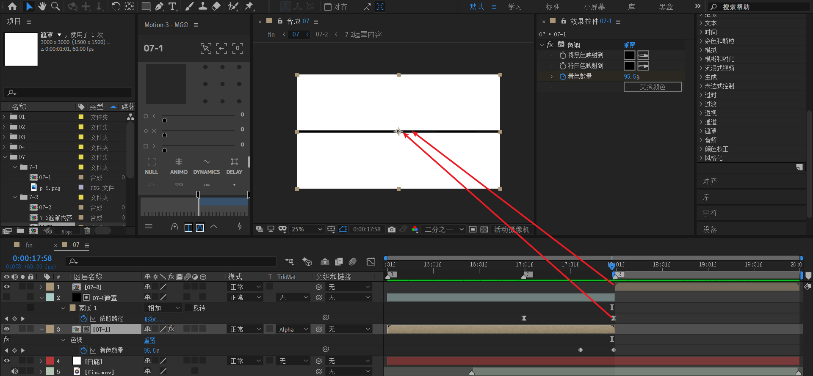

07预览

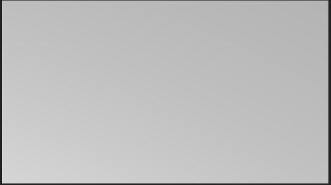

## 小结
- 环境光可以整体调节画面的明暗程度，聚光灯可以给人物打上影子（需要投影面）。
- 将人物素材位置XY拆分独立尺寸，可以创建分步的平移动画。
- 将运动的形状层复制为多个副本，并在时间轴上序列摆放，可以创造延迟滞后的效果。
- 使用调节层可以对它下面的可视图层进行统一控制管理。
