# 08 隧道
<!-- READING-TIME:START -->
>  🕛 reading time: 5 min read | 🔖 words: 807
<!-- READING-TIME:END -->

## 中心图案

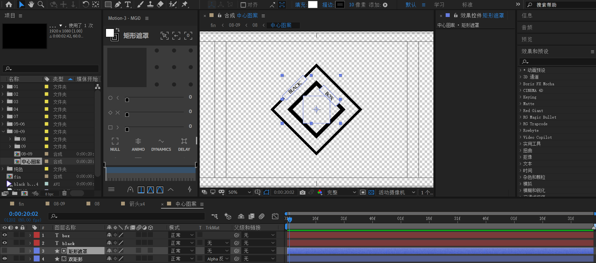

制作步骤：

- 使用形状层创建两个正方形，一大一小，都是旋转45°放于画布中间。图中【双矩形】。
- 使用形状层创建【矩形遮罩】，这个遮罩就是图中蓝色参考框，两个小矩形和一个小正方形。
- 对【双矩形】进行alpha反转遮罩。这样小矩形的位置就镂空了。
- 使用文本层放于镂空位置。

## 箭头x4

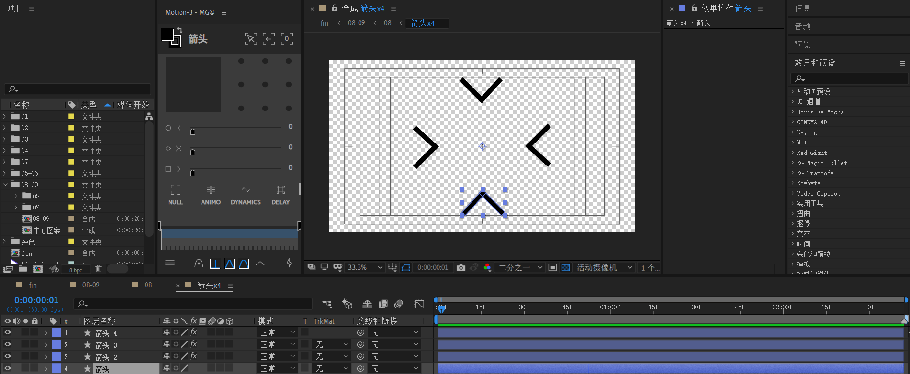

制作步骤：

- 先创建下面的箭头。使用两个小矩形拼接成90度即可。对应【箭头】层。**将旋转描点调整到画布正中心。**
- 然后将【箭头】层复制3次。对【箭头2～3】全部应用效果"变换"，从下面箭头开始，顺时针方向，分别旋转90，180，270度。

## 方形动画

将【箭头x4】合成和【中心图案】合成打成一个预合成，命名【方形动画】

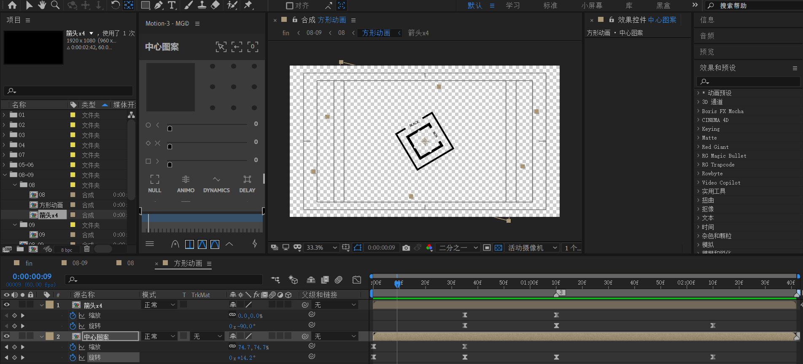

这里有三段关键帧动画。

1. 先是【中心图案】逆时针旋转出现
2. 接着【箭头x4】顺时针出现
3. 然后两个合成一起逆时针旋转。

> 旋转方向可以不固定，但必须交错。例如 顺时针-逆时针-顺时针也是符合审美的。

### 旋转细节

补充细节。

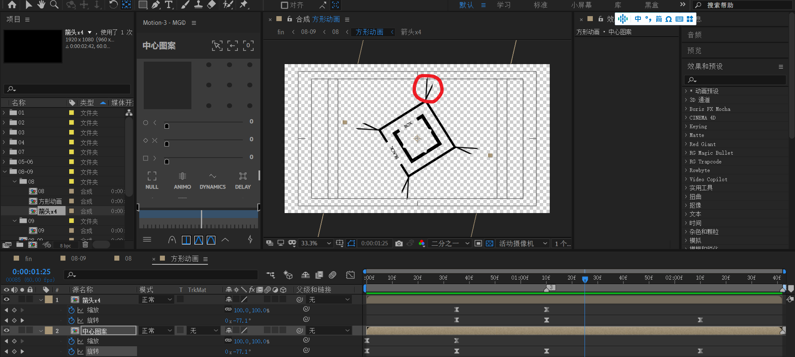

在第三段关键帧动画中，箭头本身也会沿着Y轴旋转。于是，回到【箭头x4】合成中，对齐外部标记。

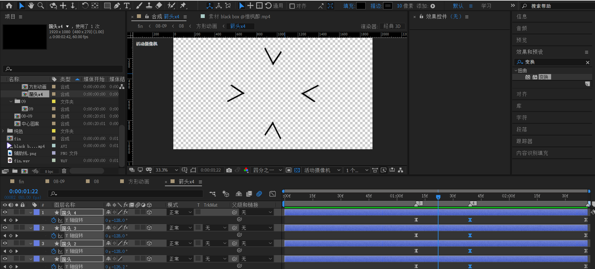

关键帧参数：Y轴从0到-180度,再到-360度。速度先快后慢。注意中间关键点调整，不要让速度变为0。

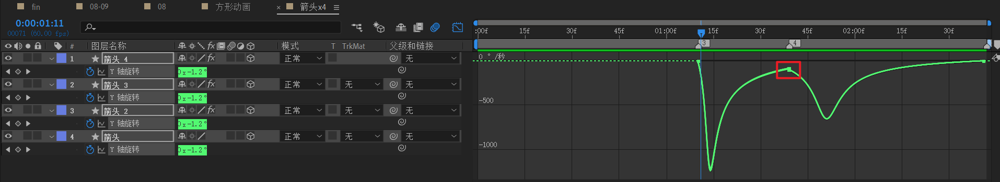

---

【方形动画】预览

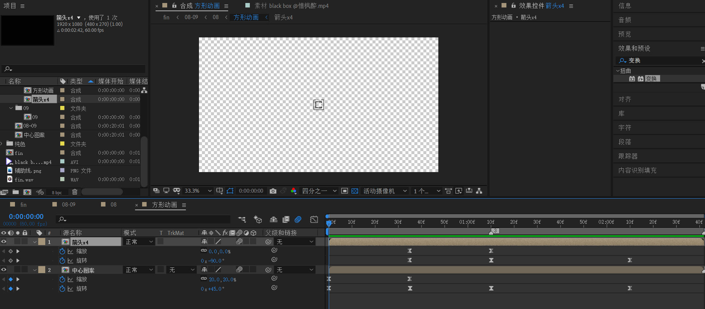

## 08

下面制作08合成。

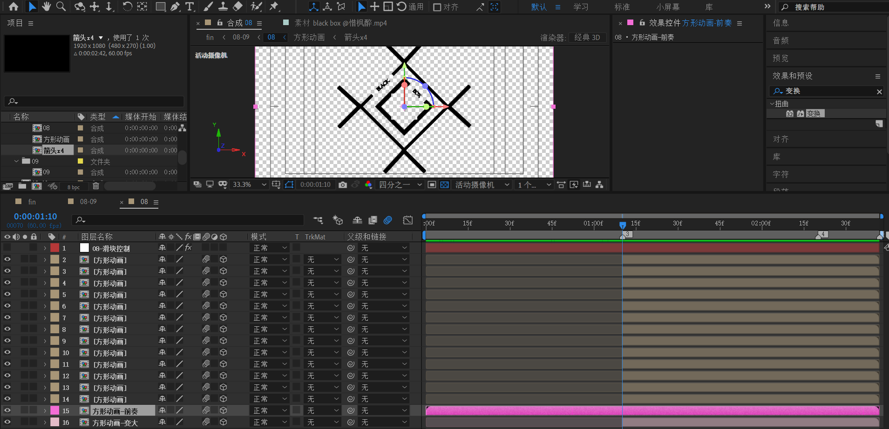

首先找到箭头和方形这两个合成整体开始旋转的时间点，图中标记【3】处。

新建一个纯色层【08-滑块控制】，应用【滑块控制】效果

- 在【3】处开始打下关键帧，值为0，
- 在【4】处打下关键帧，值为860。

- 速度曲线改为先快后慢。

接着，使用ctrl shift D将【方形动画-前奏】打断，拆开位置尺寸。对Z位置应用表达式。

> 【方形动画-前奏】就是之前的【方形动画】，单纯改名。

```js
transform.zPosition + (index - 1) * thisComp.layer("08-滑块控制").effect("滑块控制")("滑块")
```

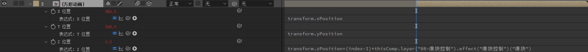

复制多次【方形动画】，形成index为2～14的层。

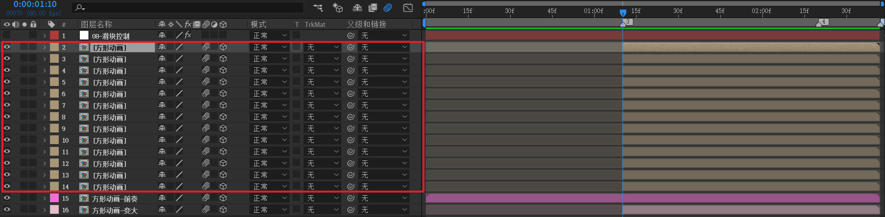

到这里，我们再来理清一些思路。

- 【方形动画】这些复制副本都是逐步往里面缩小的。

- 【方形动画-前奏】位置不动
- 为了补充画布外部区域的空白，所以这里需要制造一个稍微变大的方形动画。

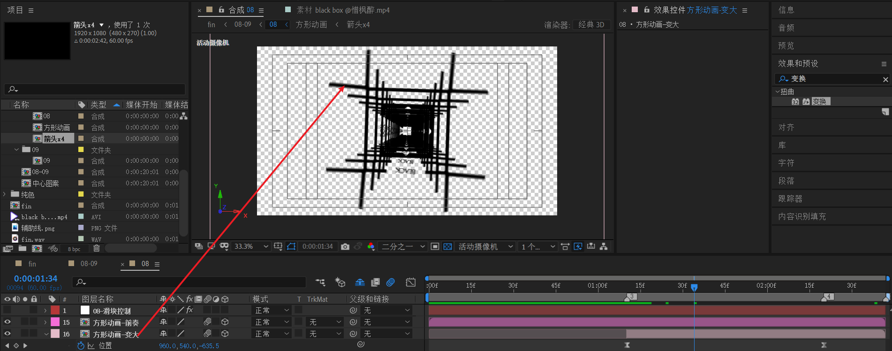

于是，复制【方形动画-前奏】，命名【方形动画-变大】。在【3】标记处，做一个位置关键帧动画

- 位置从 z =0 到 z =-860。注意这个-860值可以随意，但是绝对值不能过大，绝对值过大会导致间隔看起来太突兀。

## 小结
- 将图形复制为多个副本，按一定的渐变逻辑改变Z轴位置，可以创造重复叠加的效果，例如隧道。
