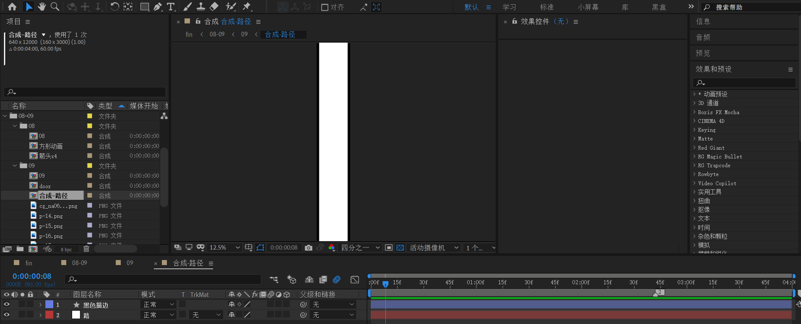
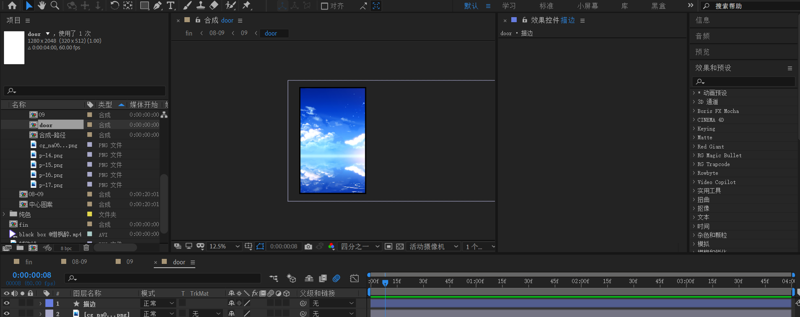
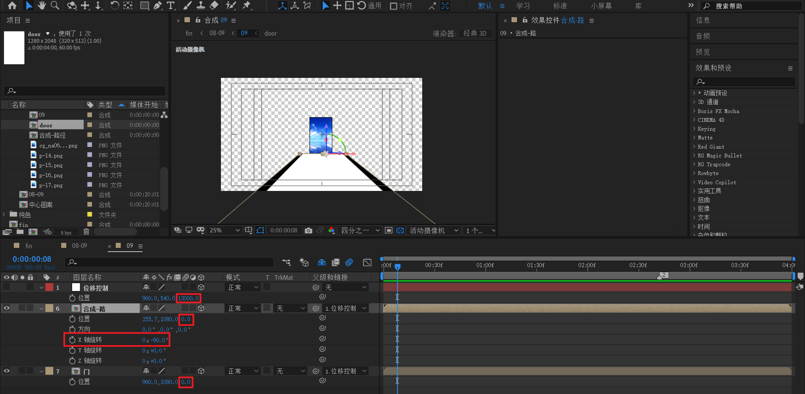
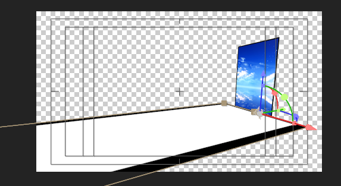
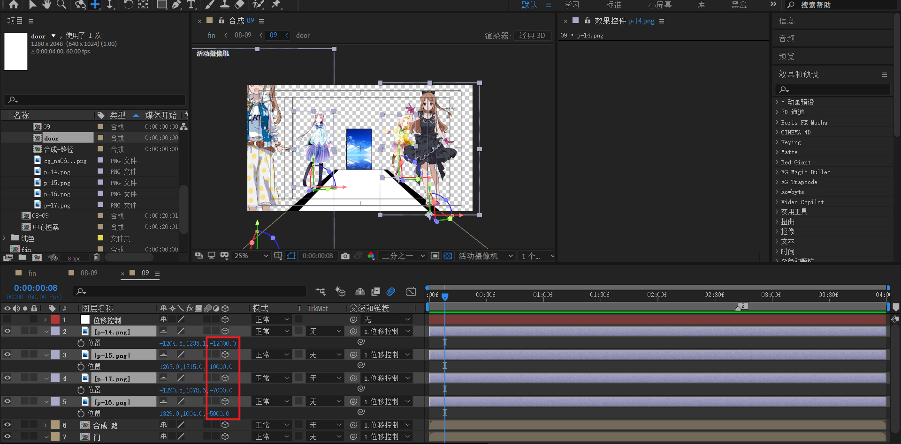
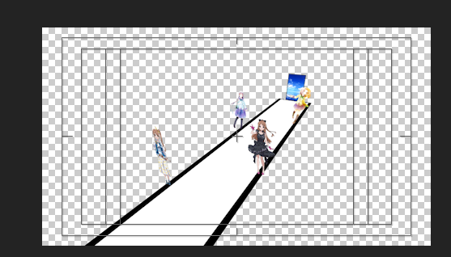
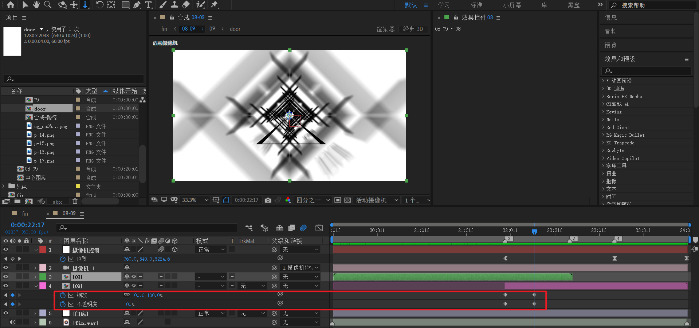
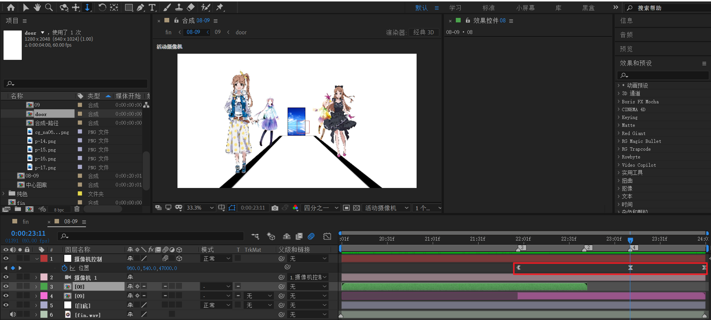
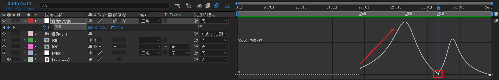
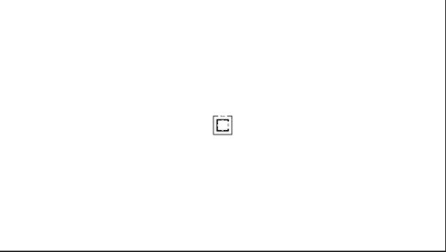

# 09 隧道穿梭与沿途风景
<!-- READING-TIME:START -->
>  🕛 reading time: 5 min read | 🔖 words: 823
<!-- READING-TIME:END -->

## 道路

创建道路。

【合成-路径】尺寸为640x12000，里面一共两层：

- 使用纯色层 640x12000创建白色层。
- 为了区分边缘，使用形状层创建比白色层稍大的黑色描边。

## 道路的终点-门

创建门。

【door】这个合成大小为 640 x 2048，保证是一个竖屏即可。

将素材导入后，使用形状层创建一个黑色描边。

## 09

### 布置门与道路

首先将【合成-路】和【门】导入：

- 【合成-路】将x轴旋转-90度。

创建一个空对象，取消显示。将下面两个合成指向该空对象。

现在我们先将【合成-路】和【门】合成的z轴定为0，【位移控制】z轴定为13000左右。将素材摆放成一个道路延伸到一个门的样子。

注意对齐画布水平中心线。

自定义视角观察：

### 布置人物摆放

下面开始处理人物素材。

将四个抠好图的人物导入后，依次摆放z轴为-5000，-7000，-10000，-12000。

> 这里 z 轴四个值不同，是为了塑造错落分布的效果。
>
> 四个值都比较接近于门的位置，是因为隧道穿梭很快，放于前面（例如z=30000位置）会导致人物在画面停留时间过短。
>
> 这两个设计点，请仔细体会。

自定义视角观察。

好了，万事俱备。下面将【位移控制】z轴值改为62000左右。注意这个值必须小于64000。理由后面会揭晓。

## 08-09

回到08-09合成。

将08和09导入，依照时间切割后大致如上图。

08-09之间的衔接，对09进行opacity和scale的关键帧处理：

- scale 从 0 到 100
- opacity 从0 到 100

### 摄像机动画

最后，创建摄像机和绑定控制。在开始处理摄像机关键帧之前。先停下来，考虑一下动画的思路。

- 首先，从方形动画隧道穿梭到人物位置，这一段应该是逐渐加速的过程，所以绝对不能使用先快后慢。如果先快后慢，那么会造成隧道穿梭过快，穿梭效果持续时间变为闪现，非常突兀。
- 接着，在人物位置运动稍微变缓，可以让观众视觉停留，能多看几眼人物。
- 最后，又是加速冲向门中心，直接穿过门，进入下一个世界。

冷静分析之后，这个摄像机动画就比较容易处理了。

z轴从0 到 47000，再到64000。

- 0-47000这段，对应隧道穿梭。至于47000这个值，是调优出来的，只要保证这个位置，人物比较布满画布就行。（这个值因为每个人实际摆放位置不一致，是不能生硬套用的，必须自己观察。）
- 47000- 64000这段。47000这个点，速度降为很低，可以稍作停留。64000这个末尾值，必须大于62000，保证能够穿过门。

下面给出参考速度曲线

最终08-09预览

## 小结

- 高速运动的物体，一般需要打开运动模糊效果。
