# 13 旋转的黑环
<!-- READING-TIME:START -->
>  🕛 reading time: 7 min read | 🔖 words: 1339
<!-- READING-TIME:END -->

> 时间码 39:48 - 45:31

截取音乐后，新建一个空合成【13-主体】

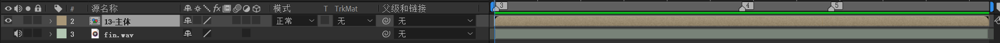

进入空合成【13-主体】，新建一个合成【黑环】

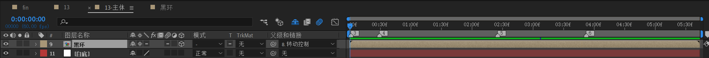

下面开始制作黑环。

## 制作黑环

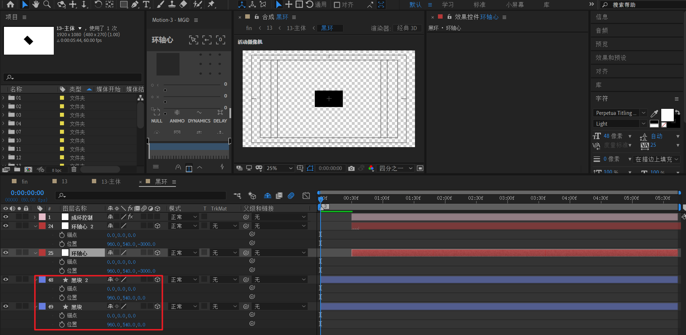

1. 新建形状层【黑块】，添加矩形，填充为黑，不要描边。适当调整矩形大小。
2. 复制【黑块】为【黑块2】。【黑块】和【黑块】2的锚点全置为0，位置为（960,540,0）

---

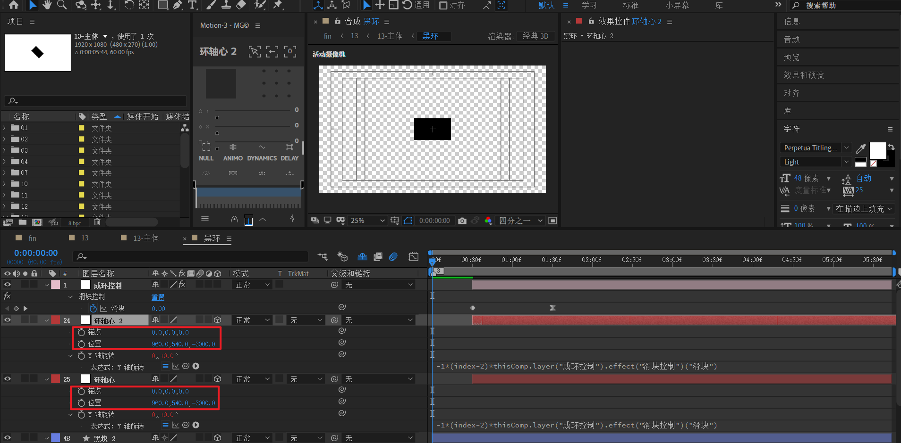

1. 新建空对象【成环控制】，添加滑块控制。滑块值从0到15。速度曲线为急剧的先快后慢。

2. 新建空对象【环轴心】，锚点（0,0,0），位置（960,540，-3000）。注意，这里-3000代表环半径就是3000。

3. 对【环轴心】的Y轴应用表达式：

   ```js
   -1*(index-2)*thisComp.layer("成环控制").effect("滑块控制")("滑块")
   ```

4. 复制【环轴心】为【环轴心2】。

---

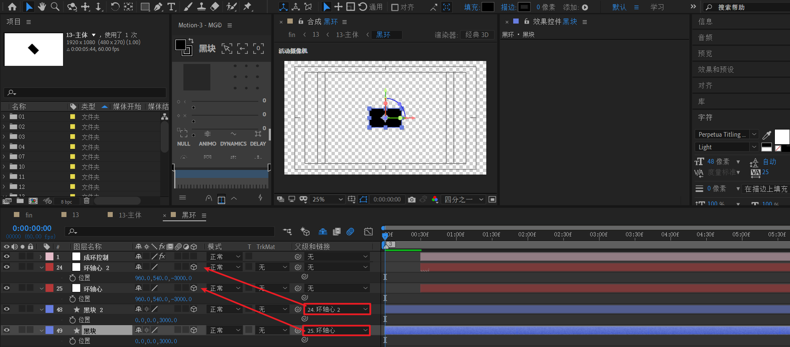

1. **将时间线指示器置于最左边。这个很关键，排除干扰。**

2. 然后将【黑块】指向【环轴心】，【黑块2】指向【环轴心2】。请注意，指向后，【黑块】和【黑块2】的位置z=3000。

   > A：Z=-3000
   >
   >B：Z=0
   >
   >将 B -> A之后，也就是 B的父链接是A之后，B会显示为Z=3000。这个值= 0-（-3000）得出。
   >
   >含义是：当选定A为参考点后，B在A的z=3000位置处。
   >
   >示意图：---------------A（参考点）----------------B-----------------------> Z+方向

3. 继续复制【环轴心】，直到出现【环轴心24】。

   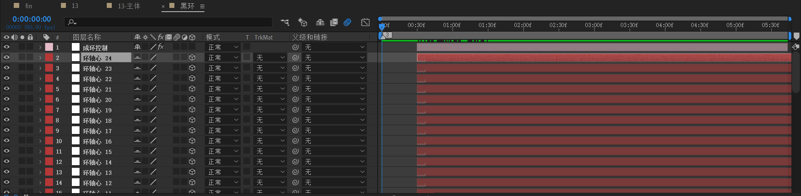

4. 继续复制【黑块2】，直到出现【黑块24】。修正【黑块 3】~【黑块24】的父链接为对应【环轴心 3】~【环轴心 24】。请始终留意所有黑块的最终Z轴，保证为3000。

   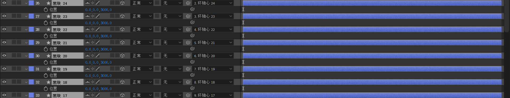

---

效果观察，图中红点就是环轴心。

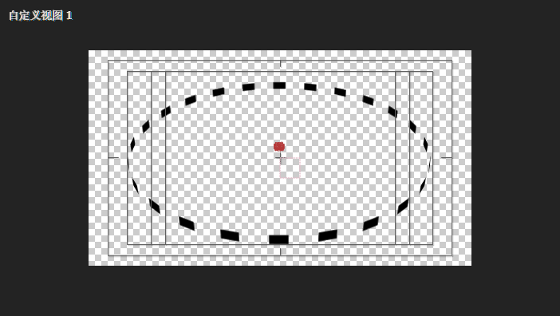

## 制作【13-主体】

新建一个白底。

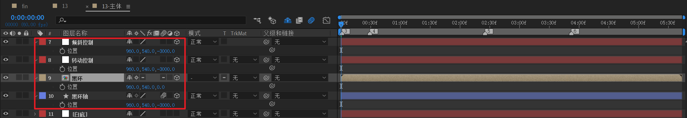

1. 新建空对象【转动控制】，【倾斜控制】，这两者z=-3000；新建形状层【黑环轴】，z=-3000；【黑环】z=0。
2. 【黑环轴】本身是一个矩形，只不过类似一根长线。

也就是，**除了【黑环】本身，其他参考点z轴都是定于绝对坐标系的z=-3000位置。**

### 父子链接的绑定

下面，开始父子链接的绑定。

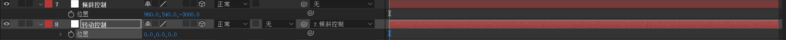

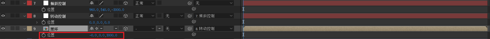

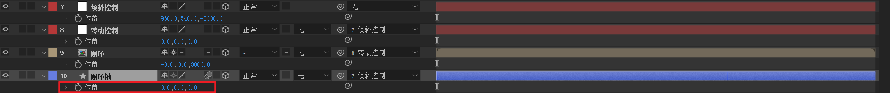

### 摄像机动画

新建35mm摄像机和空对象，摄像机z=-1866.7。先将空对象的z改为-3000。

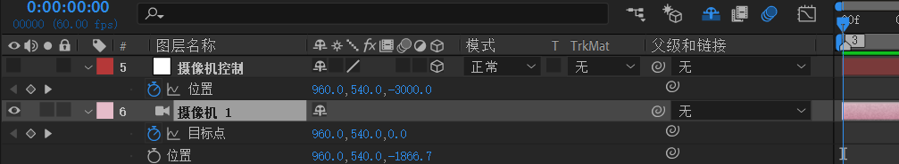

接着，将摄像机绑定到空对象。

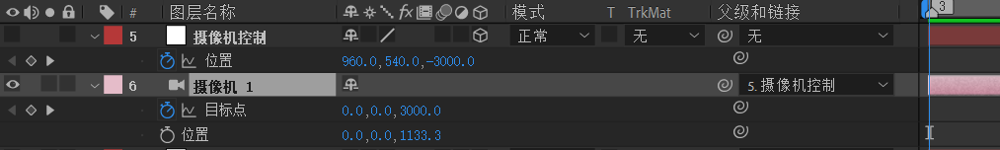

**仔细观察摄像机坐标的变化。目标点z变为3000。计算过程为z=-1866.7-(-3000)=1133.3**

---

第一列关键帧

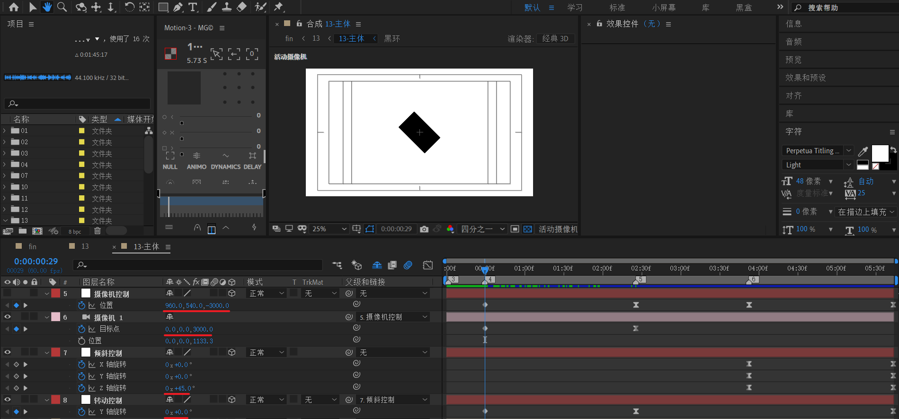

第二列关键帧

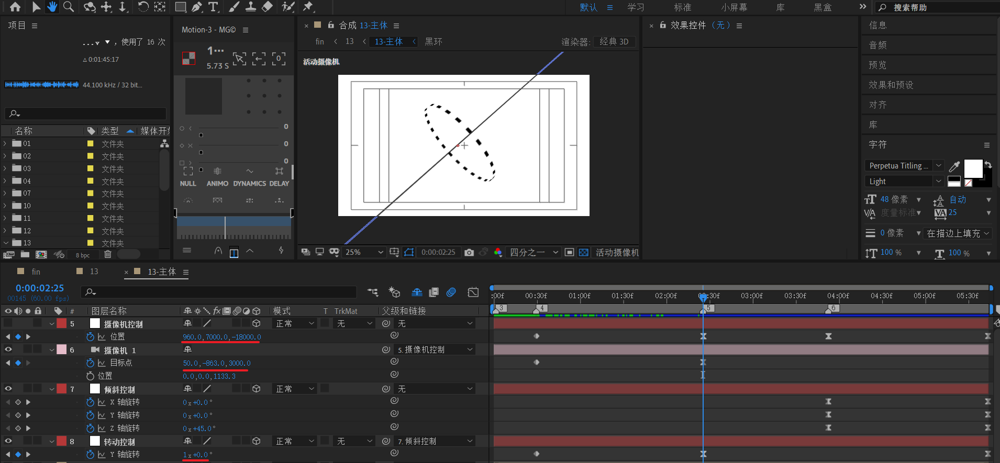

- Y轴做了一个1x旋转。这个比较好理解。

- 摄像机控制从（960,540,-3000） => (960,7000,-18000)。首先，Z轴变小，可见是拉远镜头。此时Y如果不调整，还是540的话，那么从正面角度看，看不出环的倾斜。如下图。

  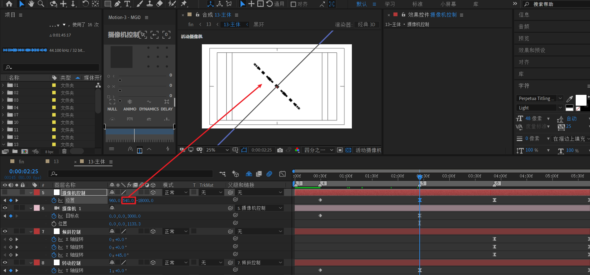

  y轴改为7000后 ，就能看出稍微倾斜。但是，这时产生一个问题：环跑到画面顶部去了。此时，要想个办法将环拉回画面中心区域。

  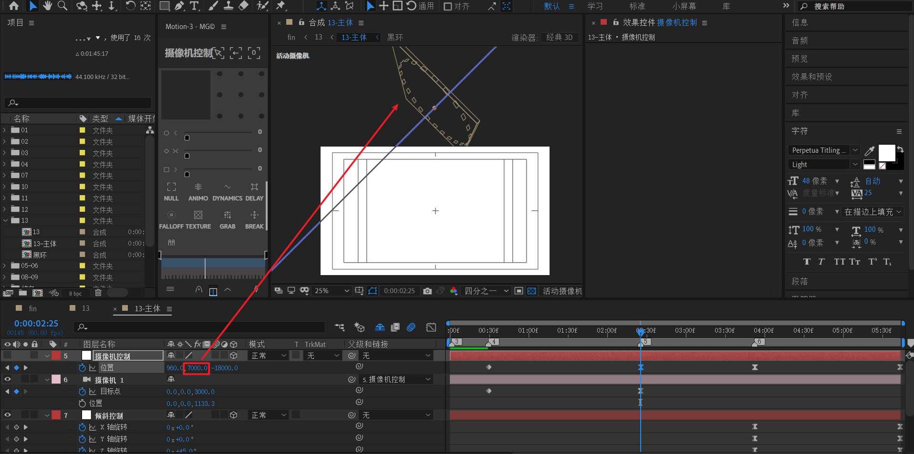

> 小技巧：空对象 对位置进行常规k帧时，例如推进或者拉远，这时，摄像机聚焦的目标点往往不在画面中心区域，如果需要将需要观察的区域放于画面中心，那么需要对摄像机目标点同步k帧，从而将需要观察区域矫正到画面中心。同步指的是速度曲线和摄像机速度曲线一致。

对摄像机目标点调整，（x，y）变为（50，-893）。使得环回到中心区域。

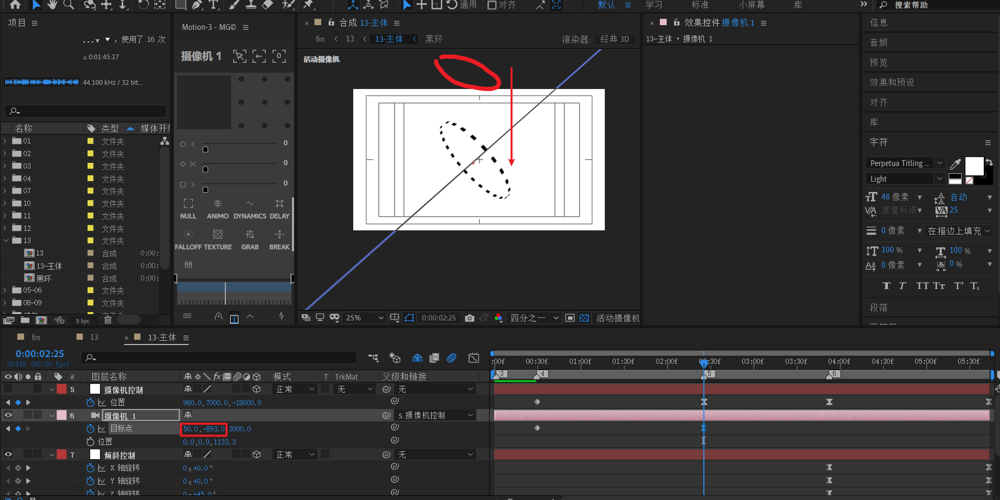

第三列关键帧

在往后一段时间点，图中【6】标记处，记录之前关键帧。

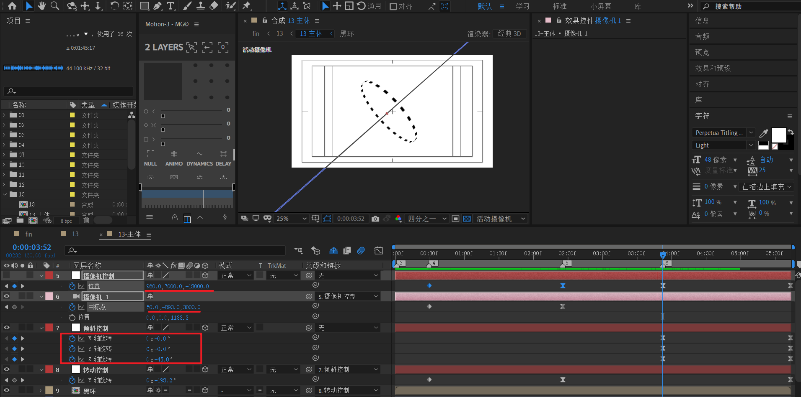

第四列关键帧

到该合成结束时间点，将摄像机控制从 (960,7000,-18000)变为（3000,1500，-8182）。也就是镜头稍微推进。

> 这个（3000,1500，-8182）的值是调整出来的。
>
> 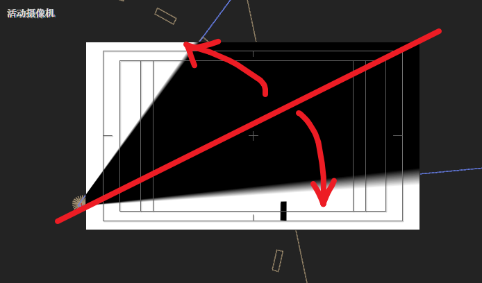
>
> 关注点在于中间的黑环轴线，当摄像机过于与该线平行时，就会产生这种微妙的对角线展开效果，非常惊艳。
>
> 下图是自定义视角观察：摄像机视线和中心轴几乎平行。
> 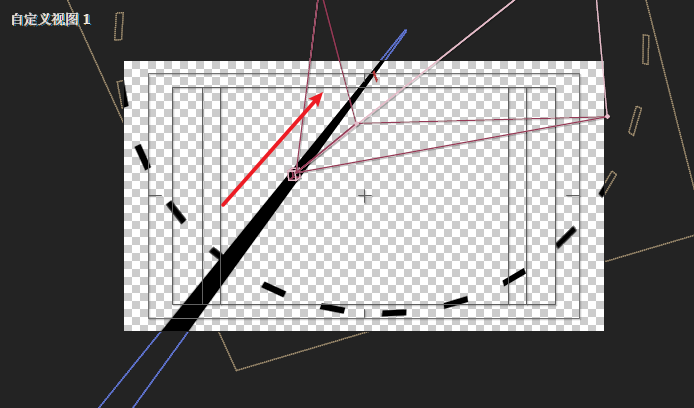

对于倾斜控制：

- x 轴从0 到 45
- y轴从 0到 60
- z轴从45到62

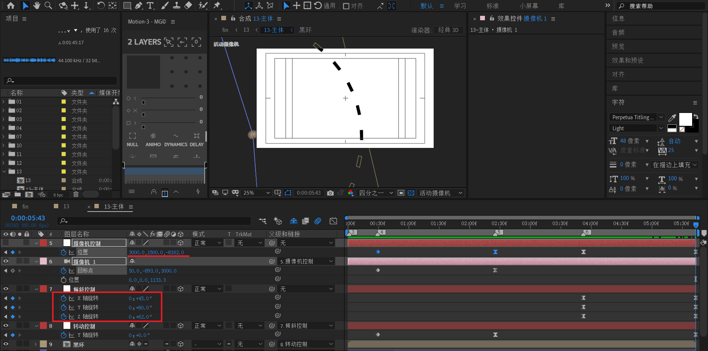

### 文本部分

制作文本层。

三个文本，先摆好结束帧位置z=0。然后回到开始帧，将z改为-2000即可。

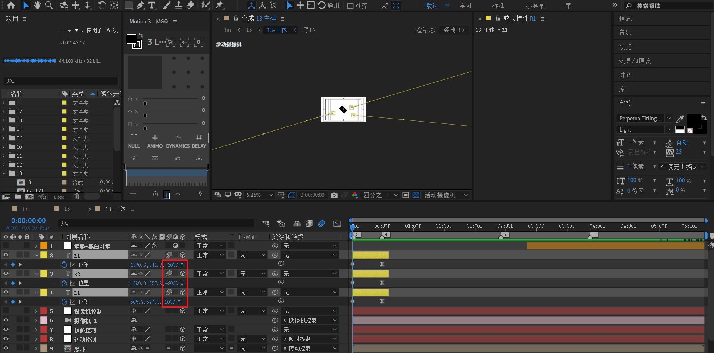

### 调整层-黑白对调

制作黑白对调。

新建调节层，每隔10帧依次对调黑白。

|              | 帧1  | 帧2  | 帧3  | 帧4  |
| ------------ | ---- | ---- | ---- | ---- |
| 将黑色映射到 | 黑   | 白   | 黑   | 白   |
| 将白色映射到 | 白   | 黑   | 白   | 黑   |

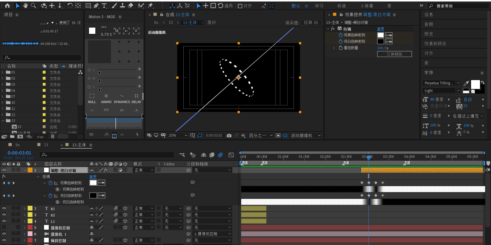

### 13 收尾

回到13合成，新建文本层。先确定结束帧位置，

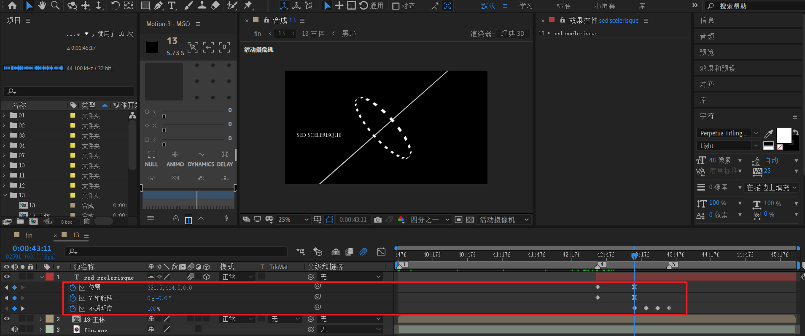

然后制作开始帧。

- y轴 变为1x
- 位置 x变为 左侧

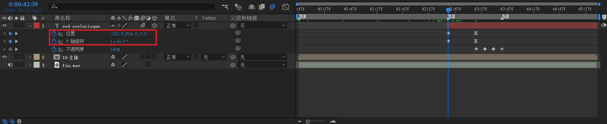

最后，补一个opacity闪烁出现即可。

### 13 预览

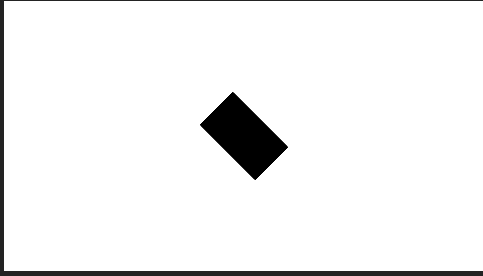

## 小结

- 对摄像机目标点进行k帧，可以将需要观察的区域矫正到画面中心。
- 当摄像机视线方向和某个被观察物体非常接近，且几乎平行时，会发生视觉上的欺骗效果。
