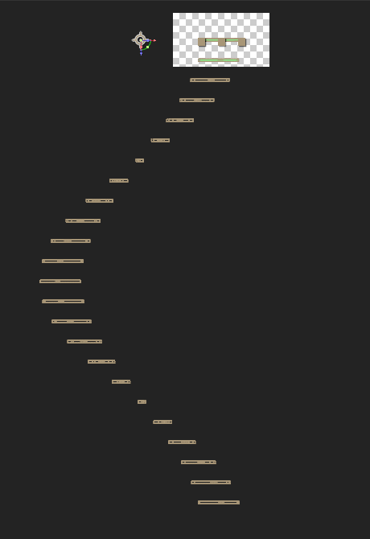
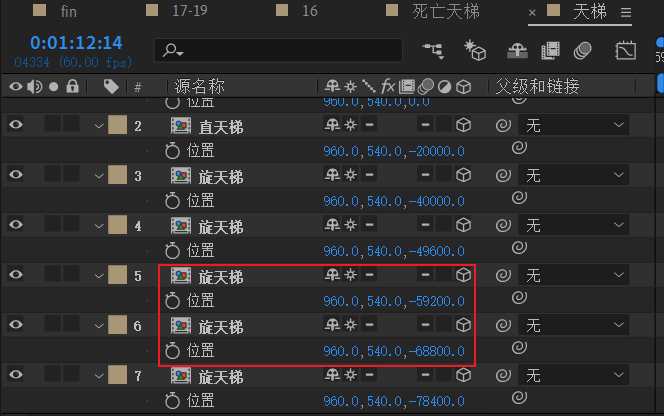
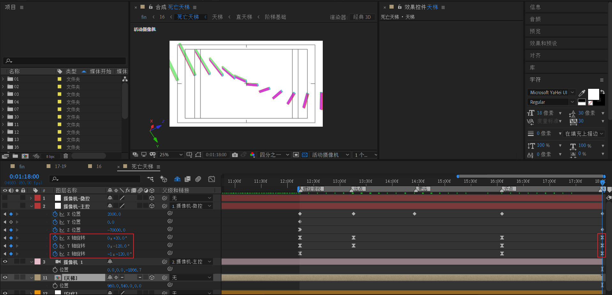

# 16 死亡天梯
<!-- READING-TIME:START -->
>  🕛 reading time: 17 min read | 🔖 words: 3346
<!-- READING-TIME:END -->

> 时间码 59:00-1:18:00

将音乐片段裁剪后，先分析制作过程。

## 分析

流程图


从自上而下的分析中，得到最底层的基础合成是：【舱线】和【阶梯基础】。

下面给出各合成示意图：

| 舱线                                                         | 竖舱                                                         | 横舱                                                         |
| ------------------------------------------------------------ | ------------------------------------------------------------ | ------------------------------------------------------------ |
|  |  |  |

| 阶梯基础（砖块）                                             | 直天梯                                                       | 旋天梯                                                       | 天梯                           |
| ------------------------------------------------------------ | ------------------------------------------------------------ | ------------------------------------------------------------ | ------------------------------ |
|  |  |  | 自由组合【直天梯】和【旋天梯】 |

下面进入制作环节。

## 阶梯基础

> 目标：制作一个长800，宽50，高100的长方体。

先制作正面和背面。正面和背面尺寸都是800x100。

将z=0作为参考平面，正面设置z=-25，背面设置z=25。


---

接着，制作左侧和右侧。左侧和右侧尺寸都是50x100。他们锚点都是（25,50,0)。也就是尺寸的一半。

将左侧和右侧y轴都旋转90度，然后设置左侧x为0，右侧x为800。


---

然后，制作顶部和底部。顶部和底部的尺寸都是800x50。锚点为（400,25,0）。

新建顶部后，需要将顶部x旋转90度。顶部的Y属性设置0.

复制顶部为底部，将底部的Y属性设置为100。


---

**到这里，这个阶梯基础完成了吗？**

从实现的角度来说，已经完成了。

如果考虑阶梯基础的移动性，可以考虑新建一个空对象来绑定之前的6个面。之后，这个阶梯基础的整体移动就交给空对象控制。

下面开始动手。

新建一个空对象，保证该空对象绝对居中于画布中心。也就是锚点在于（400,50,0）。


然后将6个面父链接到该空对象。


## 直天梯

将前面的【阶梯基础】预合成为【直天梯】。


展开【阶梯基础】的位置属性，选择拆解为单独尺寸。而且，从上图可以看到，锚点为（400,50,0）。

---

下面，**我们希望将锚点定于画布左侧，而物体保持在画布绝对居中的位置不变。**

具体怎么操作呢？下面举例说明。

假设，我想将锚点定于这个红点，也就是x=0处。


需要将锚点的X以及位置X同时减去960。得到：


---

按照这个原理。我们将锚点定于初始状态的-1600处。计算过程：

- 锚点：400-1600=-1200

- X：960-1600=-640

最后，对Z应用表达式：

```js
transform.zPosition + (index - 1) * (-400)
```

式中，index表示图层序号；-400的负号表示往前扩展，400就是每个阶梯基础的间隔距离。

然后将【阶梯基础】复制49次，形成一共50层。也就是说，【直天梯】的真实z跨度为 49* 400=19600。

但是为了计算方便，最后一块要留白，方便后续副本拼接，这里，依旧认为这个【直天梯】的整体z跨度为 50*400=20000。


这里，可以看到阶梯基础没有厚度，**原因是没有打开塌陷开关**。打开后效果如下


顶部视图：


## 旋天梯

将之前【直天梯】中的一个【阶梯基础】复制一份到外面，使用这个【阶梯基础】预合成为【旋天梯】。


对z轴旋转应用表达式


```js
transform.zRotation + (index - 1) * 15
```

这里index-1是为了将初始增量归0，而15度=360/24。也就是我们之后将使用24层来形成一个圆圈。

接着，将这个【阶梯基础】复制为一共24层。也就说，【旋天梯】的z跨度为23*400=9200。

但为了计算方便，最后一块要留白，方便后续副本拼接，这里，依旧认为这个【旋天梯】的整体z跨度为 24*400=9600。

> 技巧：复制图层的最快方式，是指数爆炸。例如将一个图层复制为24层，最少需要多少次ctrl+D？
>
> 1 ->【 2 -> 4 -> 8 -> 16 -> 32】。也就是五次。然后删掉不要的8层即可。

顶部视图如下：



背面视图：


## 天梯

将【直天梯】和【旋天梯】预合成为【天梯】。


然后，使用直x2 + 旋 x5的拼接方式来构成天梯。z轴的递减依据为之前计算的z跨度。


在直-直拼接处观察，的确和预想一致。


## 天梯动画

提醒：这部分可以说是最卡，也最复杂的摄像机动画了。

### 初始化

在合成16中新建一个等长合成【死亡天梯】。新建一个白底，并将【天梯】放入，打开天梯塌陷和3D。


此时，从活动摄像机（正面）看到的是阶梯基础的一个面。我们将视图改回顶部，再次观察。


下面我们开始新建摄像机，并做两层绑定。下面是具体步骤，请仔细体会：

- 新建35mm摄像机，双节点。
- 新建空对象【摄像机-主控】，主控位置初始为（12000,540,-1000）
- 新建空对象【摄像机-微控】，微控的位置初始为（960,540,-1000）
- 先将摄像机绑到【摄像机-主控】，然后将【摄像机-主控】绑定到【摄像机-微控】。坐标最终如下：


> 为什么摄像机要绑定两层控制，一层不行吗？
>
> 一般而言，简易的摄像机动画，的确一层空对象绑定就可以完成了，也非常直观易于理解。
>
> 但是，当设计过于复杂的摄像机动画控制时，一层是不够的，首先第一层【主控】要控制主要的分镜动画，第二层【微控】要控制一些细微的内部动画。这样做，逻辑上比较清晰。
>
> 另外，还有一个原因。当第一层已经控制位置的属性动画（指对位置XYZ k帧）之后，第二层还可以对第一层的位置属性进行k帧。

下面的例子中，由于关键帧非常多，我们将按镜头划分时间范围，然后逐个分析的方式进行分解。

好了。我们从上面的图中可以看出，红色箭头标注了用户的视角，向上。**也指明了摄像机的初始X位置。距离观察对象就是12000**。

然后下面，我们来看一下**Z轴为何初始是-1000**。


图中最上面红线就是Z=0位置，Z=-1000相当于将摄像机下移1000像素。

> 为什么要将摄像机稍微下移呢？

因为将摄像机稍微下移之后，后面将摄像机观察方向修正后，可以看到稍微多过一半长度的初始天梯。如下图所示。

> 观察对象在左侧，正确的视角方向应该是向左，如绿色箭头标注。于是需要将【摄像机-主控】初始的Y设置为-90。


这个-1000的值仅供参考，这里只是说明了它的作用。

到这里，初始化完成。

### 推进


镜头推进，对应实现就是X从11040到2000。如果回到活动摄像机视图，可以看到推进结束后：


### 旋正+Y上移


主要关键帧为：Y轴旋转从-90到0。同时X位置从2000到0。

此时，如果回到活动摄像机视图，会发现只能看到阶梯基础的一个面。所以我们需要将Y稍微偏移一下，制造俯视效果。


这里，Y从0变成-200。

### 后退+垂直


首先，将Z位置从0变化到-3500。对应镜头拉远，也就是后退的感觉。

同时，将X旋转从0变成-90。这样，相当于摄像机向上翻转90度。此时，就能看到天梯往下的视角。


最后，将位置Y从-200变成1500。Y从一个负值变成正值。此时摄像机会从Y方向越过天梯。


位置Y变成1500是为了从Y轴深入观察天梯，此时只能看到个别天梯块的部分了。

抽帧预览


### 向下螺旋


之前Y轴深入观察，现在拉远镜头，关键的地方为：将主控的Y位置从1500变回-1000。

回到微控的Z轴，此时需要做一个Z轴旋转，时间范围很广，到螺旋俯视之前结束。


微控：Z轴旋转，从0到4x，旋转4圈。线性关键帧，这个可以随性发挥。

---

到这里，微控已经设置了天梯的Z轴旋转，但是摄像机往下走的关键帧还没设置，我们先从这个入手。


- 主控：Z位置从-3500到-59900。

> 这个-59900的值是如何得出的。它不是固定的值，但是必须保证此时已经过了天梯中的【直天梯】部分，看到的必须是【旋天梯部分】。回到天梯合成部分，可以确定是在两个旋天梯之间。这点必须心中有数。
>
> 

然后，关注主控的X轴旋转中间的这个点。这个点是将X轴旋转从之前的-90变成了-180。

保证在这样一个居中的俯视角度中，看到完美的螺旋形态。


在之后的一段关键帧区域，保持主控X旋转不变，为-180。


下面，来说明主控的XY位置的变化。

- Y位置从-1000到0，主要是为了将Y重置为0。
- X位置从0到0，保持不变。

回到微控的位置关键帧。这里不会一个个细说位置参数。但稍微提一下说明它们的作用，就是**在摄像机往下Z旋转的同时，稍微调整【摄像机-主控】的位置**。


抽帧预览


### 远近旋转


对主控的X位置，分别标记远点，更远点，近点，更近点，分别对应10000，30000，5000，2000。

对Z位置添加末尾帧：-70000。注意这个值不能低于-78400。因为会超过【天梯】合成的Z范围。

在图中远点处，将X旋转改回0，Y旋转改回-90，将视角调整成从垂直角度观察。

图中Z轴旋转为顺时针：从0到-1x。

---

最后，在末尾帧继续旋转一定角度。X：+30，Y：-120，Z：-1x-120。



抽帧预览


最难的一部分已经完成了！后面的部分是处理舱线点缀。

## 舱线

### 舱线主体


1. 新建形状层。
2. 添加矩形【主体矩形】，填充黑，描边无。
3. 添加矩形，改成正方形，旋转45度，命名【小菱形】。填充黑，描边无。
4. 添加矩形，改成长矩形条，命名【长矩形】。填充黑，描边无。
5. 添加合并路径，模式改成排除交集。这样，就相当于镂空了【小菱形】和【长矩形】位置。

### 左右侧三角形

接下来，开始处理左右侧的三角形。


使用钢笔工具绘制三角形的三个顶点，然后填充灰色，描边无。注意，将【三角形】的锚点定于画布中心，也就是舱的中心。

然后，复制这个【三角形】为【三角形2】，由于锚点位于舱中心，旋转180度之后就在右侧了。


### 线

最后，是线的制作。


新建形状层，添加矩形，调整长为很大的数值，而宽为一个很小的数值。

最后，**将【舱】和【线】3d的开关打开。**

## 竖舱

使用【舱线】合成来预合成【竖舱】。


1. 将塌陷开关打开。

2. 将z轴旋转为90度。

3. 对位置应用表达式

   ```js
   transform.position+[0,0,(index-1)*300]
   ```

   式中300表示z的间隔。

将【舱线】复制到一共10层。然后调节XY摆放如下：


于是，可以计算得知：【竖舱】的z跨度为0~2700。

## 横舱


类似于制作【竖舱】的初始操作，但是这里先不设置任何旋转属性，而是对位置应用表达式

```js
transform.position + [0, 0, (index - 1) * 500]
```

这里，z间隔为500。

将这个【舱线】复制到一共10层。然后调节XY摆放如下：


于是，可以计算得知：【横舱】的z跨度为0~4500。

---

将10层选中，y轴旋转改为-90度。


效果如下


## 死亡天梯

将【竖舱】和【横舱】导入，这里先使用4个竖舱+2个横舱。

打开顶部视图，将位置摆放如下。


最后，复制一层【横舱】为【横舱-底层】。将z改为-60000。这个值参考-59900。这样做的目的是为了在旋天梯部分也添加舱线点缀。


## 16

将【死亡天梯】导入，并在0:01:01:43处打断，对上断层做一个淡入。


在开头处补一个纯色层，作为白场淡入。

然后，对上断层添加色调，将黑白对调。分别k帧 着色数量：100% - 0% - 100% - 0%。


最后，补充三个文本即可。


## 小结

- 对于复杂3D场景的制作，可以借助各种不同的摄像机视图来辅助观察。顶部视图和左侧视图比较常用。
- 对于复杂的摄像机动画K帧，先按镜头分为几个部分，然后再逐个对部分进行分析实现。
- 两重空对象绑定可以创建更为精细的摄像机动画控制。
