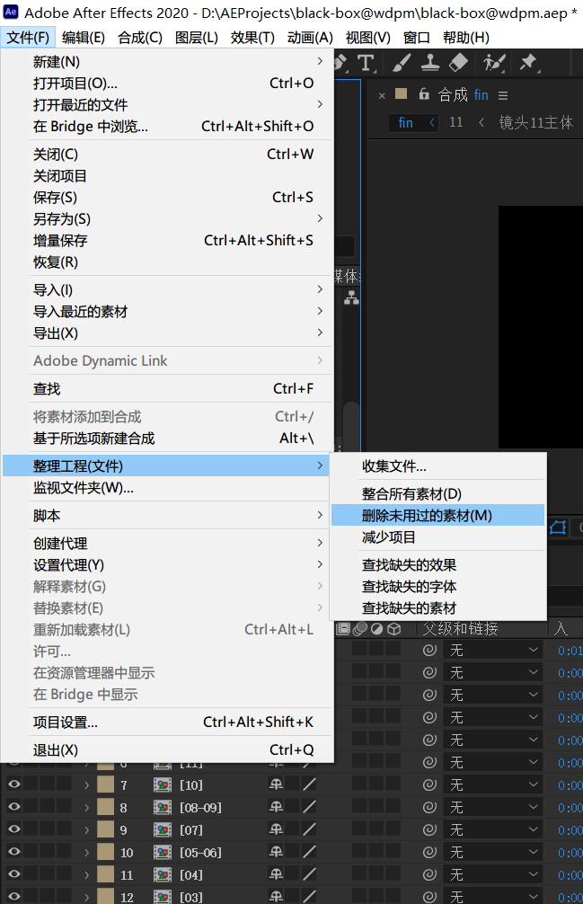
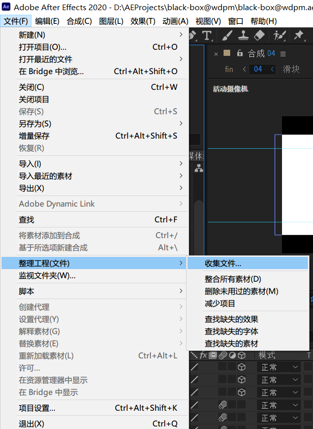
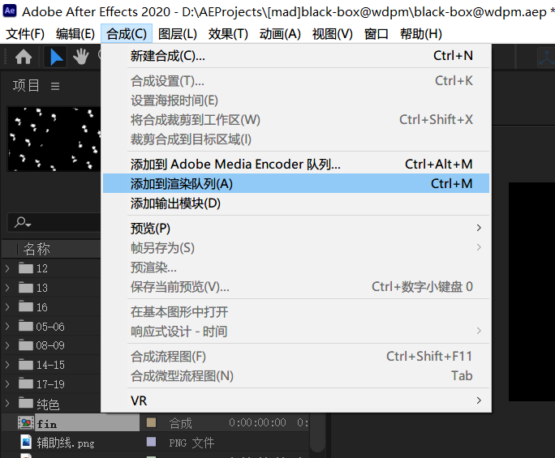
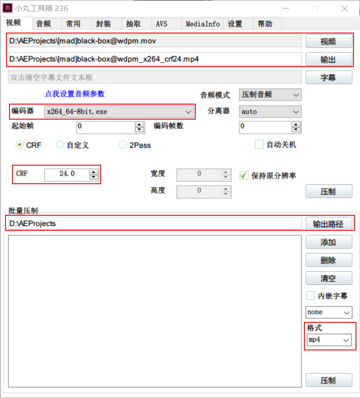

# 最后
<!-- READING-TIME:START -->
>  🕛 reading time: 3 min read | 🔖 words: 524
<!-- READING-TIME:END -->

## 交卷检查

回到总合成处，使用低分辨率例如1/4启动预览渲染，用于整体观察。主要留意以下方面：

- 是否存在某些合成或者纯色层应该对齐画布，但是却没有对齐画布？

  > 如果是，使用ctrl alt F绝对对齐。

- 是否某些动画关键帧速度曲线需要重新调整，偏快或者偏慢？

  > 重新调整速度曲线，并保证回归测试预览，保证在修复该问题时没有引入新的问题。

- 是否某些合成工程杂乱无章，存在引用次数为0的图层，或者名称不够简洁清晰？

  > 重构合成工程：
  >
  > - 删除不需要的图层
  > - 规范命名
  > - 裁剪图层生命长度，仅保留图层有效生命长度
  > - 适当使用预合成拆分模块，抽取逻辑上相关的图层。避免出现巨无霸的合成（指一个合成具有非常多图层，非常复杂）。

- 总合成中，取消个体合成的BGM图标。避免BGM重复。

当这些都确认无误后，开始整理工程。

## 整理工程

删除未使用的素材。

## 打包工程

## 渲染工程

选中总合成fin，菜单栏合成->添加到渲染队列。

### 加速渲染的技巧

- 选择合适的色彩位数。
  > 文件——项目设置——颜色，一般将颜色深度改成8位。如果你明确地知道你需要提升色彩效果，那么选择16或32位。
- 按下大写键（Caps lock），可以在渲染时关闭预览。

## 压制文件

安装【小丸工具箱】。关键参数:

- 输入文件和输出文件。建议输出文件重命名为带crf24参数后缀，方便辨认。
- 编码器根据自身系统是32位还是64位进行选择，图中是64位。
- CRF这个参数建议在18-24之间选择。CRF越大，码率越小。
- 最后选择批量压制的路径。

